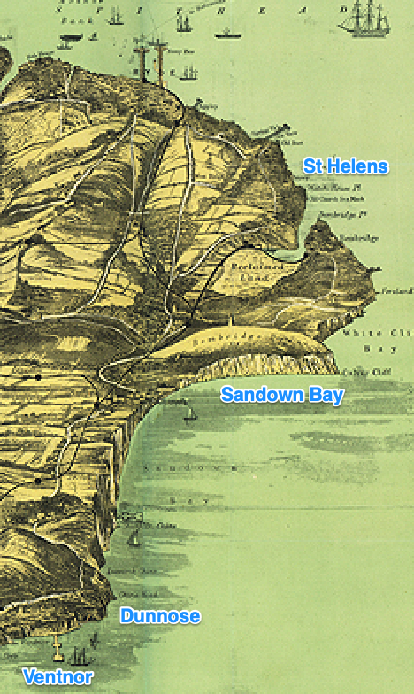
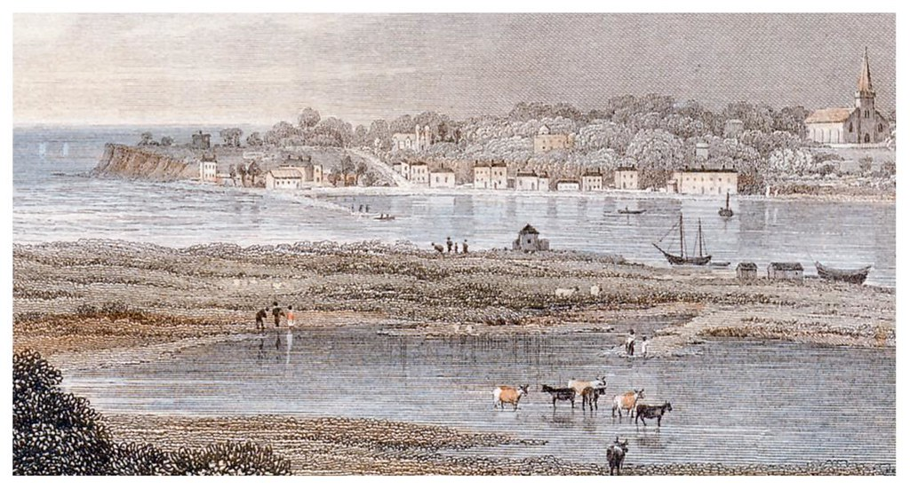
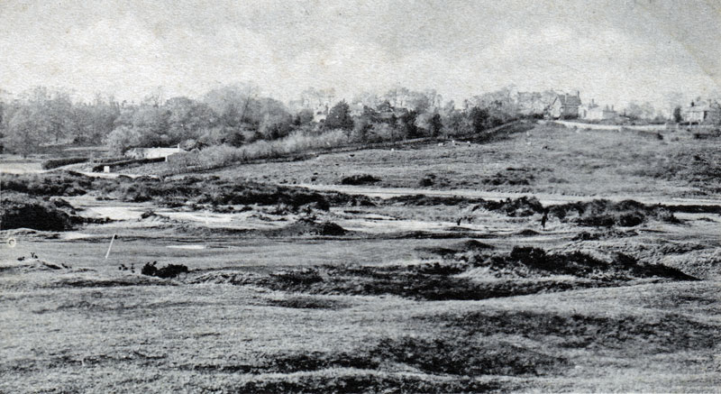
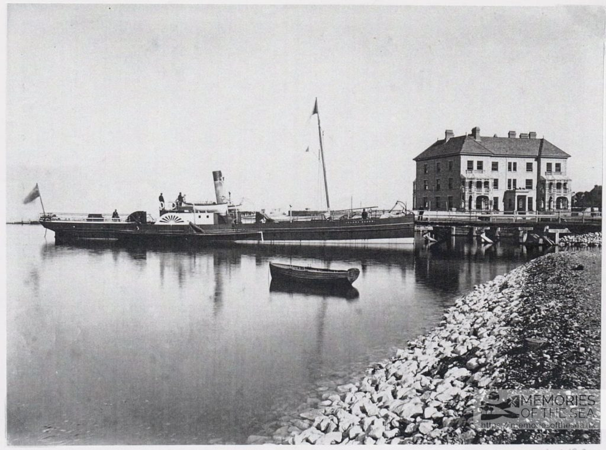

# More Life Aside

Bembridge and St Helens

Golf course

Reclamation 

jabez balfour

holy stones

lost wolverton



The Isle of Wight, AW Fowles, 1897 annotated



Isle of Wight : Bembridge from St.Helens . Harbour section of Victorian Print c.1850s.
Isle of Wight : A finely detailed print view titled " Bembridge from St.Helens " : a Victorian Print c.1850s.
https://www.flickr.com/photos/lenton_sands/3512272457/



(Golf course opened 1882)
St Helens Duver Golf Links


Island Queen at Bembridge Pier


```{admonition} CLOSING PUBLIC-HOUSES ON SUNDAY.
:class: note dropdown

[Isle of Wight Times](https://www.britishnewspaperarchive.co.uk/viewer/bl/0002100/18790710/110/0005), 1879-07-10, p. 5

The Mayor said that the next matter on the agenda was a motion by himself and he hoped that they would all give their adhesion to it. That butchers, bakers, grocers, tailors, and candlestick makers, should not be allowed to sell on Sundays, and that publicans should be allowed to sell intoxicating liquors on Sundays had always been a marvel to him. A large number of publicans would only be too glad to close their hones if they could. He thought that as the Governing body of the town they ought to shew their respect for the Sabbath-day by trying to close public-houses. When they considered the number of people that public-houses kept at work on the Sabbath he thought they would see that there was good reason why such houses should be shut up. He proposed the following resolution:—" That the seal of the Borough be of to a petition to Parliament for closing Public-houses on Sundays."

Councillor PURNIILL seconded the resolution.

Alderman Wallis said he could not support the resolution, on the ground that it was an Imperial measure and had nothing whatever to do with Corporation matters. It was bringing a party question before the Council. Suppose for instance that Councils were to take up the abolition of flogging in the army, it would be said at once that the Conservatives were trying to carry and the Liberals to stop it. If the matter were brought before the town of Ryde it would wear a different aspect. He did not mean to say that the petition came from the Mayor.

The MAYOR said he should be very proud of it if it had.

Councillor Spenser said he should record his vote against the resolution for the reasons advanced by Alderman Wallis. He thought it would be a great pity for the Council to deal in party politics. He did not think that public-houses should be shut on Sundays, but publicans had a right to shut the shops up if liked. (The Mayor said they were obliged to open at certain hours.) It was at their option to apply for a licence to enable them to do so. It was all very well for gentlemen, like the Mayor, who might have their cask of ale and wine cellar, but the poor man could not do that. The Mayor had said that public-houses being open on the Sunday was a nuisance. (The Mayor replied that he used no such word.) Councillor Spencer replied if the Mayor did not use that word he led them to suppose that they were so. Of course the Mayor knew that his motion would be opposed. It must eventually become a question of party politics— (The Mayor :—" No, Never.")— It must eventually become a measure of that sort and he did not think that it should be introduced there.

Councillor Purnell remarked that the question was one which lay at their own doors and was really a town question. For public-houses to be open on the Sabbath was a great nuisance. He questioned whether it was the poor man who most used the public-house, on the Sunday, or whether it was the middle class. He thought that it was the beet movement that the Mayor had brought forward since he bad known him, and he would support it with both hands and stand up three times to do so.

Councillor James thought that he might stand between the two parties at that Council, for was he not prejudiced against the publicans, nor yet a total abstainer. He could not vote for the resolution because he did not think that it ought to be brought forward there. He had thought this matter over, and they bad to remember that there were thousands who could only come out of the large towns on the Sunday, and it would be a certain amount of hardship on them if the houses were all closed. He would say that the members of that Council ought to set an example. He was not going to sign any petition for they were living in a free country. He stayed away from public. houses, but he did not say to his neighbours they should not go. He admitted that there were too many licensed houses in the town, but at the same time the magistrates had not taken away a single license from the place. The Mayor had not done so aver since he had been Chief Magistrate. He understood that the power to do so was in the magistrates' hands, and to take away new licenses.

The MAYOR : Unfortunately it is not, and not one of the old ones unless it is endorsed.

Councillor Newbald said it would scarcely be right to close public-houses and to leave hotels open.

Alderman Colenutt said that he could not understand how this could be looked upon as a question of Imperial policy, nor yet how it arose. If they wanted to get into a squabble between Tories and Reformers, then they could try it as question of policy, or as a question of Parsons and publicans, or so on (Laughter). [Alderman FUTCHER : That is the very thing the question arises out of.] It was a question which affected the social condition of the people, and that was to a certain extent entrusted to the care of the Municipal Authorities. If power were given to the Municipal Authorities, over the individual, to regulate moral conduct, and to deal with drunkenness, it was quite legitimate for the Town Council to deal with the question they had before them, and to regulate the vendors of the article which produced such mischief in the country. Intoxicating drinks terribly affected the best interests of their country'. He had had to do with workingmen, and in almost every case where they found mothers and their families not properly cared for, or in a state of distress, it was through the husband improperly using intoxicating drinks. There was the the greater temptation to men to use those drinks on the Sunday. There was an old saying that "Satan finds some mischief still for idle hands to do," and they found the working-man often waiting on the Sunday for the public-houses to open. Who were the parties who suffered the most? Why the poor women and their children, who would not suffer so much if those houses were not open on the Sunday. It appeared to him, therefore, that this was a social question and if they could cause a reformation and induce people to drink lees it would produce a social benefit. He thought that they should ask Parliament to enact such laws as would lessen crime, and the degradation and expense, which that crime was sure to bring on to their country. He could not for a moment suppose that it was a question of Imperial politics, and he could only believe that his friend on the right had raised that point only to frighten them. Parliament had entrusted them with power over many matters, which affected them in their moral relations, and their social relations with one another, and therefore he thought that they should deal with the question as a means to prevent the commission of crime.

Alderman HARRINGTON remarked that drunkenness was such a prevalent crime and was of such blighting consequences and so affecting the prospects of their country that he was afraid that it was leading them below the position which they ought to occupy. That the question before them was an Imperial question he fully admitted, and the making of it a matter of party polities was one great cause why the Liberals lost their seats. They shortened the publican's hours by an hour, and the feeling was so great, that he knew thousands, well he said thousands (nationally) but he knew several (locally), who voted against them on that account.

Alderman Colenutt spoke about intoxicating drink being a luxury, and there was no doubt that it was a luxury, for there was not the slightest nourishment in it. If gentlemen with means could afford to indulge in luxuries, he did not know that they could say much against them. Setting that aside, under the unfortunate public-house system the poor man went and spent that which would support his wife and family and by so doing brougut them to degradation. No man was worthy of the name of a man who neglected his wife and children, in order to indulge in a degrading luxury. That it tended to party politics to a very considerable extent there was no doubt whatever. It was a social, a personal, a domestic, and a religious question. If a man got drunk it was a personal question, for if it were in his own house, in the bosom of his own family, the law could not touch him. It was then a social question, but the law could touch him if he got drunk and went into the public road, for he then become a nuisance. The only influence that could be brought to bear, to stop the use of intoxicating drink, and the sad things resulting from it, was the religious influence. To shew men that they were going against the laws of God. If it were found in other countries, that religion prevented drunkenness, why should it not there? The Clergy and Ministers of England were to blame for the crime that existed.—(Councillor Purnell "Question.")—Look ut the Jews, they confined themselves to certain sorts of meat because their religion taught them to do it. The Mahomedans abstained from intoxicating drink because their religion kept them from it. He did not see why the Christian religion, which was far superior to all others, should not produce a similar influence. This was the only way to stop this evil. In Scotland, where public-houses were kept closed, on Sundays, men would sit at home and drink whiskey "toddy" till they could not move. Scotland was one of the most drunken countries in the world. (Voices, "No ! No ! No ! " " Hear, Hear ".) He was afraid that the resolution would lead to a great deal of sly drunkenness. It was such a burning question throughout the country that he should support the cause. He should like very much to see the licensing power transferred from the magistrates to local governing, bodies like the Council; not only fur renewing licenses, but to stop them and to have full control over intoxicating drink. Refer it to the Watch Committee, and let them give instructions to the police; the committee to have power to appoint persons annually. It was very serious that there should be 143,000,000 of money spent yearly in drink, and must very seriously injure their country. There was a Committee formed in the House of Commons on the present agricultural depression, (laughter). They might laugh if they liked, but it was a very serious matter and from drink and a variety of circumstances they were rather a descending nation. It was said that this was a free country. Yes ; and everybody was free to go to the Devil their own way, if they liked, (laughter).

Councillor RIDDETT thought they were now wasting their time in discussing such a question as a whole.

Alderman Colenutt replied that no question effecting the interest of people was a waste of time.

Councillor Riddett said when marriage with the deceased wife's sister was brought up he protested against it and he protested against the present subject as being one equally beyond the province of the Council. If they were to introduce social questions of that kind they would bo going dreadfully beyond their province. He had a good deal of sympathy with the movement and he wished to decrease the intemprance of the country and to secure to all classes the Sabbath Day as a day of rest, but he was not prepared to vote for a resolution, which he considered very wide indeed, and which would imply a great deal that they ought not to carry without further interest being considered outside those of public-houses. It was not because ho did not agree with the principle of the resolution.

Alderman DASHWOOD remarked that if anybody could shew or attempt to show, that the evil arising from intemperance were not greater than all others put together then there would be a reason for asking him not to support the resolution, but one gentleman said " my sympathies go one way, but my votes must go another," and yet he had not told them why. It was quite reasonable they should. For he had no doubt that gentlemen who considered it an Imperial question understood the reason very well why certain parties talked one way and voted another. He was not a teetotaller, but it was a question of keeping the Sabbath without desecration and what tended to desecrate it more than the way public-houses were kept open. Some one said it was quite optional to have a six day's licenae, but that was quite a mistake for 95 per cent of the public-houses were in the hands of the brewers and persons had to take their licenses as they were handed to them.

The mayor said he never was so much surprided in his life as when he heard this talked about as being a question of part y polities and Imperial question. Such an idea never came across his mind when he put the notice on the *agenda*. If he had thought so he certainly should not have raised it, but he looked upon it as one that concerned the welfare of that Borough and no farther. He was astonished at Councillor Riddett saying that his sympathies were with the question of temperance and yet he could not support the petition. It was an enigma to him.

Councillor Riddett explained his meaning, which the Mayor said was the same thing.

Councillor ALLEN said he must be another enigma.

The Mayor said it dad been said that Scotland was the most drunken place in the world, but he denied it in toto. In Ireland, where public-bowies were shut up the whole of the Sabbaths they would find that the decreased percentage of crime was so very marked that it could not leave a doubt on any reasonable man's mind of the good effects of closing such houses.

He put the resolution to the meeting. Councillors Ellery, Gunn, and Newbold left the room previously to the vote being given. Alderman Wallis and Councillors Riddett, Allen, James, Spencer, Dixon and Sweetman voted against the resolution. The ten other members voted in the affirmative and the Mayor declared the resolution carried. The Borough seal was then affixed to the petition, which was ordered to be forwarded to the proper quarter.

```


```{admonition} RYDE TOWN COUNCIL.
:class: note dropdown

[Isle of Wight Observer](https://www.britishnewspaperarchive.co.uk/viewer/bl/0000170/18790712/012/0006), 1879-07-12, p. 6

A meeting of the Council was held on Tuesday afternoon, when there were present the Mayor (Alderman B. Barrow) ; Aldermen, Wallis, Colenutt, Futcher, Harrington, and Dashwood ; Councillors Newbald, Riddett, Whittington, Allen, James, Spencer, Ellery, Barton, Dixon, Purnell, Comden, Sweetman, and Marvin.


...

CLOSING OF PUBLIC HOUSES ON SUNDAYS.

The Mayor said the next proposition was the one he had placed on the agenda paper himself, and with which he hoped the Council would acquiesce. It had long been the custom for the baker, grocer, and the other traders to close their establishments on Sunday, the only exception to the general rule were the publicans, and why they should keep open for the convenience of travellers, or pretended travellers, he could never understand. They could not, having regard to the enormous increase of drunkenness in the country of late years, refuse to take into consideration such an important question as the closing of publichouses on the Sunday. After the great number of signatures appended to the petition which he was about to read to them, he thought it would only be right for the Council also to show what their feeling was in the matter. If it was only the keepers of the publichouses who were concerned in this, there might be some reason why they should continue the present state of things, but there were barmen and barwomen constantly employed behind the bar, with no opportunity of a days rest, and exposed to a great deal of evil. He therefore begged to move that the seal of the Corporation be affixed to the petition to Parliament (read) for closing publichouses on Sundays.

Mr. Barton seconded.

Mr. Wallis said he could not support this resolution. He had nothing to say on the merits of the petition, but he opposed on the ground that this was and Imperial measure and had nothing to do with our municipal institutions at all. This was the ground taken by Mr. Pittis in a similar discussion in the Town Council at Newport. The discussion of anything outside the ordinary municipal work before them he considered was very undesirable. This was opening up a party question, such as was likely to evoke party feeling in the members of the Town Council, which ought never to be done. Supposing they were asked to seal a petition in favour of the abolition of the flogging in the army, such could not fail to evoke party feeling inasmuch as the Conservatives were determined to carry it through and the others to stop it, and the question now before them would become a party question in a similar way. It would not matter if the members of the Town Council signed in their ordinary capacity, but to seal the petition with the seal of the Corporation he considered was very undesirable. This was got up by the temperance party, for he did not believe the Mayor got it up himself, and as he thought it was needlessly introducing the ques- tion of party politics he should vote against it.

Mr. Spencer said that he too should vote against it for the reasons advanced by the last speaker. He was not aware that he was elected by the burgesses to discuss any question of this sort, and he thought it was very unwise to bring such questions before the Town Council. On the merits of the petition too he must say that he should be inclined to vote against it as he saw no reason for altering the pre- sent law. The publican could close bis house on Sunday now if he chose.

The Mayor.— They are bound to keep open certain hours.

Mr. Spencer said they had the option, if they chose, of taking out six days' licences. It was also very well for gentlemen who had a wine cellar and kept a their ales and spirits indoors to talk in this manner All they had to do was to tell the butler to bring up a bottle when they thought they would like one. The poor man could not do that, and he should say to gentlemen like the Mayor who took up this question, " You wish to deprive the poor man of a luxury which you indulge in yourself." If the public houses were such a nuisance as the Mayor implied ———

The Mayor.— I never said so. I never said they were a nuisance.

Mr. Spencer. — Well if you did not make use of the exact words that was evidently your meaning.

The Mayor. — Excuse me, I never said anything of the sort.

Mr. Spencer. — The very fact of your desiring to send such a petition as this shows that you regard publichouses as nuisances. It is perfectly plain to me that was your moaning, and if you bring forward such a motion as this we have a right to say that we don't regard publichouses quite in the same light as you do. You did not expect to bring this before the Council and get it passed without some opposition, did you : and I suppose we have a right to express our opinion.

The Mayor. — You are very unfair. I never said or hinted that anything was a nuisance, nor did I suppose that I was going to thrust this dowu the throats of the Council without hearing their opinion, I novcr said anything of the sort.

Mr. Spencer. — Well I understood just so. He would not vote for this, for the reasons given by Mr. Wallis. They might as well have a petition in favour of the Tichborne Claimant, or the Army Discipline Bill, or thousands of other matters, it all came to the same thing eventually. This must become a question oi party politics (uo). Unless this matter wore taken up by a party it would be useless to expect, private members to do so. Therefore he did not see what use it was to send the petition.

Mr. Purnell said that flogging in the Army and the Tichborne trial were very different to this. There was no comparison, for they did net come within their experience, while the other thing was right in their midst. He should think indeed that they had something to do with it ; it was really a town question. He should like those who opposed to live the same as he had done opposite to a public-house open on Sunday, and they would see whether it was a nuisance or not. As for Mr. Spencer saying that the publicans could close now, why the brewers would not let them. If they could he believed they would all shut up. He thought it was a capital motion, in fact the best motion the Mayor had brought forward since he had known him (hear, hear, and laughter).

Mr. James said that he stood midway between some of the last speakers and the teetotallers. He had not entered a publichouse himself on Sunday for 20 years, but yet he should be very sorry to curtail his neighbour's liberty in that respect. He considered this an imperial question, and as he had voted before against the discussion of imperial topics there, he should do so now. He should like to know exactly what was a publichouse. Were refreshment bars at railways to be closed? for if so, an immense amount of hardship would be entailed on a great many. He thought there were too many publichouses now, but he was bound to admit that during the five years the Mayor had sat on the bench he had not once refused to renew one of their licenses.

The Mayor. — Unfortunately, no. We can only refuse to grant new ones, not old ones.

Mr. Newbald did not see why they should attempt to close publichouses. Why not attempt to close clubs also on Sundays ?

Alderman Colenutt `[misattributed; corrected a week later to Alderman Harringotn]` did not see how this could be called a question of imperial politics ; it was rather a social one. He should think that the social condition of the people was to some extent of interest to municipal authorities, and if Parliament gave municipal authorities power to deal with drunkenness, it was quite legitimate for a Town Council to interfere as regards the vending of an article which did so much damage. It might be said that he had trafficked himself in the article, but he never sold any on a Sunday, and was not aware that his business ever profited by Sunday trading. One speaker had called drink a luxury. All he could say was that it would be a good thing if the luxury did not bring so much poverty and misery in its train. He had been acquainted with many working men, and in almost every instance where you found distress and that the family of children were not cared for, you could trace it to drink. There was a greater temptation for men to drink on Sunday than any other day, and he considered the closing of publichouses therefore would be productive of social benefit.

Alderman Harrington also supported in a lengthy speech, in the course of which he said that this question of temperance ought to be made a religious question, and he believed the clergy and ministers of England were largely to blame for the amount of crime we had ("question," and Mr. Newbald walked out in an abrupt and suggestive manner). In the course of some lengthy remarks, Mr. Harrington referred to the temperance of the Mahometans, said Scotland was the most drunken country to be found (" question"), aud gave some valuable statistical information as to exports and imports. We had been descending rather than rising with regard to our general state of prosperity, and one serious cause of this he believed to be drink. He was not a teetotaller. [Mr. Spencer : Then you ought to be.] He thought there was too much freedom now. Every one was free to go to the devil his own way, but for himself he should like to see that liberty curtailed.

Mr. Riddett said that viewing the extent of ground over which the last speaker travelled showed the danger they ran in wasting their time by the discus- sion of such questions. [Alderman Harrington (indignantly). — Be careful what you are talking about !] He did not specially refer to the last speaker.

Alderman Colenutt. — Any discussion of such an important social question as this cannot be called waste of time.

Alderman Harrington. — The youngest member in the room telling me such a thing ! I won't have it.

Mr. Riddett said almost the first question he was called upon to discuss when he entered the Council was whether marriage with a deceased wife's sister ought to be legalised. He expressed his opinion then that in discussing such questions they were going away from legitimate business. He might say that he had great sympathy with the efforts which were now being made to lessen intemperance and to secure to all classes a Sabbath day of rest. He thought, however, that legislation should be very cautious in this matter, and he was not prepared to vote suddenly in such a wide question which touched other interests besides those of the publichouse keepers. He would not say, however, that he had no sympathy with the principle of the resolution.

Alderman Dashwood said that if any one could show him that the evils arising from intemperance were not greater than all causes put together then there would be some reason for asking him not to support this resolution. How gentlemen could shelter themselves from their responsibility of givuv a vote he could not understand. Nor coidd he understand how one gentleman could get up and say "My sympathy goes one way but my vote goes another."

Mr. Riddett. — Who said so ?

Alderman Dashwood.— You.— He was not a tee-totaller, for he was not prejudiced against a good glass of wine.

Mr. James.— Then you ought to be. You want to do away with it.

Alderman Dashwood said it was as much a question of keeping Sunday undescrated as anything else. What could be greater desecration of the Sabbath than to see all these public houses open ? As for saying it was optional with the publicans, and they could get six days' licences if they liked, it was nothing of the sort. Quite 95 per cent, of the publichouses were in the hands of the brewers, and the publicans had to sell as much beer as he possibly could, and many of this class had told him how glad they would be if they could close on Sunday.

The Mayor said that no idea of party or imperial politics ever crossed his mind when he placed this motion the agenda. He considered it a social question which concerned this borough as it concerned every other. They might just as well deny the right of the Watch Committee to interfere with police, who were under the supervision of the Imperial Governmeut, as their right to speak and discuss a question like that before them. Of all the speakers, however, the one who had astonished him most was Mr. Riddett, who told him that his sympathy went in support of the petition but that he should vote against it. That to him was an enigma which he would not attempt to explain.

Mr. Riddett said that the Mayor had misreprepresented him. What he did say was that although he had sympathy with those who were endeavouring to get rest for the Sabbath Day, he should not support this unless other interests besides those of publicans' houses were considered.

Mr. Allen.— I merely rise to say that I shall be another " enigma " Mr. Mayor.

The Mayor said that Mr. Riddett seemed to have expressed just the same idea as before. If there was anything destructive of the morality and reli- gion of the country he believed it was the drunkenness which was brought about by publichouses bemg kept open on the Sunday. He would close (it he had his way) every publichouse from 9 o'clock on Saturday till Monday morning. As to what had been said about preventing the poor man enjoying a luxury which the rich could not, that was a baby argument (laughter), because if they wanted beer they could buy it over night and bottle it. He had heard it said that Scotland was the most drunken country He denied it in toto. Ireland had been, but if they would only take the statistics of crime in Irish town- where they had closed the publichouses on Sunday, the per centage of crime was so much less that no one could doubt as to the good effects of closing those houses.

He then put the motion, which was carried. For it— The Mayor, Aldermen Colenutt, Futcher, Harrington, Dashwood, Whittington, Marvin, Purnell Barton, and Com Jen. Messrs. Gunn and Newbald had left, and those remaining were against.

```


```{admonition} RYDE, THURSDAY, JULY 17, 1879.
:class: note dropdown

[Isle of Wight Times](https://www.britishnewspaperarchive.co.uk/viewer/bl/0002100/18790717/088/0004), 1879-07-17, p. 4

The course which the Ryde Town Council took last week, with regard to the petition in favour of closing publichouses on Sundays, must have met with the approbation of the majority of our fellow-townsmen, and of many of the publicans also. The general feeling of the meeting exhibited by those who dissented from the petition being sealed, was in favour of the movement, but their objection was on the ground that it was a matter of Imperial and not of local politics. This seemed a correct view to take, inasmuch, as the principle implied in the Premissive Bill has not yet been legislatively brought into the law of England, over the sale of intoxicating beverages. On the other hand it was urged, on quite as good a basis, that the matter was not yet a question of party polities, but one which seriously affected our social interest : that the question was not one of Imperial politics even, so much as essentially a social one, and that moreover, open public-houses on the Sunday very seriously deteriorated the value of property. Many of the argument. brought forward, although, everyway applicable to manufacturing towns, had locally but little weight. The population of Ryde and its neighbourhood being a highclass one and, therefore, not subjected to the too prevalent bad habits of workingmen. On reading the report, which we published last week, it is easy to see that the subject was one which affected individual and pocket interests, as well as the social well-being of our Borough, but the neutrality of Councillors. Ellery, Gunn, and Newbald, placed the majority of the votes on the side of law and order. We cannot help thinking that the most important speech, during the late discussion, was that of Alderman Harrington, which in our last report, unfortunately, by an accident, was attributed to Alderman Colenutt. He looked on Intoxicating beverages as luxuries, and such undoubtedly they are, and the most expensive of the present age. He reviewed it from a social, personal, domestic, and religious, point of view, and put forward the important suggestion hat the Corporate bodies of the Kingdom should have full control over licensed houses, instead of the Magistrate. If, however, this course were pursued there would be the great danger that the publican interest would be more rampant than under the present system. In the majority of English towns it is the publican interest that secures the election of anti-teetotal candidates at municipal and general elections. The position the Mayor assumed was not that the control of the liquor traffic is not an Imperial question, for that is, at once, self-evident to anyone, but that in no sense did he look upon it locally as a question of Parliamentary, or of Party Politics, when the sanctity of the Sabbath is concerned. This seemed misunderstood by some of the members of the Council, for no good man would attempt to call into question the correctness of this view of the matter. When Alderman Harrington said that it was a subject to be dealt with by the " religious influence" he took up a strong position, and if this course were but followed up by the clergy of all denominations, there would soon be no need for the interference of the Government, for Sunday custom would become speedily extinct and publicans would close their houses when there was no longer any demand. A most important part of the subject is the Sunday labour, which is entailed on so many thousands of bar-girls, by those unfortunate individuals, who think that they would die if they did not gratify their drinking propensities on the Sunday. Many of these young women have to work seven days in the week, and have virtually no Sabbath free from the helotry of the bar.

```
