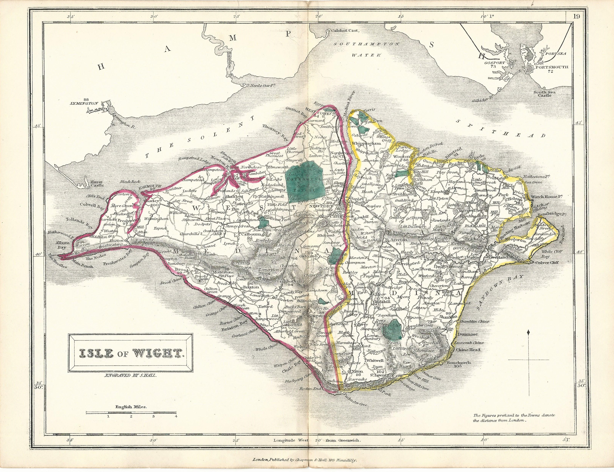

# Bembridge in 1882 — A New Destination for Discerning Visitors

By 1882, the reclaimed land was now well established and rather more commercial improvements to Bembrdge had formed part of the development including the opening of a new sea-front hotel, a pier, and a 9 hole golf course.

## Royal Spithead Hotel

At the end of June, 1882, a new luxury hotel opened, the Royal Spithead Hotel, overlooking the sea and just the shortest of walks from Bembridge railway station, and a new pier.

---

https://www.britishnewspaperarchive.co.uk/viewer/bl/0001485/18820630/076/0014
St James's Gazette
Friday 30 June 1882
p14

HOTELS.

Royal Spithead Hotel, Bembridge, Isle of Wight.

This commodious and beautifully situated Hotel will be OPENED on SATURDAY, July 15th, under the personal management and supervision of Mr. J. W. SCADDAN, formerly of H.M. Navy, and subsequently of the "Lion Hotel," Farningham.

The Royal Spithead Hotel has been erected and furnished with great taste and care, and is replete with every modern convenience. It will be conducted upon thoroughly hospitable principles with efficient service, the best quality of provisions and wines, and moderate charges.

The Royal Spithead Hotel is only twenty minutes from Ryde by railway, and is in direct railway communication with the mainland and all parts of the Isle of Wight.

It is close to the sea, and commands magnificent views of Spithead, Southsea, and the South Downs, of Bembridge, Nunwell, and St. Boniface Downs, and of the beautiful Valley of the Yar. Early application for accommodation is requested to J. W. SCADDAN, Manager, Royal Spithead Hotel, Bembridge, Isle Wight.

---
https://www.britishnewspaperarchive.co.uk/viewer/bl/0000069/18820722/031/0007
Hampshire Telegraph
Saturday 22 July 1882
p7

OPENING OF THE ROYAL SPITHEAD HOTEL AND BRADING HARBOUR RAILWAY.

Any stranger passing through Bembridge on Saturday last could not fail to notice an unwonted air of excitement about this, at one time isolated little village. Flags were flying, a band was playing, and the trains, as they passed up and down the little loop line which runs to Brading, were gaily decorated with evergreens, flowers, flags, &c. The cause of all this was the formal opening of the "Royal Spithead" Hotel, which may be said to be the consummation of a work begun six years ago, commencing with the reclamation of the harbour to the extent of over 700 acres, and the consetruction of a railway, &c., and, finally, the erection of the really splendid hotel at the terminus. The new building is substantially built of stone, and stands upon a little neck of land which at one time formed a sort of bar at the mouth of the harbour. It is surrounded on three sides by the sea, and though there is sufficient space to allow of a very nice lawn, croquet-ground, &c., on opening the garden gate the visitor is able to walk directly on the shingly beach, which is one of the most beautiful in the island. From every room in the hotel, too, there are most extensive views, embracing to the eastward, Spithead and Portsmouth, and the forts, while looking westward the opposite coast gradually fades into a misty cloud, and looking south the eye wanders along the downs or over the valley of the Yar. A more crommauding position it would not be easy to find. The hotel is worthy of its beautiful surroundings, and does credit to the architect, Mr. Theo. R. Saunders, of Ventnor. The exterior, of stone, is relieved by Bath stone and terra cotta dressings and a porch in the Tuscan style, but more attention has been paid to interior comfort than to meretricious exterior adornment. That no expense has been spared will be understood when we state that the building cost 10,000l. There are upwards of 30 rooms, all large, lofty, and beautifully furnished by Maple and Co., of Tottenham Court-road, London. The bedrooms are large and so arranged that they may be used either as a bed or semi-sitting rooms. Messrs. Ingram and Son, of Ventnor, are the builders. Nothing seems wanting, from the basement to the uppermost story, which can conduce to the comfort of the visitor. The management has been placed in the able hands of Mr. F. W. Scadden, who was messman to the Indian troopship Serapis during the voyage of H.R.H. the Prince of Wales to India, and who, at the end of the voyage, received at the hands of His Royal Highness a valuable watch, as a memento of the journey, and as a proof of the satisfaction he had given in the discharge of his duties.

In celebration of the completion of the undertaking and the opening of the hotel, the directors invited a great number of their friends to a grand luncheon at the hotel on Saturday afternoon. For the accommodation of these ladies and gentlemen, a special train was run from London Bridge, connected with a special steamer at Portsmouth Harbour, and bringing the visitors direct over to Bembridge, the entire journey occupying only two hours and 40 minlutes. It is, we understand, the intention of the London, Brighton, and South-Coast Railway Company to open up a direct passenger communication between London and this part of the island, while in the course of a few months an extensive goods traffic will be opened up, steamers running betwveen Hayling Island and Brading Harbour. The necessary wharves and landing stages are now in course of erection, and will he completed in a very short time. After having been shown over the hotel, about 100 visitors sat down to a *recherché* luncheon in the coffee-room, which was served in the most complete manner. The chair was taken by Mr. J. Spencer Balfour, M.P., who was supported by Professor Thorold Rogers, M.P., Mr. W. Borlaso. M.P., Colonel B. Galt, Colonel Malone, Messrs. J. B. Bird, J. H. Freeman, J. Bourne, C.E., Cooke, Baines, A. J. de Pass, S. Wright, J. R. Pattison, F.R.S., G. E. Brock, F. T. Bannister, G. T. Porter, R. Hicks, H. Grose Smith, the Rev. Canon Le Mesurier, J. O. Wilkie, J. W. Hobbs, C. Seymour. S. Walker, G. Wright, R. F. Grantham, Howard Brook, James Walker, C.E., H. G. Sumner. Professor Morris, E. A. Freeman, F. Sumner, J. Roberts, F. Walker, T. H. Saunders (architect), Herr Von Spindler, H. Threadingham, W. H. Wooldridge, G. Hirch, Sam Knight, Lieut. F. W. Price, Captain W.L Clayton, &c., and many ladies.— After the luncheon, the CHAIRMAN proposed the loyal toasts, which were most heartily received, the band of the Ventnor detachment of the Isle of Wight Rifle Volunteers, which attended, playing "God Save the Queen"—Mr. BORLASE, M.P., said he haid a toast to propose which he felt would find a fitting response in the hart of every free Englishmnan, and he did not think there had been a time for many years past when the toast would be received with so much enthusiasm and good feeling as now, when we were engaged in a state of affiars in which our Navy had played so important a part. (Cheers.) `[Presumably a reference to the [bombardment of Alexandria](https://en.wikipedia.org/wiki/Bombardment_of_Alexandria) and the *Anglo-Egyptian War*.]` If it became necessary for us to go further in the work we had commenced, he was sure that we should find that our Army would do its work equally well. There was a lady present whose brother, Mr. Freeman, was at that moment in Alexandria with that little brave force which had just been landed there. (Applause.) After having alluded to the efficiency of the Volunteer Force, the hon. gentleman concluded by expressing the hope that it would be long, before a fleet anchored at Spithead interfered with the earth works at Bembridge. (Applause.)—Col. E. GALT, in responding, said he should feel it an honour had time allowed, under present circumstances, to dilate upon the patriotic feeling which had been evinced by Great Britian during the present complications. He only hoped there would be found a head to properly guide the destinies of this country, for if so he was sure the arm to execute the plans would be found. (Applause.) He desired to thank the gentlemen who had invited him and so many others to this celebration of the completion of a splendid enterprise, and he wished them. success. (Applanse.)—Capt. CLAYTON proposed the "Houses of Parliament," and said that, however much they might. differ upon politics, no one could question the hard work which members of Parliament had to perform. When they heard of members sitting for 24 hours at a stretch he felt sure they must all be grateful to them. (Applause.)—Professor THOROLD ROGERS, M.P., whose name had been coupled with the toast, said that if, ashis gallant friend had pointed out, members of Parliament had to work very hard, he could say that they rested very enjoyably. He knew of nothing more pleasant than such an outing as was afforded them that day, when they could get out of the heated atmosphere of Westminster and come down to that pleasant retreat. (Hear, hear.) He felt it was a very kind action on the part of those who had invited them. Not only might they watch here the forces by which the powers of nature were kept in check, but he saw that visitors here would have an opportunity of noticinag those artificial elements which the enterprise of the manager had brought into being. They could hear the eooing of pigeons (laughter), the clucking of hens, the quacking of ducks (laughter), and could even watch, with a sense of perfect rest, the somewhat vapid lives of the oysters. (Laughter and hear.) Everything combined, in this intensely rural retreat, to relieve the mind and to inspire a feeling of contentment. There was no obstruction but that of the wind and the waves, and he hoped the obstruction which these could offer to the success of this undertaking had been finally overcome. (Laughter and applause.)—Mr. PATTERSON proposed "The Bishops and Clergy and the Ministers of Religion."—The Rev. Canon LE MESURIER responded, and after thanking those present for the hearty manner in which they had received the toast, said that he had watched wvith a great deal of interest the change which this undertaking had produced in the place. Some people had called Bembridge a "one-eyed place," hut he thought time would prove thot they had two eyes, which were now wide open to the benefits which would accrue from the completion of this great enterprise. (Applause.) He complimented the Company upon the good conduct of the men they had employed. He had never seen any cause to regret their coming there, and he believed they had been the means of affording them great benefits. (Loud appluase.)—The CHIAIRMAN said he now came to the toast of the afternoon, "Success to the Brading Harbour Undertaking, including the ' Royal Spithead' Hotel." (Loud applause.) With regard to the latter portion, if they had all been so fortunate as to make, as good a luncheon as he had, they would feel that nothing would be wanting on the part of the management to secure it. (Hear, hear.) He was sure they all wished success to that hotel, and that it would long keep its hospitable doors open, and entertain travellers as pleasantly as it had that day. (Applause.) Without going into details which might be found wearisome, he might state that they had been pursuing this undertaking nearly five years. During that period they had encountered almost every difficulty which could have been foreseen, and many difficulties which, under no circumstances, could have been foreseen, and now they stood safely on a sure foundation, having seen the end of their troubles, and beginning to emerge into a mere stable period. They had cause for thankfulness, not merely that a good Provsidence had aided the undertaking, but for the great kindness which they had received from all their friends in the neighbourhood. At first these works were regarded, not perhaps with hostility, but certainly with some amount of dislike. He remembered on one occasion being over at St. Helens, and talking with a fisherman (a very intelligent man), who had been there many years. He (the Chairman) was dwelling with sanguine hope upon the time when there would be a bank across the harbour, a railway, &c. This fisherman replied, " Ah, it's a long way across the water, sir," and he said it in such a manner as to damp all the hopes he had entertained. However, the bank had been made, and the railway had come. He was told the aboriginal inhabitants had concocted a mild sort of pleasantry. They said they hoped their heads would never ache till the railway came. (Laughter.) He hoped their heads had not ached, and he was sure the railway had cured many other aches which must have been endured before—viz., leg aches. (Laughter and applause.) Coming down from London that morning the elements were very unpropitious, and it rained a great deal, but as he was coming down he thought of the experience they had encountered. Through storm and through sunshine, through every possible kind of vicissitude, tribulation, and trouble, they had struggled on to the attainment of the end of these works, and though he did not wish to boast or say one word of self-congratulation, he had seen no history of man's endeavor undertaken and carried on successfully through more discouragements. At one time he almost lost all hope, and thought the thing would fail, as it had failed in the hands of a greater man (Sir Hugh Middleton) who tried this job, and was supposed by to have succeeded, as they had, when the sea broke in, and all his labour was overthrown. For 200 years engineer after engineer had broached the subject of the reclamation of Brading Harbour, and their were now fortunate enough to see it assured. Their difficulties commenced to pass away and the sun of fortune to shine upon them from the moment their estimable friend Mr. Freeman came to reside there. It was at the hour of darkest night, when all their money seemed destinedto be spent in vain, and all their hopes blasted; at this moment his colleagues and himself thought that, if ever these works were to be carried out, it was necessary to have a master mind, with long experience and intimate knowledge, of these works, and they eventualy came to the conclusion that, if any man could carry these works through, it would be Mr. Freeman. They asked him to como down, and at considerable sacrifices he consented, and the result was what they saw. Therefore, he thought no one had a better right to be coupled with the toast than his dear, long-valued friend, Mr. Freeman. (Applause.)—Mr. FREEMAN, in responding, thanked the Chairman for the compliment he bad been good enough to pay him, but he must say he never would have been able to do what he had if the Chairman and the Company had not so courageously backed him up through thick and thin. (Apolause.) If they had not found the sinews of war so generously no mere resolution on his part would have done anything. (Hear. hear.) The credit they had accorded him might be fairly shared, and now he was thankful to say they had arrived at such a pass that they could sit around that table and fairly congratulate each other on the completion of the work. Tho poet had said:—

Whoever has travelled life's dull round,  
Whatever his fortune may have been.  
Has sighed to think he still has found  
His warmest welcome at an inn."

(Hear, hear.) He was sure they could not be more heartily welcomed than they were at that inn at the present moment. (Hear, hear.)—Mr. FREEMAN then proposed "The health of the Chairman," who had not referred to the part he had taken in carrying out this work. They could have no idea how important was the help he had rendered, and how much he had done to encourage and carry forward the undertaking. (Applause.)—The toast was warmly received. and briefly responded to by theCHAIRMAN.—Mr. BAINES proposed "The Railway Companies," specially mentioning the London, Brighton, and South Coast and the Isle of Wight Railways. He was sure they must all wish success to these railways, knowing what they received from them.—Mr. A. J. DE PASS responded, and pointed out that though it rained when they left London, the sun was now shining brightly. Might that be an omen; might prosperity attend them; and might they carry back pleasant reminiscences of the Isle of Wight.—The pleasant meeting then broke up, owing to the necessity of the majority of those present catching the steamer, which, it was feared, if there was any delay,— would not be able to cross the harbour bar.

---

TEXT

Access was further improved by the announcement of a new steam ship service landing at Bembridge Pier, just the shortest of walks from the Royal Spithead Hotel.


Island Queen at Bembridge Pier

---
https://www.britishnewspaperarchive.co.uk/viewer/bl/0000290/18820914/003/0002
Portsmouth Evening News
Thursday 14 September 1882
p2

New Local Steam Service.—

Owing to the enterprise of some local gentlemen and others connected with the Bembridge Harbour Works Improvement Company, a new and most attractive steam service has just been successfully added to the attractions of tbe Solent, and one, moreover, which opens up some of the loveliest and least known bits of the scenery of the Isle of Wight. The service is at present worked by a new, comfortable, and rapid little vessel, built in Scotland, and appropriately named the Island Queen. She makes trips daily each way, leaving Bembridge Harbour at haif-past eight, half-past one, and a quarter-past four each day, and calling at the Chain Pier, Sea View, the South Parade Pier at East Southsea. the Clarence Esplanade Pier, and Portsmouth Harbour. The charges are exceedingly moderate, return tickets being issued at 9d. and 1s 6d. for respectively second and first-class passages; and as the trip is as novel as it is really enjoyable, the steamer will doubtless become very popular. Yesterday a party consisting of the journalists of Portsmouth, bank managers, and other gentlemen who are interested in the development of the trade and prosperity of Portsmouth and Southsea, went over by invitation of the company and were much struck with the evidence that met their eyes of the enormous sum of money that is now being spent in the improvement of the east end of the island. Leaving out of question the symmetrical pier and other works at and around that beautiful spot, Sea View, we will confine ourselves chiefly to the marvellous transformation which has been wrought at Bembridge the Harbour Works and Improvement Company, under the supervision of Mr. Spencer Balfour, M. P., Mr. Freeman (who, regret to say, breathed his last a few days ago), and Mr. Walker, the very clever resident engineer of the company. Here, where all few months ago was waste of mud and sand and water, are now 700 acres of land reclaimed to the plough, a railway along which runs a well-appointed train to meet the main liae traffic Brading, and which calls at St. Helens en route; an exceedingly commodious and well arranged quay, where most of the cargoes of coal, timber, ami general merchandise for Ryde, Shanklin, Ventnor, and Brading are landed. The works also include the deepening of Bembridge Harbour, and the construction through the reclaimed land of a channel for the river Yar, a stream that drains about a third of the Island. The whole of these great works have been constructed in the most solid and efficient manner and they do infinite credit the engineer, Mr Walter. Close to the pier where the Island Queen lands her passengers, and close also to the new railway station, a commodious and elegantly fitted hotel has been erected and opened under the management Mr. Scadden, whose name as a successful caterer and careful host is so well known in Portsmouth and its neighbouring towns. A golf club has also been formed here, which already numbers fifty members, and no effort will be spared to render Bembridge one of the favourite resorts of the Isle of Wight. An idea of the value of much of the land that has been reclaimed may be formed from the fact that au expert in the employ of the Messrs. Sutton, the well-known seedsmen, estimates that it will require no manure for twenty years. A first crop of oats has just been threshed out with a surprisingly satisfactory result. Some large and well-arranged oyster beds have been established and other portions of the newly-created estate are gigantic beds of such choice vegetables as asparagus and seakale. It will thus be gathered that an exceedingly valuable property is being rapidly created, and people are already beginning to ask themselves how so very promising a field has been permitted to lie fallow for so long, but it seems that an unsuccessful effort to do what has now been accomplished was made two hundred and fifty years ago by Sir Hugh Middleton, who made the New River Waterworks in London. Under his direction a number of Dutch labourers were brought oyer from Holland on the supposition that they would prove to be especially qualified for the work, but they failed, and the failure seems to have deterred others from the undertaking until the successful effort which we now announce. In addition to the railway from Brading to Bembridge a carriage drive 35ft. wide has been constructed between the same points. After viewing the works, which we have attempted thus hastily to describe, and also a pretty acacia avenue for which the place is celebrated, and other points of interest, the party were hospitably entertained by Scadden at the Royal Spithead Hotel, and returned to Portsmouth delighted and impressed by successful effort thus been made to add to theattractiveness of the locality. Full particulars as to the sailing of the Island Queen may be obtained on the Portsmouth side at either of the piers.

---
TEXT



Hall map IW ~1850?


---

https://www.britishnewspaperarchive.co.uk/viewer/bl/0000174/18980921/013/0002

Morning Post

Wednesday 21 September 1898
p2

Sale of Land at Bembridge.

The reclamation of land from the sea has always been more or less an enterprise of a difficult character, though it has frequently proved successful. As far back as 1678 the expanse of Brading Harbour, Isle of Wight, was first reclaimed but the sea twice made inroads through the banks. Later an attempt was made by Sir Hugh Myddleton, but again the force of water proved too much for the barrier which was built to check it. About twenty years ago Jabez Balfour secured the estate and built a strong sea wall, formed a harbour constructed a railway, built gas and waterworks, and erected a fine hotel on the sea front. Since that time , about five hundred and twenty acres of land have been gradually brought under a state of cultivation, and this land, together with a building estate of some twenty-eight acres, was sold by auction by Messrs. Douglas Young and Co. yesterday. Over three hundred persons were conveyed by special train and steamer to Bembridge, and the whole of the lots offered were disposed of, the total sale amounting to £13,890, a result which was apparently considered highly satisfactory by the vendors.

??Jabez Spencer Balfour?
https://www.spectator.co.uk/article/a-very-different-sort-of-balfour

---

TEXT

## The (Royal) Isle of Wight Golf Club


(Golf course opened 1882)
St Helens Duver Golf Links


Back to last search results WILLS CIGARETTE CARD- GOLFING (1924)


The following is found on https://www.islandeye.co.uk/history/historic-parks/the-royal-isle-of-wight-golf-club.html 

> A Short History of The Royal Isle of Wight Golf Club
> Published by the club, circa 1922 - with some small changes for ease of reading. This account is of the early days of the club and formed the main part of a pamphlet which set out its history.
>
> The Royal Isle of Wight Golf Club can be said to have originated at a luncheon party held at the Royal Spithead Hotel in the spring of 1882, when to the assembled company that popular sportsman, Captain Jack Eaton R.N. suddenly proposed: "What was the Duver meant for?"
>
> The party hazarded various suggestions, but Jack Easton would accept none of them crying out himself “It was made on purpose for golf". So across the harbour the party went and had explained to them the intricacies of a game which was at that time unknown in England, save to a few enthusiasts who played at Blackheath, Wimbledon and Westward Ho!
>
> Jack Eaton’s enthusiasm quickly spread to his hearers, and almost before the tour of the Duver was over, they had promised one and all to become members of the new club, which it was decided to call the Isle of Wight Golf Club.
>
> A man of action, this commander of the eastern division of the Isle of Wight Coastguards very soon obtained a lease of the ground from the Brading Harbour Company, and it was not long after the date of the luncheon party that men were set to work under the supervision of experts “with strong Gaelic dialects“ to root up and cut down the gorse bushes, level the ground and transport freshly cut turf from the downs to the projected greens.
> Naturally, the interest of the islanders was evoked in this new and wonderful game, and the preparations being made for the playing of it. Speculation as to the nature of the game ran high, some thinking it would be a sort of new kind of croquet, others that it would reveal itself as a form of dignified hockey with a touch of polo on foot. Both conceptions were about as far from the truth as that of an engineer of a steam yacht at that time in the harbour who "knowed it was worked somehow by steam, ‘cos he heard ‘em a talking’ about the best drive, and where the bunkers were to be."
>
> The list of members slowly but steadily increased, and no inconsiderable gathering of people was present at the opening ceremony. The honour of driving the first ball fell to a Mrs Hambrough, wife of the club’s first captain, Dudley A. Hambrough, and she acquitted herself well in what must have been something of a trying ordeal. In strict truthfulness it must be recorded that at the first match the interest of many spectators was directed not so much at the players as at one of the caddies , who was a very pretty barmaid from the Royal Spithead Hotel.

---

https://www.britishnewspaperarchive.co.uk/viewer/bl/0002446/18820805/228/0020

Field
Saturday 05 August 1882

p20

ISLE WIGHT GOLF CLUB.—

At a meeting held at the Marine Hotel, Ventnor, on July 31, a golf club was formed for the island, to be called the Isle of Wight Golf Club. The club have secured an excellent ground at St. Helens, where a beautiful course of nine holes will be made. The course will he very spirting, and similar in nature to Hoylake, North Berwick, &c. It is situated close to Bembridge, where a first-rate hotel has recently opened. The scenery in the neighbourhood is romantic in the extreme, commanding extensive views of the sea. Spithead, &c. It is hoped to arrange an opening day at an early date, of which due notice will be given. The hon. sec.. Mr J. S. Eaton, Mountheld, Bonchurch, Isle of Wight, will be glad to forward all requisite information.

---
https://www.britishnewspaperarchive.co.uk/viewer/bl/0002446/18820916/240/0038

Field
Saturday 16 September 1882
p38

ISLE OF WIGHT GOLF CLUB.

THIS club was formally opened for play in the Dover, at St. Helens, on Monday, the 11th inst. A considerable number of the members and their friends lunched at the Royal Spithead Hotel at Bembridge, where an excellent repast was prepared by the manager. The hon. sec. (Commander Eaton, R.N.) made an interesting statement of the origin and ries of the club up to the present time, showing that since its formation on July 31 its members had increased to fifty, and hardly a day passes without bringing new and important additions to their number. An excellent professional (Mr James Beveridge, late of North Berwick) has been appointed, and has taken up his quarters on the ground. Through the extreme liberality of one of the patrons (Mr C. Tottenham). who has also become a life member, a beautiful gold medal by Meseta Phillips Brothers and Son, of Cockspur—street, has been designed, to be called "The Tottenham Medal." This medal and other prizes will be competed for at the autumn meeting. appointed to be held on Thursday, Oct. 28; and it is hoped that on that day most of the leading golf clubs will be represented on this charming ground.

After luncheon a numerous gathering proceeded to the golf grounds, where Mrs D. A. Hambrough, the gifted wife of the captain, performed the ceremony of opening by gracefully driving a gilded ball, and, amidst the cheers of the assembled multitude, declared the club opened. After this Capt. Eaton played a round of the green against James Beveridge, the professional, a large number of ladies and gentlemen following with much interest a game almost entirely new in the isle. In this round the gallant captain was defeated by three holes. Afterwards some fifty ladies and gentlemen dined together at the Spithead Hotel, and spent a most enjoyable evening.

---

https://www.britishnewspaperarchive.co.uk/viewer/bl/0002941/18820920/041/0004

Hampshire Independent
Wednesday 20 September 1882
p4

THE HAMPSHIRE INDEPENDENT, WEDNESDAY. SEPTEMBER 20, 1882.

BEMBRIDGE.

ISLE OF WIGHT GOLF CLUB— we learn from the *Field*, was formally opened for play in the Dover, at St. Helens', on Monday, the 11th inst. A considerable number of the members and their friends lunched at the Royal Spithead Hotel at Bembridge, where an excellent repast was prepared by the manager. The hon. sec. (Commander Eaton, R.N.) made an interesting statement of the origin and rise of the club up to the present time, showing that since its formation on July 31st its members had increased to fifty, and hardly a day passes without bringing new and important additions to their number. An excellent professional (Mr. James Beveridge, late of North Berwick) has been appointed, and has taken up his quarters on the ground. Through the extreme liberality of one of the patrons (Mr. C. Tottenham), who has also become a life member, a beautiful gold medal by Messrs. Phillips Brothers and Son, of Cockspur-street, has been designed, to be called "The Tottenham Medal." This medal and other prizes will be competed for at the autumn meeting, and it is hoped most of the leading golf clubs will be represented on this charming ground. After luncheon a numerous gathering proceeded to the golf grounds, wnere Mrs. D. A. Hambrough, the gifted wife of the captain, performed the ceremony of opening by gracefully driving a gilded ball, and, amidst the cheers of the assembled multitude, declared the club opened. After this Capt. Eaton played a round of the green against James Beveridge, the professional, a large number of ladies and gentlemen following with much interest a game almost entirely new in the Isle. In this round the gallant captain was defeated by three holes. Afterwards some fifty ladies and gentlemen dined together at the Spithead Hotel, and spent a most enjoyable evening.

---
https://www.britishnewspaperarchive.co.uk/viewer/bl/0000170/18821104/016/0006

Isle of Wight Observer
Saturday 04 November 1882

p6

BEMBRIDGE. The Isle of "Wight Golf Club. —

This club, which has been estalished in connection with the Royal Spithead Hotel here, held its first autumn meeting on Thursday. Unfortunately the weather was totally against good scoring. Eight couples started to compete for the prizes, consisting of a gold medal, presented by Mr C. Tottenham ; a claret jug, presented by Mrs Henley Grose Smith ; and a set of gold clubs and one dozen balls presented by the club. On examining the cards it was found there was a tie between Captain Corse Scott and Mr R. B. Molesworth at 95 strokes for the Tottenham gold medal, and, on playing off the tie, Mr Molesworth won, doing the round in 88 strokes. Captain C. Scott, with a gross score of 95, reduced by an allowance of 8 to 87, carried off Mrs H. Grose Smith's much coveted prize. The set of clubs was won by Captain Eaton, R.N., with a score of 99 reduced by an allowance of 2 to 97, and the prize of golf balls was won by Mr A. J. Duncan, with a score of 111, reduced by an allowance of 26 to 115, The scores were :

| |Score.| Handicap. | Net.|
|===|===|===|===|
| R. B. Molesworth, Esq | 95 | scratch | 95 |
| Captain C. Scott | 95 | 8 | 95 |
| Captain J. S. Eaton | 99 | 2 | 97 |
| A. J.  Duncan, Esq | 141 | 26 | 115 |
| R. W. E. Crant, Esq | 155 | 26 | 129 |
| M. Tabateau, Esq | 157 | 45 | 121 |
| G Le Marchant. Esq | 176 |35|151 |

Remainder no return.

Subsequently to the meeting a dinner took place at the Royal Spithead Hotel. The chair was taken by- Mr C. Tottenham, the vice-chair by Captain Eaton, and the company present includ-d Mr Marriott, Mr Molesworth, Captain Scott, Mr Duncan, Mr D. Watkins, Mr Richards, Mr Grant, Colonel Morton, the Rev J. N. Palmer, Mr Tab iteau, Mr Sumner, Mr Walker, Captain Clayton, Mr Gaspard Le Marchant, and 1 1 ltdies.

---

https://www.britishnewspaperarchive.co.uk/viewer/bl/0000170/18821111/014/0006

Isle of Wight Observer
Saturday 11 November 1882
p6

BEMBRIDGE.

To the Editor of the Isle of Wight Observer.
Sir, — I observe in your issue of last Saturday, in reference to the Isle of Wight Golf Club, that it is stated that the club is in connection with the Royal Spithead Hotel, Bembridge. As this is in no way the case, I shall be much obliged by your correcting the statement in your next issue. The Golf Club merely holds its dinners, &c, there, and of course it is the natural place for members from a distance to stay at when visiting the Island for golf. Yours faithfully, J. P. EATON, Hon. Sec. November 6th, 1882.

---
https://www.britishnewspaperarchive.co.uk/viewer/bl/0000290/18830814/008/0002

Portsmouth Evening News
Tuesday 14 August 1883

p2

ISLE OF WIGHT. BEMBRIDGE.

—His Royal Highness the Prince of Wales has consented to become Patron, while His Serene Highness Prince Edward of Saxe-Weimar has agreed to become President of the Isle of Wight Golf Club at Bembridge.

[TH: then became known as the Royal Isle of Wight Golf Club]

---
https://www.britishnewspaperarchive.co.uk/viewer/bl/0000170/18830825/013/0005

Isle of Wight Observer
Saturday 25 August 1883
p5

ST. HELEN'S. Royal Isle of Wight Golf Club.

— H.R.H. the Prince of Wales has graciously consented to become the patron of this club, and H.S.H. Prince Edward of Saxe-Weimar has been pleased to accept the presidency. The distinguished honour thus conferred upon the club comes most opportunely when we are celebrating the anniversary of its creation. On July 31st of last year the club was formed, on September llth the club was opened for play, and up to the present time over 120 members have been elected. The ground steadily improves under the able direction of J. Beveridge, the custodian, and his brother Daniel, who are at the same time second to none in the art of club making. His Royal Highness' s early departure from the Island has precluded the possibility of a visit to Bembridge, but it is hoped that at no distant date the club may be honourod by a visit, when Their Royal and Serene Highnesses will receive a true golfer's welcome.

---

TEXT

```{admonition} RULES FOR THE GAME OF GOLF, 1886

http://ruleshistory.com/rules1886.html

12 MARCH 1886.
RULES FOR THE GAME OF GOLF
THE ROYAL ISLE OF WIGHT GOLF CLUB

[Commentary: An early attempt at a universal rules code ("...shall suit all greens alike.") from the now defunct Royal Isle of Wight Golf Club.
A remarkable document; well laid out, well written and more comprehensive than any other code of the time.
This code introduced definitions, out of bounds, hole size (albeit at 4 inches) and other concepts later incorporated in the R&A codes.]

```

https://www.islandeye.co.uk/history/historic-parks/the-royal-isle-of-wight-golf-club.html
The Royal Isle of Wight Golf Club can be said to have originated at a luncheon party held at the Royal Spithead Hotel in the spring of 1882, when to the assembled company that popular sportsman, Captain Jack Eaton R.N. suddenly proposed: “What was the Duver meant for?”
The party hazarded various suggestions, but Jack Easton would accept none of them crying out himself “It was made on purpose for golf". So across the harbour the party went and had explained to them the intricacies of a game which was at that time unknown in England, save to a few enthusiasts who played at Blackheath, Wimbledon and Westward Ho!
Jack Eaton’s enthusiasm quickly spread to his hearers, and almost before the tour of the Duver was over, they had promised one and all to become members of the new club, which it was decided to call the Isle of Wight Golf Club.
A man of action, this commander of the eastern division of the Isle of Wight Coastguards very soon obtained a lease of the ground from the Brading Harbour Company, and it was not long after the date of the luncheon party that men were set to work under the supervision of experts “with strong Gaelic dialects“ to root up and cut down the gorse bushes, level the ground and transport freshly cut turf from the downs to the projected greens.
Naturally, the interest of the islanders was evoked in this new and wonderful game, and the preparations being made for the playing of it. Speculation as to the nature of the game ran high, some thinking it would be a sort of new kind of croquet, others that it would reveal itself as a form of dignified hockey with a touch of polo on foot. Both conceptions were about as far from the truth as that of an engineer of a steam yacht at that time in the harbour who “knowed it was worked somehow by steam, ‘cos he heard ‘em a talking’ about the best drive, and where the bunkers were to be.”
The list of members slowly but steadily increased, and no inconsiderable gathering of people was present at the opening ceremony. The honour of driving the first ball fell to a Mrs Hambrough, wife of the club’s first captain, Dudley A. Hambrough, and she acquitted herself well in what must have been something of a trying ordeal. In strict truthfulness it must be recorded that at the first match the interest of many spectators was directed not so much at the players as at one of the caddies , who was a very pretty barmaid from the Royal Spithead Hotel.
These were but interludes in the development of the club, which each month added to its membership and on September 18th 1883 a letter was received from the Secretary of State intimating he had “had the honour to submit to the Queen you (the Secretary’s) request that the Isle of Wight Golf Club may be permitted to assume the title of ‘Royal ‘and that Her Majesty has been graciously please to accede to your request and to command that the Club be styled the ‘Royal Isle of Wight Golf Club’.”
With the bestowal of this royal patronage, the reputation of the club was still further enhanced and so many more members enrolled, that a special private room at the hotel had to be reserved for their special use. It may be remarked that this patronage has been extended by the royal family until the present day. The late King Edward was patron of the club until his death and our present King has been patron since his ascension in 1910. H.R.H. Prince Henry of Battenburg was captain for the years 1894-1895, and his two sons, Prince Leopold and Prince Maurice, are both Hon. Members at the present time.
The yearly crowdings at the two hotels resulted in the roof of the Royal Spithead Hotel being raised and another storey added, and this accommodation was further supplemented by a new private room which was built at a later date for the club members.
The plan shows how well and naturally the holes are laid out, giving a good length (2891 yards) width, and variety of holes, on such a relatively small area of ground. In fact it is doubtful if there is to be found anywhere, nine more attractive and varied holes in such a small compass; and yet despite its size, it will be found in playing (with a bogey of 37) to be a most enjoyable and difficult test of golf.
The natural hazards are sand dunes and hillocks, gorse, sea boundaries, and a public road, which round diagonally across the links, coming into prominence at 4 holes 1, 5, 6 and 9, and in a minor ways at the 8th, off a poorly played shot.
The three long holes, 1st, 8th and 9th are good three shot ones, in anything but calm, dry weather! The 3rd and 4th and 6th are superlative “fours” and would be hard to beat by comparison anywhere. The 2nd, 5th and 7th are very good and varied one shot holes, and of different length and difficulty and the 7th being a particularly clever punchbowl shot. Altogether the course is one of the most interesting nine hole in existence, and is full of character and individuality throughout, with the possible exception of the 5th, which is perhaps rather insipid and weak, but necessary, to keep up the proper sequence of play. This hole however together with the 6th are the only two remaining holes of the original course, as laid in 1892. That is to say they have been in constant play with little alterations for 47 years. 
The links and clubhouse are situated on The Duver, St Helens, Isle of Wight, 4 minutes by ferry boat to Bembridge Station, Southern Railway, 10 minutes to St Helen’s Station via the Mill Pond Walk and Harbour Yards; 20 minutes by a good “bus service to Ryde and Sea View from St Helen’s Village.
https://www.islandeye.co.uk/history/historic-parks/royal-isle-of-wight-ladies-golf-course-and-pavillion.html
The ladies course had 18 short holes with natural bunkers. The pavillion acted as the clubhouse as well. Gentlemen were allowed to play the course, so long as they were accompanied by a lady.

https://www.wightpedia.org.uk/detail2.php?id=royal-spithead-hotel-bembridge
The Spithead Hotel opened in 1882. In the same year the railway was extended to Bembridge, (the station was on the opposite side of the road) and with a new pier for steamers, the hotel was well positioned for visitors.q
Royal patronage was granted to the hotel in the following year, 1883
The Royal Isle of Wight Golf Club, on the sand dunes across the harbour, was established by visitors to the hotel, the hotel was also popular with visitors to nearby Bembridge Sailing Club.
The hotel was demolished in 1989 and the site redeveloped.
