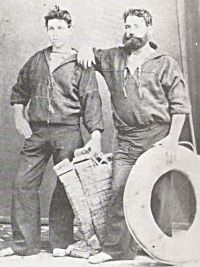
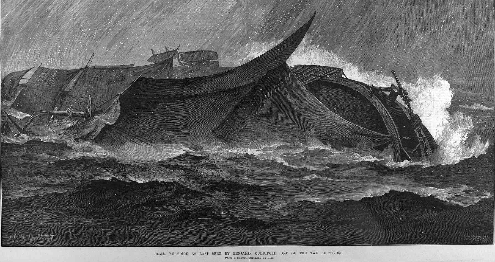
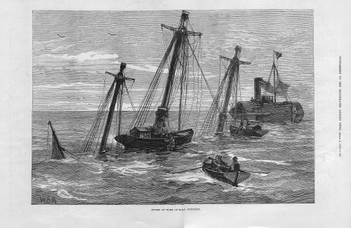

IMAGES

https://www.bonhams.com/auction/27248/lot/13/a-model-of-the-frigate-hms-eurydice-40in-x-195in-x-315in-102cm-x-50cm-x-80cm/

Bonhams Auctioneers
A Model of the Frigate HMS 'Eurydice', English,
40in x 19.5in x 31.5in (102cm x 50cm x 80cm)
THE MARINE SALE
27 April 2022, 14:00 BST
London, Knightsbridge
£800 - £1,200

A Model of the Frigate HMS 'Eurydice', English,
the hull of carved and hollowed timber painted black to the waterline, a white port-line pierced for brass cannon, and copper below, with wooden spars and accurate running and standing rigging, the model mounted on crutches in a glazed display case,
40in x 19.5in x 31.5in (102cm x 50cm x 80cm)
Footnotes
The 26-gun, three-masted HMS 'Eurydice' launched on 16 May 1843, sailing the North American and West Indies station on its original commission. The vessel was recommissioned three further times in 1846, 1854, and 1877, eventually as a training ship. On 24 March 1878, strong winds off the Isle of Wight led to a foundering which saw all but two of the crew perish.

The present model faithfully recreates the timber deck with inscribed plank lines, and detailed fittings including anchor & cables, bitts, ship's boats on chocks, capstan, gratings, companionway, wheel, binnacle, and hammocks in place in the nettings.

https://www.britishnewspaperarchive.co.uk/viewer/bl/0003142/19270409/028/0002

Title: HMS EURYDICE British Frigate, 1843
Caption: Capsizing off the Isle of Wight, 27 March 1878, while on training duty. Only two of her crew were saved.
Description:
Catalog #: NH 61070
Copyright Owner: Naval History and Heritage Command
Original Creator:
Original Date: Wed, Mar 27, 1878
After this Year: 1870
Before this Year: 1879
Original Medium: BW Photo
- https://www.history.navy.mil/our-collections/photography/numerical-list-of-images/nhhc-series/nh-series/NH-61000/NH-61070.html

Title: HMS EURYDICE British Frigate, 1843
Caption: Capsizing off the Isle of Wight, 27 March 1878, while on training duty. Only two of her crew were saved.
Description:
Catalog #: NH 61069
Copyright Owner: Naval History and Heritage Command
Original Creator:
Original Date: Wed, Mar 27, 1878
After this Year: 1870
Before this Year: 1879
Original Medium: BW Photo
- https://www.history.navy.mil/our-collections/photography/numerical-list-of-images/nhhc-series/nh-series/NH-61000/NH-61069.html

https://www.history.navy.mil/our-collections/photography/numerical-list-of-images/nhhc-series/nh-series/NH-61000/NH-61068.html
Title: HMS EURYDICE British Frigate, 1843
Caption: HMS EURYDICE British Frigate, 1843.
Description:
Catalog #: NH 61068
Copyright Owner: Naval History and Heritage Command
Original Creator:
After this Year:
Before this Year:
Original Medium: BW Photo

- https://w.iln.org.uk/iln_years/year/1878.htm

HMS Eurydice at St Lucia before her last voyage home, 1878 1878
Albumen print | 14.5 x 21.5 cm (image) | RCIN 2580515
Photograph of sailing ship surrounded by small boats, off St Lucia; tree covered cliffs
Provenance
Album compiled by the Reverend J N Dalton (1839-1931) and presented to King George V
https://www.rct.uk/collection/2580515/hms-eurydice-at-st-lucia-before-her-last-voyage-home-1878

HENRY ROBINS (1820-92)
The Wreck of the "Eurydice" Signed and dated 1878
Oil on canvas | 60.2 x 123.1 cm (support, canvas/panel/str external) | RCIN 406265
HMS Eurydice was a training ship for ordinary seamen which had sunk in a sudden squall on 24 March 1878. There were more than 300 men on board but only two survivors. She was brought into Sandown bay on the Isle of Wight, but an easterly gale caused her further damage and by 9 August, when this picture was painted, she was being pumped out in preparation for being moved to Portsmouth Harbour.
In the painting the vessel is in Sandown Bay under Culver Cliff, with spectators and a photographer on the beach. There are other small craft, including steam tugs and the 'Rinaldo', which had helped to raise the sunken ship. The picture was apparently painted in less than 40 hours by Robins 'an artillery sergeant who paints naval subjects exceedingly well. He is self taught', according to Queen Victoria's notes in her Journal. The Queen had driven over with other members of her family to see the wreck.
Signed and dated: H. Robins / Augt 9th 1878.
Provenance
Painted for Queen Victoria (See also QV Journal, 22 August 1878)
https://www.rct.uk/collection/406265/the-wreck-of-the-eurydice

---

Via https://w.iln.org.uk/iln_years/year/1878.htm

---

The Graphic

https://www.britishnewspaperarchive.co.uk/viewer/BL/0000057/18780330/024/0019?browse=true

https://www.britishnewspaperarchive.co.uk/viewer/bl/9000057/18780406/029/0012

https://www.britishnewspaperarchive.co.uk/viewer/BL/9000057/18780914/014/0006?browse=true

---

Illustrated London News
https://w.iln.org.uk/iln_years/year/images/1878/euridyce/1878%20loss%20of%20euridyce%20aug%2017%20004.jpg

http://supercurioso.com/wp-content/uploads/2015/10/P.1986.44-Copy.jpg

Winston Churchill, who was four at the time, was at Ventnor on the Isle of Wight and he witnessed the tragedy. It obviously made a lasting impression on him, as he recounted fifty-two years later in his memoir “My Early Life”:
“One day when we were out on the cliffs near Ventnor, we saw a great splendid ship with all her sails set, passing the shore only a mile or two away… Then all of a sudden there were black clouds and wind and the first drops of a storm, and we just scrambled home without getting wet through. The next time I went out on those cliffs there was no splendid ship in full sail, but three black masts were pointed out to me, sticking up out of the water in a stark way... The divers went down to bring up the corpses. I was told and it made a scar on my mind that some of the divers had fainted with terror at seeing the fish eating the bodies... I seem to have seen some of these corpses towed very slowly by boats one sunny day. There were many people on the cliffs to watch, and we all took off our hats in sorrow.”
The poet Gerald Manley Hopkins was sufficiently moved by the tragedy to write very powerfully on “The Loss of the Eurydice”. Space precludes copying his poem in full here but the following verses are especially memorable:
They say who saw one sea-corpse cold     
He was all of lovely manly mould,
    Every inch a tar,                       
Of the best we boast our sailors are.          
Look, foot to forelock, how all things suit! he         
Is strung by duty, is strained to beauty,    
    And brown-as-dawning-skinned              
With brine and shine and whirling wind.           
O his nimble finger, his gnarled grip!          
Leagues, leagues of seamanship  
    Slumber in these forsaken          
Bones, this sinew, and will not waken.
http://dawlishchronicles.blogspot.com/2014/07/training-tragedies-losses-of-hms.html

The Raising of HMS Eurydice
Painted originally by: Richard Henry Nibbs, National Museum of the Royal Navy

H.M.S. Eurydice salvage operation off the coast of the Isle of Wight in 1878. Original page from ‘The Illustrated London News’ of Royal Navy divers engaged in the raising of the vessel. Dated Apri 6th. 1878. Excellent condition. Paper size 15.75 x 10 inches.
https://www.mapsandantiqueprints.com/shop/antique-prints/h-m-s-eurydice-salvaged/

Wreck of HMS Eurydice
1878
R. Cadogan-Rothery
Carisbrooke Castle Museum

Photo credit: Portsmouth Museums and Visitor Services
https://artuk.org/discover/artworks/wreck-of-hms-eurydice-towed-into-portsmouth-harbour-1-september-1878-24881

Inboard profile plan for HMS 'Eurydice' (1843)
https://prints.rmg.co.uk/collections/ship-plans/products/inboard-profile-plan-for-hms-eurydice-1843-j6247

https://www.britishnewspaperarchive.co.uk/viewer/bl/0001702/18780323/078/0008 Shipping and Mercantile Gazette - Saturday 23 March 1878 - weather chart

https://www.britishnewspaperarchive.co.uk/viewer/BL/0000057/18780330/027/0021?browse=true Weather chart for week March 21st - March 27th (inclusive) Graphic - Saturday 30 March 1878

![The Graphic -  THE EURYDICE MEMORIAL AT HASLAR It will be remembered that the bodies of the unfortunate officers and seamen which were recovered from the wreck of the Eurydice were laid to rest in Haslar Cemetery, near Gosport, each grave being marked with a simple headstone. A more imposing memorial, as represented in our engraving, has now been erected on the spot. It was designed by Colonel Parley, R.E., C.B., and erected by Mr. Carruthers, the Assistant Civil Engineer for Gosport, and Messrs. Bramble, the contractors for the work. The base, of bright granite, bears upon its sloping ledge the 316 names of those who went down with the" ill-fated vessel on Sunday, March 24th, 1878, and above this is a moulding of Portland stone, each side of which contains an appropriate quotation from Scripture. This again is surmounted by a huge rocky superstructure, on the summit of which is the real anchor, shackle, and part of the ship's cable which was recovered from the scene of the disaster. The measurement at the base is 23 feet by 17 feet, and the height is 10 feet. Our engraving is from a photograph by G. West and Son, Gosport, copies of which have been purchased by Her Majesty the Queen.  - Saturday 19 November 1881, p11](../images/BL_9000057_18811119_027_0011.png)
https://www.britishnewspaperarchive.co.uk/viewer/bl/9000057/18811119/027/0011

https://www.britishnewspaperarchive.co.uk/viewer/bl/9000057/18800710/046/0021

---
