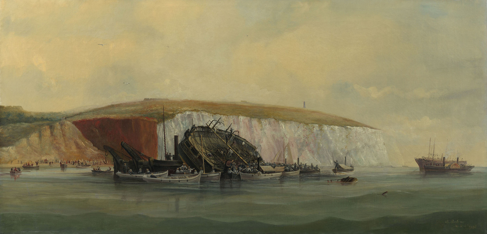

IMAGES

Title: HMS EURYDICE British Frigate, 1843
Caption: Capsizing off the Isle of Wight, 27 March 1878, while on training duty. Only two of her crew were saved.
Description:
Catalog #: NH 61070
Copyright Owner: Naval History and Heritage Command
Original Creator:
Original Date: Wed, Mar 27, 1878
After this Year: 1870
Before this Year: 1879
Original Medium: BW Photo
- https://www.history.navy.mil/our-collections/photography/numerical-list-of-images/nhhc-series/nh-series/NH-61000/NH-61070.html

Title: HMS EURYDICE British Frigate, 1843
Caption: Capsizing off the Isle of Wight, 27 March 1878, while on training duty. Only two of her crew were saved.
Description:
Catalog #: NH 61069
Copyright Owner: Naval History and Heritage Command
Original Creator:
Original Date: Wed, Mar 27, 1878
After this Year: 1870
Before this Year: 1879
Original Medium: BW Photo
- https://www.history.navy.mil/our-collections/photography/numerical-list-of-images/nhhc-series/nh-series/NH-61000/NH-61069.html

https://www.history.navy.mil/our-collections/photography/numerical-list-of-images/nhhc-series/nh-series/NH-61000/NH-61068.html
Title: HMS EURYDICE British Frigate, 1843
Caption: HMS EURYDICE British Frigate, 1843.
Description:
Catalog #: NH 61068
Copyright Owner: Naval History and Heritage Command
Original Creator:
After this Year:
Before this Year:
Original Medium: BW Photo

- https://w.iln.org.uk/iln_years/year/1878.htm

HMS Eurydice at St Lucia before her last voyage home, 1878 1878
Albumen print | 14.5 x 21.5 cm (image) | RCIN 2580515
Photograph of sailing ship surrounded by small boats, off St Lucia; tree covered cliffs
Provenance
Album compiled by the Reverend J N Dalton (1839-1931) and presented to King George V
https://www.rct.uk/collection/2580515/hms-eurydice-at-st-lucia-before-her-last-voyage-home-1878

HENRY ROBINS (1820-92)
The Wreck of the "Eurydice" Signed and dated 1878
Oil on canvas | 60.2 x 123.1 cm (support, canvas/panel/str external) | RCIN 406265
HMS Eurydice was a training ship for ordinary seamen which had sunk in a sudden squall on 24 March 1878. There were more than 300 men on board but only two survivors. She was brought into Sandown bay on the Isle of Wight, but an easterly gale caused her further damage and by 9 August, when this picture was painted, she was being pumped out in preparation for being moved to Portsmouth Harbour.
In the painting the vessel is in Sandown Bay under Culver Cliff, with spectators and a photographer on the beach. There are other small craft, including steam tugs and the 'Rinaldo', which had helped to raise the sunken ship. The picture was apparently painted in less than 40 hours by Robins 'an artillery sergeant who paints naval subjects exceedingly well. He is self taught', according to Queen Victoria's notes in her Journal. The Queen had driven over with other members of her family to see the wreck.
Signed and dated: H. Robins / Augt 9th 1878.
Provenance
Painted for Queen Victoria (See also QV Journal, 22 August 1878)
https://www.rct.uk/collection/406265/the-wreck-of-the-eurydice

Illustrated London News
https://w.iln.org.uk/iln_years/year/images/1878/euridyce/1878%20loss%20of%20euridyce%20aug%2017%20004.jpg

http://supercurioso.com/wp-content/uploads/2015/10/P.1986.44-Copy.jpg

Winston Churchill, who was four at the time, was at Ventnor on the Isle of Wight and he witnessed the tragedy. It obviously made a lasting impression on him, as he recounted fifty-two years later in his memoir “My Early Life”:
“One day when we were out on the cliffs near Ventnor, we saw a great splendid ship with all her sails set, passing the shore only a mile or two away… Then all of a sudden there were black clouds and wind and the first drops of a storm, and we just scrambled home without getting wet through. The next time I went out on those cliffs there was no splendid ship in full sail, but three black masts were pointed out to me, sticking up out of the water in a stark way... The divers went down to bring up the corpses. I was told and it made a scar on my mind that some of the divers had fainted with terror at seeing the fish eating the bodies... I seem to have seen some of these corpses towed very slowly by boats one sunny day. There were many people on the cliffs to watch, and we all took off our hats in sorrow.”
The poet Gerald Manley Hopkins was sufficiently moved by the tragedy to write very powerfully on “The Loss of the Eurydice”. Space precludes copying his poem in full here but the following verses are especially memorable:
They say who saw one sea-corpse cold     
He was all of lovely manly mould,
    Every inch a tar,                       
Of the best we boast our sailors are.          
Look, foot to forelock, how all things suit! he         
Is strung by duty, is strained to beauty,    
    And brown-as-dawning-skinned              
With brine and shine and whirling wind.           
O his nimble finger, his gnarled grip!          
Leagues, leagues of seamanship  
    Slumber in these forsaken          
Bones, this sinew, and will not waken.
http://dawlishchronicles.blogspot.com/2014/07/training-tragedies-losses-of-hms.html

Eurydice - images The Graphics https://www.britishnewspaperarchive.co.uk/viewer/BL/0000057/18780330/024/0019?browse=true

Inboard profile plan for HMS 'Eurydice' (1843)
https://prints.rmg.co.uk/collections/ship-plans/products/inboard-profile-plan-for-hms-eurydice-1843-j6247

https://www.britishnewspaperarchive.co.uk/viewer/bl/0001702/18780323/078/0008 Shipping and Mercantile Gazette - Saturday 23 March 1878 - weather chart

https://www.britishnewspaperarchive.co.uk/viewer/BL/0000057/18780330/027/0021?browse=true Weather chart for week March 21st - March 27th (inclusive) Graphic - Saturday 30 March 1878

---
