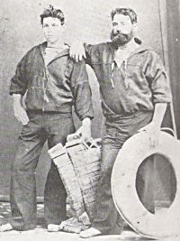
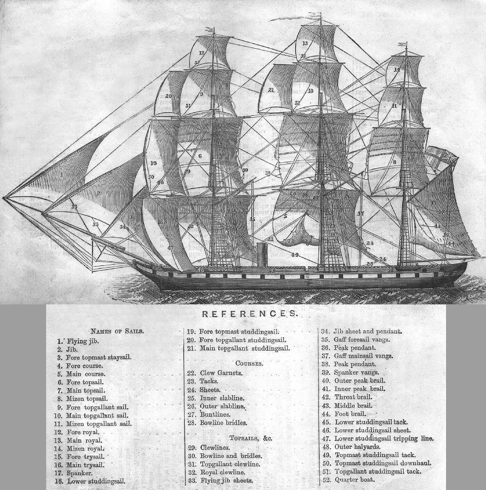
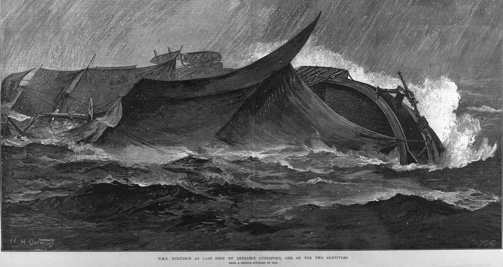

# The First Inquest

The first inquest surrounding the tragedy was held in Ventnor on Tuesday, March 26th, 1878, for the three deceased sailors returned by the Emma, Lieutenant Francis Hope Tabor and Captain Louis Ferrier, R.E., who both died on board the Emma, and David Bennett, ordinary seaman, who was already dead when his body was retrieved from the sea.

Originally planned to be held in the Queen's Hotel, the Coroner asked if a larger room was available. The Freemasons Tavern was suggested as an alternative but eventually a large room in the Royal Hotel was offered for use by the Coroner.

The aim of the inquest was two-fold: to identify the bodies, and to ascertain how the deaths had occurred. The key witnesses were the two survivors, Benjamin Cuddiford and Sydney Fletcher, and W. L. Jenkin, master the schooner "Emma" of Padstow.


The two survivors

```{admonition} Benjamin Cuddiford
:class: dropdown

Able seaman, 21 years in the navy.

Strong Swimmer.

```

In an earlier statement, Benjamin Cuddiford, who originally tried to save several of his shipmates, revealed he had been forced to push off four others who had clung to him in order to save his own life, although this remark was not repeated in the direct testimony or verbatim report of the inquest proceedings. Having been in the hour for an hour and twenty minutes, he then saw a boat from the schooner, Emma, and a rope was thrown to him. On being rescued, he was overcome by dizziness.

```{admonition} Sydney Fletcher
:class: dropdown

Just turned 19 years of age.
First-class ordinary seaman.

```

Once on board the Emma, coffee was provided to the two survivors, although no other stimulants (eg whisky or brandy) were available. Jenkin deposed that *"[t]hose who died were too far gone to take it if they could have had it"*.

As and when other bodies were discovered and landed, additional coroners' courts were held, as required, in the appropriate jurisdiction.

To help understand the commentary provided by the two survivors, the following drawing shows how to identify the various parts of a similar vessel.


Example of sail names for a three masted sailing ship

With the ship being a training ship, it was initially assumed that the majority of the men, officers aside, would be unmarried. Along with the crew and several men making passage back to England from service overseas, several prisoners had also been aboard, one of whom was believed to have been held in chains.

This first report includes the statement Cuddiford made to the Admiralty authorities, as well as a direct report of the inquest.

----

https://www.britishnewspaperarchive.co.uk/viewer/bl/0002100/18780328/107/0005

Isle of Wight Times

Thursday 28 March 1878

p5

OFF THE ISLE OF WIGHT. 300 OR 400 LIVES LOST.

Her Majesty's training ship Eurydice, returning from a cruise to the West Indies with a crew of young seamen, capsized on Sunday afternoon, about four o'clock, during a heavy snowstorm, and sudden and tremendously heavy squall, about five miles off Dunnose. A schooner picked up five of the crew, but two soon died, and another— Tabor, the first lieutenant, soon followed. The remainder of the officers and crew, said to be between and 300 and 400 in all, were drowned. Dunnose is a headland near the centre of the south-east coast of the Isle of Wight, between Shanklin and Sandown. The two men saved are Benjamin Cuddeford. first-class seaman, of Plymouth, and Sydney Fletcher, a first-class boy, of Bristol, aged 19. Cuddeford was among the last on the ship. Captain Marcus Hare, he says, was near him when the ship went down, sucking many with her. A man near him said a vessel was close by when the squall came up, and, therefore, they would be sure to be picked up. He was over an hour in the water. Being a first-rate swimmer everyone called to him for help. He tried to assist two or three, but at last four clung to him, and he was obliged to kick them off. He was well taken care of by the master of the schooner and the crew. The ship left Bermuda three weeks ago. She passed the Lizard on Sunday, and expected to anchor at Spithead about five o'clock. These two men were well provided for at the Cottage Hospital. Bonchurch, and placed under the care of Dr. Williamson, of Ventnor.

The Eurydice, a sailing vessel of 921 tons burden, was commissioned in Portsmouth in 1877, as a training ship for second-class ordinary seamen, and sent to the Barbadoes station. Most of the unfortunate young men are believed to belong to Portsmouth. Two tugs were sent from Portsmouth as soon as the sad news reached Admiral Fanshawe.

The circumstances are similar in many respects to those attending the loss of the Captain, both ships having turned over and sunk during a gale of wind, all their sail being at the time set. So far as can be ascertained the Eurydice had 368 souls on board at the time, though this is very much a matter of conjecture, as, besides her own officers and crew, she was bringing home a number of military officers, supernumeraries, and invalids from the West Indies. Hence considerable uncertainty exists as to the names and numbers of the sufferers. The Eurydice was a wooden sailing, fully-rigged ship of 921 tons displarsimeat, and was at one time considered one the smartest and quickest 26 gun frigates in the service. She was built about 1843. Last year she was converted into a training ship for ordinary seamen at Mr. John White's yard at Cowes, and was completed for sea at Portsmouth Dockyard. She was commissioned on the 7th of February, 1877, and finally sailed from Portsmouth on the 13th of November with a crew of about 300 ordinary seamen and the officers named below. All the officers and crew are lost, with the exception of two seamen. Captain Hare had been at one time commander of the St. Vincent, training-ship at Portsmouth, and was selected for the command from his knowledge and experience of young seamen. Lieutenant Tabor was a thoroughly efficient sailor, having had command of the Cruiser in the Mediterranean. The Eurydice was accompanied from Portsmouth by the training brig Martin, and was eventually joined at Madeira by the Liberty from Plymouth. All the vessels were filled with ordinary seamen, whom it was considered necessary to inure to the sea by a long cruise ; and, as they were all draughted from the home training-ships, the distress caused by their loss is spread over the whole country. They were, of course, mostly unmarried men, and in this respect the crew differ from that of the Captain, who were principally able-bodied seamen and petty officers. The Liberty arrived at Portsmouth a few days ago, the Eurydice being detained for the purpose of taking up supernumeraries. Captain Hare, however, informed Lieutenant-Commander Hicks that he expected to be home almost as soon as the Martin.

Cuddeford made the following statement to the Admiralty authorities:–

"At 7 bells on Sunday afternoon, the 24th inst., the watch at a quarter to 4 o'clock was called to take in lower studding-sails. I was on deck to tend the lower tack, and let it go. The captain gave orders to take in the upper sails. The wind was then freshening. The captain ordered the men to come down from aloft, and then to let go the topsail halliards. The gunner's mate let go the topsail halliards, and another man, Bryans, let go the mainsheets. The water was then running over the lee netting on the starboard aide, and washed away the cutter. The foretopmast studding-sail was set. The wind was about a point abaft the port beam. I caught hold of the main trues, fell, and caught hold of the weathernetting, and got on the ship's side. We could see her keel. She righted a little before going down, bringing the mizzen topsail out of the water. She then went gradually over from forward, the greater part of the hands being at the fore part of the ship outside. She then turned over, bringing the port cutter bottom upwards. I and another, Richards, cut the foremost gripe, and then saw the captain standing on the vessel's side near the quarter boat and the two doctors struggling in the water. I swam some distance, keeping over my head a lifebuoy, which I found, and then picked up some piece of wreck, which I gave to some of the men in the water. I then came across the copper punt full of water, five men were in it. The sea capsized the punt, and they all got on the bottom. They asked me if there was any signs of help. I told them the best thing they could do was to keep their spirits up. One of them was just letting go his hold of the punt. I do not know his name. I next saw Mr. Brewer, the boatswain, with a cork lifebelt on. He was struggling strongly. I then saw Fletcher in the water with a cork belt and breaker. I lost sight of him during the snow. About five minutes afterwards the weather cleared up. I saw Fletcher again and we kept together. Then we saw land, but, finding it too rough, we turned our backs to the land and saw a schooner. The schooner bore down on us, sent a boat, and picked up two officers that I had not previously noticed with a wash-deck locker. A rope's end was thrown to me from the schooner, and I was then picked up. I judge that I was in the water one hour and 20 minutes. The officers picked up were Lieutenant Tabor and a captain of the Royal Engineers who came on board at Bermuda with one corporal, one bombardier, four privates, and a servant of an officer of the Royal Engineers. The ship capsized about 10 minutes to 4. The captain was giving orders at the time, and was carrying out his duty. We rounded on the weather beam, and set the lower studding-sail at 2p.m. The ship was then going 8 1/2 knots. I don't know who was the officer of the watch as the captain was carrying on the duty. The Hon Mr. Giffard went to the wheel to help at the time the water was coming over the lee nettines in consequence of an order being given to put the helm up. There were the following supernumeraries on board:— Three Court-martial prisoners from the Rover; one A. B., a Court-martial prisoner from Bermuda; an ordinary seaman named Parker, who bad been tried by Court-martial (he belonged to the Eurydice) ; and about 12 or 14 Marines, with one sergeant of Marines from Bermuda Dockyard, two invalids from Bermuda Hospital, one ships' corporal from the Argus, one captain's cook from the Argus, one engineer's steward from the Argus, one ship's cook from Bermuda Dockyard, one quartermaster, named Nicholas, from the Rover. I believe some of the maindeck ports were open to let in the air to the maindeck mess. I don't think the hands were turned up; there was hardly time for that. I saw most of the men forward take off their clothes and jump off before I lost sight of them in the squall. When the snow cleared up the ship was gone down."

THE INQUEST

Was opened ar the Queen's Hotel, the Esplanade, Ventnor, at one o'clock yesterday, by F. Blake, Esq., coroner for the Isle Wight, and a jury of which  W. Mew Judd was foreman. —The inquest was on the bodies of Lieut. Franics Hope Tabor, Capt. Louis Ferrier, and – Bennett.

The Coroner said that before opening he must express his deep concoern— in which he was sure they all shared, and every one who had heard of the sad occurrence which had called them together— which had resulted in the loss of a large number of valuable lives, when they were really almost in reach and sight of their destination. It was a very important enquiry. Although they were only nominally inquiring into the deaths of three persons, a hundred times that number had met their deaths from the same cause, and he was quite sure they would give this matter their meet serious attention, and he hoped the evidence would be such as to enable them to arrive at a satisfactory reason for this sad disaster.

After viewing the bodies the jury adjourned to the Royal Hotel.

Robt. Montague Tabor,of Carshalton, Surrey, deposed that he had seen the bodies. One was that of his brother—Francis Hope Tabor, a lieutenant in the navy. Last saw him alive five or six months ago, in Kent. He went to the West Indies, and was on his way home from Bermuda in the Eurydice. He expected him daily. Thought he would have been 30 in July.

Benjamin Cuddeford deposed that he was an able seaman. The bodies viewed were those of Lieut. Tabor, a man named Bennett, and a Captain of the Royal Engineers [Captain Ferrier] who took a passage home in the ship. Bennett was captain of the quarter deck. The Eurydice was a wooden sailing ship-4 guns. One trip before this she was employed as a training ship, and had been 13 months' in commission. Lately she had been all round the West India Islands, witness being aboard her. Her captain was Capt. Marcus Hare. They left Bermuda on the 6th March for Portsmoutb. There were over 300 persons aboard, including supernumeraries. The greater part of the crew were ordinary seamen. There were about 30 ship's company—attached to the ship. On Sunday they were about two hours' sail from Spithead just before 2 p.m.—off the Isle of Wight. They set the lower studdingsail. They had all plain sail set before-all except the topgallant studdingsails. The weather was then very fine. There was just a moderate breeze, just abaft the beam. Between 3.30 and 4 o'clock the captain called the port watch to take in the lower studdingsal. The wind was coming on. Ihe sail was taken in. Then the Captain gave orders for the Royal yardmen aloft to take in the Royals. They were not taken in. The captain ordered the men down at once, and sail let go the mainsheet and topsail halyards. That was for the men's safety —the squad just caught them then. He believed the royals were lowered but not furled. The Captain gave orders to let go the maintopsail halyard and main sheet. That was done. The ship was pretty near on her beam ends. Heard the captain say "If you can't let it go cut it." The men on the lee were up to their waist in water then. He expected it must have been the foresheet. Witness was on the quarter deck at the time. He then crawled up the quarter deck netting over the ship's side, and saw all the sails in the water. He got up to get on the weather side of the ship. He could then see the ship's keel, and her sails were in the water. She righted a few feet, and he saw her mizzen topsail come out of the water. Then he looked forward and saw the ship sinking from forward taking a lot of men with her who were outside the ship. The water gradually increased aft, and just as it got in a line with the mainmast she turned right over, and the port cutter was bottom upwards. Ihe ship's keel was right out of water. He stuck to the ship. The captain gave orders to try and get the port cutter clear. He and another man went, and they got one gripe clear by cutting it with a knife. Then the water encroached. The captain was just behind him at the side of the ship. Richards, who was assisting him (witness), was swept away, and he saw him no more. The cutter was not got clear. He jumped overboard and passed the two doctors drowning, but could not give them any assistance. Many others were in the water then. Witness swam to a round life buoy, and took some pieces of wreck —wood and spars— going to the assistance of others. The captain was still on the vessel when witness jumped over, and the vessel went down almost immediately afterwards. He saw six men on the bottom of a boat. They asked if there was any hopes, and he said the best thing was to keep their spirits up. One let go with the cold. Of those on the bottom of the boat were Mason, Martin, another cook's mate being brought home. The others were ordinary seamen ; he didn't know their names. He saw Mr. Brewer, boatswain, with a lifebelt. He believed the cook's mate had been left behind from the Tamar. Fletcher was close to him, and when the mist cleared they saw land and made for it till they were picked up. Thought he was swimming about an hour and 20 minutes. Fletcher, an ordinary seaman, was also picked up by the schooner. He (witness) caught hold of the rope's end they chucked at him, but turned dizzy afterwards.— A violent snowstorm came on. They were not tacking at the time. The squall came on between 3.30 and 4. They could not see that the storm was coming on: he could not see—he was at work. He didn't see land at all—he didn't go above the netting to see—that was about 2ft above his head. The ports were open on each side. The sub. lieutenant, the Hon. – Gifford, went to assist at the wheel— five men were at the wheel, and the sub-lieutenant at the weather wheel. The helm was put up after they tried to take in the Royal. They did their best to put the helm up —couldn't say whether they did or not. The ports were 4 or 5ft. above the water when the ship was on even keel. The guns did not shift. There was one watch below deck— about 150, and all the supernumeraries— when the first order was given to shorten sail. Some were lying down asleep, and some writing. She had 10 ports and two small ones— all on the upper deck. When the first order was given to shorten sail no order was given to those below —it was not an order to all hands. 150 in the watch on deck was sufficient for shortening sail. When the squall commenced—when the captain saw it coming, he gave the order to shorten sail. Witness experienced most snow in the water than he did before. The officer of the watch was Sub-Lieut. Randolph. He was forward assisting in taking in the lower studdingsail.

By Mr. Tabor: The captain gave the order to set the lower studdingsail.

By others: We run in the weather braces, then set the lower studdingsail. The captain said heave the log, and the reply was 8 knots. That was about 2 o'clock. The main deck being very close, they had the ports open. It was quite usual on such an afternoon as Sunday afternoon, to have the porta open. Didn't see Capt. Hare after he (witness) jumped over. The ship went down about five minutes after she was on her beam ends. There was no time to lower boats—the lower starboard boat was swamped away. The galley was smashed. On Sunday the rule is to pipe down. Saw the captain on deck before it began to look dirty. There was a life buoy on each side the bridle, and one on each bow of the launch, forward, and one right astern. There were only five on deck. There were about twelve life belts. These were in one of the launches, having been moved the day before for painting.

By Mr. Harvey (representing the Admiralty): Directly the captain observed the squall coming, he immediately ordered the taking in of the lower studdingsail— the largest sail in the ship. This was done. The men were in the act of lowering the Royals, when the captain gave the order, Let go the maintopsail halyards and main sheet. In the act of going up, and before doing this, they were ordered down. He supposed the captain was afraid the top?allantmast and royal mast would be carried away. He supposed it was for their safety. There were two cutters—port and starboard. It took 10 to man one, and 12 another, besides coxswains. There would be a life belt for each man in each cutter. The rule was to keep one life belt for each cutter.Three life belts were packed up. The squall came all of a sudden, and she went on her beam ends immediately. It was a sudden gust— almost say it gave no warning. As one of the ship's company, he didn't expect that any such thing would take place. He had been on her 13 months. It was very fine weather just before —nice steady breeze. He thought everything was done that could be done, both to save the vessel and the men's lives. She behaved very well in a gale is the Bay of Biscay going out. All the time witness wait on deck, the Capain and Lieut. Tabor were there. The Engineer Captain was there too. Considered the captain and officers thorough seamen. Had been 21 years in the navy. During that time he sever saw a squall come so quickly. Sundays was a quiet day, and Thursday afternoons was for mending clothes— if fine weather. Thought 150 hands enough to save the vessel, if anything more could have been done. There was no time to do anything. If she had been braced sharp up, it would have taken all hands. If the whole company had been on deck, they would have been in one another's way. Didn't think the least blame attached to any of the officers.

By jurors: When thrown on her beam ends, he thought only a few would have any chance of getting up on deck. When the main sheet was let go, and topsail halyards, it had no effect.

Captain George Henry Ferrier deposed that he belonged to the 105th Light Infantry, now quartered at Colchester. He recognised one of the bodies as that of his brother, Captain Louis John George Ferrier, quartered in Bermuda. He appeared to have come home on leave in the Eurydice. Had not heard that he was coming home. Didn't know whether he had any duty aboard. He was now in his 38th year.

Sydney Fletcher deposed that he was 19 years of age. He was a first-class ordinary seaman aboard the Eurydice. He came in her from Bermuda, having been aboard six months. Last Sunday afternoon he was below between 12 and 4. He was getting his tea to come on at eight bells, when he heard a rush of water on the main deck—in through the ports. She had been going very steady. Just before he heard the water, he found she gave a lurch. He lowered the half port and ran on deck. The water was coming in over her lee netting, and he assisted another man in overhauling the foretopsail halyards. He got over the weather netting, and walked on the ship's side —right aft on the quarter. She was right on her side— he walked below her ports. As soon as he got aft he saw the keel of the ship right out of water. It was blowing hard and snowing, and the sea was breaking right over the ship. He believed the main yard touched the water. Saw the captain standing on the quarter— giving orders. They could not cut the after gripe of the cutter, as it was too late— she was under water. He picked up a life belt, and got away from the ship about 30 yards. She was then nearly under water. The captain was on the side, and Mr. Edmunds, sub-lieutenant, took off his coat and jumped over. Didn't see him after. Saw Mr. Tabor with no cap on. Saw him on a wash-deck locker in the sea. Witness was saved by a life belt, which fell out of one of the cutters. When he saw a schooner yards off he felt so full of joy he didn't know what to do. Bennett had been floating by him. Was in the water an hour and twenty minutes before he was picked up. Then he was insensible. Before the ship lurched he had not noticed the wind blowing harder. His mess was right against the fore hatchway. Didn't think that of the whole watch more than two besides himself got up. Many tried to do so—he heard them making a row, crying and screaming. He was close to the hatchway, and that was how he escaped. He saw Mr. Brewer in the water. Didn't see a great many others. Couldn't say how long the snow storm lasted. It snowed when he jumped off. He got within about half a mile of and then saw the schooner. Should think there were 26 or 38 life belts aboard. The greater part were kept in the pinnaces—boomboat. On ordinary occasions the belts could be easily got at—when the ship was sailing.

By Jurors: Did not see the ship go down. Belioved there was only one man below in irons. Water was partly her ballast.

By the Coroner: This water, being consumed during the voyage, would become lighter towards the close. Could not say what water was left on Sunday. Neither stores nor guns had shifted.

By Mr. Tabor: When he got on deck all was confusion. Lieut. Tabor was in his shirt sleeves. Didn't know whether he was mistaken, as he was picked up with his uniform coat on—he might have been.

By Mr. Harvey : The heeling over and the rushing in of water were instantaneous. lie heard the captain giving the orders, and the men would have got out the cutter if they could. It had been fine up to the very minute, and they were sailing along as they had been all day. Didn't know what the ballast of the ship really consisted of. He knew some ballast was iron. He always understood that the water was taken in for ballast as well as for drink. He didn't understand this as regarded every ship. He had been told on board that water was partly her ballast. Was not sure she had iron ballast. He said partly water, meaning the other part stores. Had never been down to see. Didn't know anything about her ballast —only water. He overhauled the halyards for about two minutes before he got up and out on the side. Thought the ship went down in 7 or 8 minutes after she was struck. All had a chance of getting the life belts in the pinnace —not after she heeled over.

By a Juror: The captain's order was as the port cutter. Could not see the other.

Cuddleford (recalled) by Jurors, said the Eurydice had proper ballast for her tonnage– the lower tier of tanks was never disturbed. She was more lively when they ran rather short. If she gave a cant she would throw you off your legs. Never heard during the voyage that any ballast had shifted. If it had shifted, hands would have had to put it right. She went down with her masts on one side—under water. The mizzenmast showed out of water. There was no chance getting to it.—Didn't know the state of the barometer. Had there been a sudden change by 8 in the morning he should have heard.

William Langworthy Jenkin deposed that he was master the schooner "Emma " of Padstow. On Sunday he was proceeding from Newcastle to Poole. He encountered a sudden squall about ten minutes past four. He was off Dunnose. Yes he had warning. It looked rather bad to windward before the squall came on. He hauled down the flying jibs, maintopmast staysail, gaff topsail, lowered the mainsail away, the gallant and topsail halyards, boom jib and fore staysail. He afterwards lowered the foresail down. They had only the standing jib set properly. They did it during the squall, which he supposed lasted half-an-hour. Supposed he was four or five miles from land when the squall took them. He saw it approaching. It rose very black. There was a fall of snow too. Didn't see the Eurydice before she went down. After the snow cleared away he saw something floating on the water. He sent a man in the rigging to see what it was. Another man reported he fancied he saw a man in the water. He set the mainsail &c., and went right towards what was floating. They heard cries in the water. They found five men in the water- well on for a quarter of a mile apart from one another. They were all insensible when on deck and very much exhausted. The five were Cuddeford and Fletcher and the three bodies viewed. He got them in the cabin, and stripped them and rubbed them and then came on to Ventner. Should think it was three or four miles from land where he picked them up. They would not take any stimulant. Cuddeford and Fletcher had some coffee. The others could not take anything. A boat came off and he sent ashore for a doctor, and two came. One man was dead when picked up—Bennett. Lieut. Tabor had his uniform on. Two others died aboard. Thought it was only a boat's crew when he picked up the men. Had not seen the Eurydice. His schooner was 137 tons register. The crew was six hands all told. He was laden with coals— light cargo. The wind was W.N.W., should think a vessel 4 or 5 miles from shore would have a better chance of seeing it than one a mile or mile and a-half. He didn't make much preparation till the squall struck. He had no stimulants aboard. Those who died were too far gone to take it if they could have had it.

By Jurors: Saw a barque after the squall. Only saw the five men in the water—no wreckage. The tide was running strongly to the westward. There was no sign of the Eurydice. They couldn't see any more. They didn't sail about. Three had belts on, one a lifebuoy and another a box. Couldn't see the length of the vessel when the snow fell. It took him 30 minutes to take his sails in and it was pretty well over then. They didn't take in any sail till they felt the first weight of the wind. He didn't think it was going to be near so heavy. Had often experienced a stronger squall—perhaps not a more sudden one. A squall might strike with different force and effect on two objects within half a mile of each other.

James Mann Williamson deposed that he was a Doctor of Medicine. On Sunday afternoon he went aboard the schooner. He found three persons in the cabin. Coddeford was half dressed. He was sensible, but apparently suffering from shock, and the other two were apparently dead. Dr. Martin arrived there before, and had been using every means to restore animation in Lieut. Tabor. He attempted to restore animation to the body of as. Ferrier. Did not discover any signs of life. - Dr. Martin thought Lieut. Tabor's head pulsated very slightly, but witness could not feel that. Bennett was dead. He believed all died from drowning. Froth exuded from Mr. Tabor's mouth.

George Parkinson, able seaman, deposed that he was aboard the schooner on Sunday afternoon. He saw the Eurydice before the storm came on—about ten minutes before. She was going up, and they down channel. All the sail was on the Eurydice so far as he could see. When he first saw her, he didn't consider she had too much sail for her safety. After the squall came on, he could not see anything– and he never saw the ship again :didn't look for her. He saw it coming up black but didn't think it was going to be anything, as it was so long coming. Never saw anything so heavy, after being so long rising. There was only a moderate breeze while he saw the Eurydice. She was about a mile from land. Witness' vessel was four or five. They didn't lower sails till the squall struck.

By Mr. Harvey : He was surprised to hear of the loss of the Eurydice, though he was in the same squall. Had experienced a deal heavier ones. Had seen a squall act more on one vessel than another, when near— had seen one dismantled and not the other. Looking at the weather before the squall, he didn't think the Eurydice had too much canvas. The squall would strike the Eurydice first.

Sgt. Ransom produced the watch which be received from Dr. Martin, who attended Capt. Ferrier. It stopped at eight minutes to four.

Mr. E. J. Harvey (who is the Admiralty Law Agent for Portsmouth) called John Flynn, a commissiosed boatman in the Coastguard, of Ventnor, who produced photographs of a storm which passed over Cowes a year or two ago. The "Globe" was destroyed, and the next house escaped. He produced a photograph to show that it had cut like a knife through some trees in a Copse near Cowes. It showed that a squall at sea would strike one vessel and not another—he had seen that himself. In the Chinese seas he had seen junks blow over, and others not touched.

The Coroner (the above being all the evidence) then summed up the several depositions to the jury –reminding them of the most important points. He said he did not think it necessary to offer many observations, the facts were so short and simple. It seldom happened that in a disaster of this magnitude the facts were so simple and clear. It was not a case of collision where there might be a conflict of evidence as to the cause at the collision, as to whether it it might have been occasioned by want of a sufficient look-out or observation of the rules of the road of the sea, or any similar cause. It was not a case of a vessel striking on a rock, which might or might not be due to any want of care or skill on the part of the person navigating the vessel. The question in this case was whether the parties responsible for the safety of this vessel did observe or did not observe that care, caution, and skill, which it was imperative upon them to exercise upon the occasion. It seemed to him that the questions for them to consider were— was the capsizing of this unfortunate ship owing either to her carrying too much sail, and if not whether there was sufficient promptitude on the part of the commander in lowering the sails when he saw that a storm was upon him. Another question which bad been incidentally mentioned, was whether it might have been due in any measure to any want of sufficient ballast. There did not appear to be anything to suggest that there was any danger in the sails which the ship was carrying before she was struck. Cuddeford said the weather was fine and there was a moderate breeze, but be was not on deck to observe whether a storm was approaching, or not. The seaman of the Emma didn't observe anything dangerous or unusual in the quantity of sail. The next question was— did the Captain use all promptitude and care in giving orders, and were those orders obeyed as far as they could be in taking down the sails. If they believed the evidenee, and there was no reason to doubt it, the Captain did exercise care and promptitude, and remained on the vessel till she went down. If so, there would be no blame attaching to any person.– After alluding to the question of ballast, the Coroner said the Eurydice being much nearer the shore, her captain would not be likely to observe the storm coming so soon as the master of the schooner. He thought the jury could only arrive at the conclusion that it was an accidental circumstance.

The Jury retired and were absent nearly an hour. On their return, the foreman announced that they unanimously found "that Louis J. C. Ferrier, Francis Hope Tabor, and – Bennett, were accidentally drowned, owing to the capsizing of H.M.S. Eurydice, by a sudden squall off Dunnose on Sunday the 24th inst., and the Jury consider from the evidence adduced, that no blame whatever can be attached to the captain, officers, or men of the ship.

There is something of a personal sorrow which must affect every Englishman when he reads a narrative of this kind. We are all proud of the quality of our seamen, and of the courage with which they expose themselves to a life of constant peril. We cannot but mourn over the untimely loss of so many brave and promising fellows. The disaster is intensified in poignancy by the circumstances under which it happened. Death of one's native land, after a long separation from near and dear friends, is a terrible thing. The joyous hope, the buoyant expectation, the thrill of delight with which the shores of Old England fill the home-coming sailors are changed into the wild cry of despair and wail of drowning men. On such a picture we have no morbid fancy for dwelling. It will haunt, during these coming weeks, many an English home. In scores of cottages hearts have beat high with hope, the simple preparations of affection have been made, and parents have counted the hours till they should clasp their stalwart sailor-lads in their arms once more. And now the desolation of death has turned their joy into a terrible sorrow. The cruel, merciless sea has robbed them of the bright boys of whom they were so proud. England shares their sorrow. If it be any consolation to the bereaved relatives of those who have gone down in the Eurydice, they may be sure that not an English heart beats but does not sympathise with them in their great sorrow, and deeply deplore the calamity which has robbed the country of more than 300 of her brave defenders.

---

TEXT


Illustrated London News — H.M.S. Eurydice as last seen by Benjamin Cuddiford, one of the two survivors, April 6, 1878

The next report adds a little more colour regarding the setting of the inquest, describing how larger premises had to be found for the inquiry given the large number of people who were keen to attend it.

---
https://www.britishnewspaperarchive.co.uk/viewer/bl/0000170/18780330/016/0006
Isle of Wight Observer
Saturday 30 March 1878
p6

THE INQUEST.

The inquest upon the bodies of Lieutenant Francis Hope Tabor, Captain Louis Ferrier, R E , and David Bennett, ordinary seaman, was held on Tuesday afternoon by F. Blake, Esq. coroner, who commenced the proceedings at the Queen's Hotel, Esplanade, Ventnor. The bodies were in a little outhouse near the hotel, and had already been coffined. That of Captain Ferrier especially bore a calm and peaceful expression, betokening that death had been sudden and painless. The white cloths with which they had been covered were sprinkled with beautiful flowers. As soon as the Coroner, jury, and representatives of the Press had assembled at the Queen's Hotel it was at once perceived that the room placed at their disposal was a great deal too small, and the Coroner asked if a larger room could not be procured. The Freemasons' Tavern was at first suggested, but eventually the proprietor of the Royal Hotel offered the use of a larger room there, and after the jury, of whom Mr. W. M Judd was foreman, had been sworn and had viewed the body, they adjourned to the Royal Hotel. In opening the proceedings,

The Coroner said he could not forbear expressing his deep concern, which he was sure everybody must share, at the cause which had called them together — an accident which had resulted in the loss of so many valuable lives when they had almost arrived at their destination. This was a most important enquiry, for, though the present inquest was nominally only as to the death of three persons, a hundred times that number had died from the same accident. He asked them to give this evidence their best attention.

The first witness called was,

Robert Montague Tabor, who deposed — I live at Carshorton, Surrey. I have ,seen the bodies which have been viewed by the jury, and identify one of them as that of my brother, Francis Hope Tabor, a lieutenant in the Navy. I last saw him alive about five or six months ago, in Kent. He had since been to the West Indies. He was first lieutenant on board the Eurydice, and was coming home in her. We were expecting him daily. I think he would have been 30 in July.

Benjamin Cuddiford deposed - I am an able sea-man. I have seen the bodies which have been viewed by the coroner and jury, and identify them as those of Lieut. Tabor, a man named Bennett (I don't know his Christian name), and the other is a captain in the Engineers, who took a passage in the ship. I knew him by sight, but did not know his name. Lieut. Tabor was first lieuteuant on board the Eurydice, and I was able seaman on board the same ship. Bennett was captain of the quarter deck. The captain in the Engineers had only taken a passage on board, and was not doing duty. The Eurydice was a wooden sailing ship, and had been employed as a training ship, and had been 13 months in commission. She had lately been over to the West India Islands. I had been on board her all the 13 months. She was cruising out the West India Islands all the winter. Lieut. Tabor was commanding officer. Capt. Hare was on board. We left Bermuda on the 6th of March, for Portsmouth. We had over 300 officers and men ou board. That included supernumaries. I cannot say for certain exactly how many there were. The crew were mostly ordinary seamen. The ship's company was about 30 altogether. The others left at the end of the voyage. On Sunday, about 2 o'clock in the afternoon, the ship was off the Isle of Wight, we set the lower tunsail. We had all plain salts set betore that. We had all sails set except topgallant stunsail. The weather was then very fine, and there was a moderate wind just abaft the beam. Between half-past 3 and 4 o'clock they called the lower watch to take in the lower stunsail, the weather looking dirty to windward. It was just coming on to blow tnen. The sail was taken in, and tnen orders were given to take in the royals. The squall caught us before the royals were taken in, and ihe captain ordered the men down for their own safety. The royals were then lowered, but not furled. Then the captain gave orders to let go the maintopsail halyards and main sheet. That was done, and the next order the captain gave was, "If you cau't let it go, cut it." The ship was tnen on her beam ends, and the water up to the men's waists, but I don't know to what the order referred. I was on the quarter deck netting. I got there to get on the Weather side of the ship. I could then see her keel, and her sails were in the water. She righted again in a few feet, and I saw her mizentopsail come out of the wateer. I then saw the ship sinking from forwards, taking down with her a body of men which were on her bottom. The water began to increase aft, and just as the water got abreast of the mainmast the ship turned right over, and her keel was out of water. I stuck to the ship. The captain gave orders to get the cutter clear, and we had got one rope clear by cutting it with a knife, but the water encroached upon us. The captain was about six or seven feet from me. A man by the name of Richardson, who was assisting me, was swept away. The cutter was not got clear. I then jumped overboard and passed two doctors drowning, but couid render them no assistance. There were many others in the water. I swam to a round life-buoy, and then went to the assistance of others with pieces of wood and spars. The captain was on the vessel when I jumped overboard, and the vessel must have gone down immediately afterwards. I called one or two men I knew, and let them have spars, &c. I saw six men clinging to a boat. They asked me if I thougnt there was any hope. I said, "the best thing they could do was keep tneir spirits up." One of them let go with the cold. I knew some of their names. There was Mason, Martin, and a cook's mate taking his passage home. The other three were ordinary seamen, and I do not know their names. I saw Mr Brewer, the boatswain, with a life-buoy. I believe the cook's mate was from the Tamar I turned my back to the squall when it came on, and the other man (Fletcher) was near me. I tnink I swam about for an hour and 20 minutes before I was picked up by the schooner. Fletcher, an ordinary seaman, was also picked up. I did not see any others picked up. I was sensible when I was picked up, but felt giddy, and staggered when I got on the schooner's deck. It came on a sudden gust, which caught the vessel.

By the Jury.— We were not tacking at the time the squall struck the ship. The squall came on between half-past 3 and 4 o clock. I was on deck but went down and had a basin of tea. We could not see that it was coming on. I did not see any land any time all the afternoon. I did not go above the netting to see it. My work kept me from seeing anything else. The ropes I had to attend to were close to the deck. The ports were open. The squall caught us from the same direction as we were going. They tried to put up the helm. There were five men at the helm. The Hon Gifford was there. I can't say whether they did put it up. The ports, when the ship was on an even keel, were about 5ft, above the water. The guns were well secured. There might be one watch below when the order was first given to shorten sail. There were about 150 men and supernumeraies below. There was no order given for all hands to shorten sail. It is not usual to call all hands. The watch on deck were quite sufficient to shorten sail. The captain gave the order to shorten sail when he saw the squall coming. It was about 4 o'clock when I jumped overboard. Sub-Lieut Randolph was officer of the watch. I could not remember yesterday.

By Mr. Tabor.— I don't know whether the captain was on deck all the afternoon. He gave orders to heave the lead at 2 o'clock, and the reply was "eight knots and a half"

By the Jury.— It is usual, under such circumstances as on Sunday afternoon, to have the ports open. I did not see any more of Capt Hare after I jumped. There was no time given to lower boats. She has four quarter boats. The galley was smashed and no good. I can't say whether the captain was on deck when the weather began to look dirty. There were life-buoys on each side of the bridge, one on each side of the launch, and one astern— five altogether. There were 12 life-belts, which were on deck. The life-buoys floated when the ship went over.

By Mr Harvey.- Directly the captain saw the squall coming he ordered the stansail to be taken in. This was the largest sail in the ship. The captain also gave orders to let go the maintopsail half yards and mainsheet, and the men were in the act of doing this when ordered down. That was done for fear the masts would give way and the men be sent into the sea. There were two cutters– port and starboard. It takes 13 men to man one, and 11 the other. There would have been a life-belt for each man on board each cutter That was the regulation ; but the cutters were bottom up ward, and I could not say whether the belts were there or not. I know three life-belts have been picked up. It was a sudden gust which sent the ship over. It came without giving any warning. As one of the ship's company, I did not expect that any such thing would take place.

Capt George Henry Ferrier, of the 105th Light Infantry, stationed at Colchester, identified one of the bodies seen by the Coroner and Jury as that of his late brother, Capt. Louis George Ferrier, of the Royal Engineers, stationed at Bermuda, who was taking passage home on leave in the Eurydice. he had no idea that his brother was coming home in the ship until the previous afternoon, when he received a telegram. The deceased was in the 38th year of age.

Sydney Fletcher stated that he was just turned 19 years of age and was a first-class ordinary seaman on board the Eurydice. He came in the Eurydice from Bermuda. He had only been in her during the last trip. He had been on board during the past six months. On Sunday afternoon last he was below from 12 o'clock at noon till 4 o'clock. At the latter hour he was getting his tea, in order to be in readiness to go on watch at eight bells, when he heard a rush of water coming through the port. Just before he found the water come in, the ship had given a lurch. He lowered the half port, and then ran on deck and let go the topsail halyard. At that time the water was coming in over her lee nettings. He assisted another man in overhauling the fore top-sail halyards. He then got over the weather nettings and walked right aft on the side of the ship. She was right on her side at that time. He walked below her ports. When he got aft of the quarter he could see the keel of the ship out of water. It was blowing hard and snowing at the time. The sea was breaking over her and the main yard was touching the water. He saw the Captain standing on the quarter-deck giving orders to clear the cutter. The foremost gripe was cut, but the after one could not be cut, as it was too late, the ship at this time sinking fast. He picked up a life belt that had fallen out of one of the cutters, about 30 yards away from the ship. He could not see much of the ship at that time, as she was very nearly under water. Mr. Edmunds, a Sub-Lieutenant. took off his coat and jumped overboard, but witness could not tell what became of him afterwards. He saw Mr. Tabor standing with his coat off and no cap on. He afterwards saw him clinging to a wash deck locker. He did not see anything at all of Capt. Ferrier during the afternoon, but he understood that he was picked up from off the wash deck locker. He saw Bennett, the captain of the quarter-deck, and Mr. Brewer, the warrant officer, floating past him. He thought he must have been in the water an hour and twenty minutes when he was picked up by the schooner. He (witness) was sensible when he was picked up. Before he found the ship lurch he did not know that the wind was blowing any harder than before. He did not believe there were any more than two others beside himself wno succeeded in getting on the upper deck. They were all crying out and screaming. He was close to the hatchway when the lurch came, and that was how he came to get up on to the upper deck. After ihe ship went down, he saw Mr Brewer floating about, and asked him in what direction he thought the land was. He could not say how long the snow continued to fall but when it cleared away he saw the land, and thought he was about half-a-mile from it. He did not see any other men floating about. When the snow cleared away he saw the schooner standing towards him as he was making for the shore.

By the Foreman : I did not see the ship go down.

A Juror: Were there any men below in irons? — I believe there was one.

By the Coroner : I cannot say whether the wind was bowing off the land or not. I had no reason for noticing.

A Juror: Had you a sufficient quantity of ballast on board?— A great portion of our ballast was water.

The Coroner : Which was being consumed during the voyage ? — Yes

Do you kuow whether there was a large quantity of water in her on Sunday afternoon before this happened ?— No, I cannot tell.

The Foreman : You had not been put on shore allowance of water ?— No.

The Coroner: Were the guns or stores displaced previously ? —No ; not that I kuow of.

Mr. R. R Tabor: Don't you think you might have been mistaken in recognising my brother ? You say he was in his shirt sleeves when you saw him, and yet when he was picked up he had on his uniform coat. — I might have been mistaken.

By Mr. Harvey : I had not much opportunity of seeing what was going on after I came up, but I heard the Captain giving his orders. Up to the very minute of the lurch and the rush of warer the weather had been fine.

Mr. Harvey : Do you really know whether the water formed a part of the ballast ? — I know that we had water on board, and I always understood that it was partly carried as ballast. I have been told on board that her ballast was partly water. I do not know of my own knowledge that we had any concrete and iron on board as ballast.

Do you really know anything of your own knowledge as to her ballast ? No, except that I have always heard chat her ballast was partl water.

You were below at the time of ihe lurch ? — Yes.

And you cannot say what orders were given on deck until you came up ?— No.

The Coroner : I will re-call the witness Cuddiford and ask him a few questions as to the ballast. He will know more than ihis witness.

The witness Cuddiford was re-called and questioned by one of the jurors, Mr. Henry Owen.

What ballast had the Eurydice on board at the time of the accideut ? — She had her proper ballast for the tonnage of the vessel.

What is this about the water being reckoned as ballast ? — She had two tier of tanks, and the lower tier were never touched or disturbed in any way.

Had she sufficient ballast without the water? — She had sufficient ballast in her without reckoning the water or her stores, but when the water or the stores became light, the vessel, of course, sailed lighter, and became more lively, and when she gave lurches, as she often used to do, she would knock us off our feet to leeward.

She had the reputation of being a lively vessel, had she not ? —No ; I did not know that she had.

the lower tier of tanks being full of water, and never touched, would add to her ballast as a matter of course? — Yes, of course it would.

At any time during the period you have been on board the Eurydice have you ever heard anything said about her ballast having been shifted or interfered with in any way ? — No.

Has it been slutted ? -No. Had it been shifted I must have known it.

And had it shifted hands would you have been employed to put it right again ? — Yes.

The Foreman. —You say she was on her side and then righted ? — Yes, but still she went down on her side.

The Coroner.— So that the fact of her righting herself for a short time did not make any difference ? —No; her mizenmast stood out of water as she went down.

Then it was only what may be termed a temporary righting ? - That was all.

Do you kuow what the state of the barometer was just nefore the occurrence— I mean during the day or two before ? —I do not know. Dr. Murdoch used to take the readings of the barometer every morning at 8 o'clock. He took them every day since we have been in commission.

Did you hear of any sudden fall having takeii place in the baromoter ? -No. Had there been any fall when the barometer was read at 8 o'clock on Sunday morning I must have known of it, for I was working close by where Dr. Murdoch took the readings. Every day at 2 o'clock the Navigating Lieutenant used to put up a card on the main deck showing the distance we had run, and the latitude and longitude.

William Langworth Jenkin was called and examined. He said he was master of the schooner, Emma, of Padstow. On Suuday afternoon last he was proceeding from Newcastle to Poole. At about ten minutes past 4 o'clock, according to his watch, he encountered a sudden squall when off Dunnose.

The Coroner : Had you any warning of the squall's approach? -It looked rather bad to windward before it came on.

Did you notice any alteration in your sails in consequence?– Yes. We hauled down the flying jib, the main topmast staysail, and the gaff top-sail. We lowered away at the mainsail the top gallantsail, and looked after the various halyards. We afterwards lowered the foresail down.

What sails had you then set? We only had the standing jib set properly.

Were you able to do this before the squall came on ? —No ; we did it in the squall.

How long did the squall last ? I suppose half-an-hour. We were from four to five miles from land when the squall struck us.

A Juror : There was no high land to prevent your seeing the approach of a storm ? – Well, sir, we saw it rising up very black to windward when we looked out.

Another Juror: Did you see anything of the Eurydice before she went down ?  – No.

The Coroner : Tell us what happened subsequently to the squall. — There was a lot of snow. and when it cleared away I saw something floating up in the water, and I sent a man up into the rigging to see if he could make out what it was. Another reported that he saw a man in the water. We set a reef mainsail, a fore staysail, and a topsail an went towards what we saw floating to windward off us. As we got nearer we heard cries from the water for help, and when we got up to the spot we found five men floating in the water.

Were they together ? — No. They were about a quarter of a mile apart I should say. We picked them all up. They were very much exhausted and I believe they were all insensible after we got them on deck. Those we picked up were the witnesses Cuddiford and Fletcher and the bodies of Lieut. Tabor, Capt. Ferrier, and Bennett. We took them into the cabin, stripped them, rubbed them, and then proceeded on for Ventnor. I think it should have been from three or four miles from the land. I picked them up, but I cannot tell you the exact distance. Cuddiford and Fletcher took a little water, but the others could not take any. A boat came off, and I sent on shore for a doctor. Two doctors came. I do not think all three of the deceased, whose bodies the Coroner and jury have viewed, were quite dead when they were received on board my vessel, but I think Bennett was dead when we picked him up. One of my men said he thought he heard one of them speak after he was got into the boat. Lieut. Tabor was wearing his uniform at the time.

Do you consider that the squall was sufficiently violent to capsize the Eurydice, she being under full sail? No; I should think not. I was surprised when I found the Eurydice had gone down. I thought it was a boat's crew I was picking up.

A Juror : What sort of a vessel is yours ? She is a schooner of 137 tons register. We have six hands all told. We were laden with coals and were short of about 10 tons of our full cargo. When the squall struck us the wind was about W.N W. We did not have time to take in our sail before we were struck. We had more time to prepare for the squall than the Eurydice had, seeing that we were furiher out to sea, and consequently had more opportunities noticing the approach of a storm. In answer to further questions, the witness said he had no stimulants on board to administer to the persons he picked up, but supposing they had they had they would have been of no use, as the three deceased persons could not have partaken of them. After they had picked up the bodies they looked about, but could see no others. Three of the five were wearing swimmming belts; one was wearing a life-buoy, and another was clinging to a box. Witness had been 15 years at sea, and had known squalls stronger than this, but conld not say that he know them to come on more suddenly. He had never heard that the Dunnose had a reputation for sudden gusts of wind.

Dr James Mann Williamson deposed to going on board the schooner on Sunday afternoon, and, in conjunction with Dr. Morton, using every possible means for restoring the deceased. He attributed the death of the deceased to drowning.

George Parkinson, seaman on board the Emma, deposed to seeing the Eurydice going up Channel as they were going down. All sail was on the Eurydice as far as he could see, but he did think that she had too much on her when he saw her. He saw the squall coming, which was very sudden, however. There was only a moderate breeze when he saw her, and she was then about a mile from the shore, while they in the schooner were four or five miles away. They did not lower sails until the squall came. He had been in squalls far heavier than that, and was surprised when he heard that the Eurydice had not weathered it out.

By Mr Harvey. — He had known cases in which a squall had seriously injured one vessel, and had not affected, in the slightest degree, another, although close to it.

Police Sergeant Ransom, stationed at Ventnor, produced a gold watch which he found on the body of Capt. Ferrier, and it was found to have stopped at eight minutes to 4.

John Flynn, a commissioned boatman in the Coastguard service, was called by Mr. Harvey, and produced two photographs, showing the effects of a tornado which had visited the Island two years ago, by which the Globe Hotel was destroyed, while the house next door escaped injury. The photographs also showed the effects upon trees in the vicinity. The witness added that he had known cases, and particularly in the China seas, in which squalls had capsized one junk and left the other totally uninjured.

This being all the evidence, the coroner proceeded to sum up. He said the first question for the jury was as to what the capsizing of the Eurydice was owing; whether it was due to her carrying too much sail, and, if not, whether there was sufficient promptitude on the part of the captain in lowering sails when he saw the storm upon him. The evidence went to show that there was not too much sail, and that all possible promptitude had been used. As to whether the capsizing might have been owing to want of sufficient ballast, Cuddiford had proved that the ship had her proper ballast.

The jury then retired, and, after an absence of half-an-hour, returned with the following verdict:

"The jury unanimously find that the three deceased were accidentally drowned, owing to the capsizing of Her Majesty's ship Eurydice by a sudden squall, at Dunnose, on Suuday, the 24th inst., and the jury consider that from the evidence adduced no blame whatever can attach to the captain, officers, and men of the ship."

---

TEXT

*`It might be useful to compare these reports, as well as other reports of the inquest, to see if there are any major differences between them and try to generate a more complete and closer to verbatim report.`*
