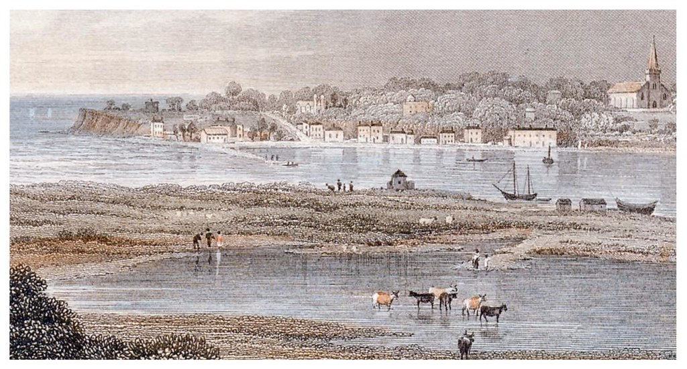

# More Life Aside

We have already seen how developments were taking place in Sandown in 1878, such as the opening of the pier, even as the Eurydice lay in Sandown Bay.

As the hulk of the ship was moved into St. Helen's Roads, we also find that the developments were happening there around the same time, works that would change the outline of the Island on a map in an even more significant way than the addition of a pier.

Over the coming years, the area around Bembridge and St Helens would change signicantly, the result works that were in full swing in 1878.

## Land Reclamation Around Brading Haven

An Ordnance Survey map of the Isle of Wight around 1853 shows the extent of Brading Harbour in the mid-nineteenth century.


OS IW Mudge 1853
https://archive.org/details/dr_10-isle-of-wight-6916014

An older French map also shows how the opening to the harbour was much closer to the St Helen's side, reaching as far as the old Church.


Brading Haven, old French map. In: Bembridge Past and Present


A close up from Hall's map of c. 1850 shows how far inland the harbour extended, reaching up to what is then end Quay Lane in Brading today.


Hall map IW ~1850? Brading Harbour

`````{admonition} The Environs of Brading, 1066
:class: seealso dropdown

The view today is ofter referred to as Brading Marsh, a haven for wild birds. Almost a thousand years ago, in the summer and autumn of 1066, the land between St Helens and Brading, on what was the north side of Brading Harbour at the time, would have seen the encampment of King Harold, and before him, his estranged brother, Earl Tostig. The invasion of King William had been anticipated, but as yet, had still not arrived. With the autumn wearing on, and the weather likely to turn ever the worse, King Harold left the Island before the invasion that was to see the end of his reign had landed.

> Anglo-Saxon Chronicle
>
> 1066
>
> This year came King Harold from York to Westminster, on the Easter succeeding the midwinter when the king (Edward) died. Easter was then on the sixteenth day before the calends of May. Then was over all England such a token seen as no man ever saw before. Some men said that it was the comet-star, which others denominate the long-hair'd star. It appeared first on the eve called "Litania major", that is, on the eighth before the calends off May; and so shone all the week. Soon after this came in Earl Tosty from beyond sea into the Isle of Wight, with as large a fleet as he could get; and he was there supplied with money and provisions. Thence he proceeded, and committed outrages everywhere by the sea-coast where he could land, until he came to Sandwich. When it was told King Harold, who was in London, that his brother Tosty was come to Sandwich, he gathered so large a force, naval and military, as no king before collected in this land; for it was credibly reported that Earl William from Normandy, King Edward's cousin, would come hither and gain this land; just as it afterwards happened. When Tosty understood that King Harold was on the way to Sandwich, he departed thence, and took some of the boatmen with him, willing and unwilling, and went north into the Humber with sixty skips; whence he plundered in Lindsey, and there slew many good men. When the Earls Edwin and Morkar understood that, they came hither, and drove him from the land. And the boatmen forsook him. Then he went to Scotland with twelve smacks; and the king of the Scots entertained him, and aided him with provisions; and he abode there all the summer. There met him Harold, King of Norway, with three hundred ships. And Tosty submitted to him, and became his man. Then came King Harold to Sandwich, where he awaited his fleet; for it was long ere it could be collected: but when it was assembled, he went into the Isle of Wight, and there lay all the summer and the autumn. There was also a land-force every where by the sea, though it availed nought in the end. It was now the nativity of St. Mary, when the provisioning of the men began; and no man could keep them there any longer. They therefore had leave to go home: and the king rode up, and the ships were driven to London; but many perished ere they came thither.

And the rest of the story, as they say, is history!

```{youtube} GT-e4OIMzVY
```

`````

To get to Bembridge from St. Helen's meant either a long trip to Brading, across the bridge over Easter Yar at Brading, and then back round to Bemrbdige, or a ferry across.

At the shore, a print from around the same time shows the view of Bembridge from St. Helens.


Isle of Wight : Bembridge from St.Helens . Harbour section of Victorian Print c.1850s.
Isle of Wight : A finely detailed print view titled " Bembridge from St.Helens " : a Victorian Print c.1850s.
https://www.flickr.com/photos/lenton_sands/3512272457/

The first inklings of what were to come appeared in 1864 with the adoption of *The Bembridge Railway, Tramway, and Pier Act, 1864*, weer ranyone to be paying attention to the matter.

---

https://books.google.co.uk/books?id=UKFUAAAAcAAJ&pg=PT14&dq=27+%26+28+Vict.+bembridge&hl=en&newbks=1&newbks_redir=0&sa=X&ved=2ahUKEwjVk86zlKX3AhUYgFwKHXOGBxYQ6AF6BAgHEAI#v=onepage&q=%20bembridge&f=false

The Statutes of the United Kingdom of Great Britain and Ireland, Volume 27

1864

p 1018

Cap. cccxxviii.
"The Bembridge Railway, Tramway, and Pier Act, 1864." [29th July 1864.]

Recites that the making of a Railiway from the authorised Line of Railway from Ryde to Lower Shanklin, near Yar Bridge, to Bembridge Point, with a Pier or Landing Place there, and a Tramway from the said intended Railway to Bembridge Down, all in the Parish of Brading in the Isle of Wight and County of Southampton, would be of great public and local Advantage; that cerrtain flooded and uninclosed and Waste Lands on the Shore of the Sea in Brading Harbour, and adjoining or near the proposed Railway, which are in the present State incapable of Cultivation, may, by reason of the Works of the Railway, be conveniently reclaimed, and it is expedient that Powers should be given for the Reclamation and Improvement of the same; and that the Company and the Isle of Wight Railway Company should be empowered to enter into Contracts and Arrangements as herin-after provided.

---

https://www.britishnewspaperarchive.co.uk/viewer/bl/0002569/18770310/140/0004
Isle of Wight Journal
Saturday 10 March 1877

p4

BRADING.

We would call the attention of the inhabitants of Brading to a report lower down with reference to their harbour. It seems that no one examined the Act of Parliament obtained by the new company, and if the inhabitants do not look out they will find bye-and-bye that they will have no harbour at all, which would indeed be a calamity.

---
TEXT

As some local inhabitants started to realise what might be involved, a public meeting was called; but was it already too late to stop the development?

---
https://www.britishnewspaperarchive.co.uk/viewer/bl/0002569/18770310/034/0004

Isle of Wight Journal
Saturday 10 March 1877

p4-5

BEMBRIDGE. IMPORTANT PUBLIC MEETING

BRADING HARBOUR

In accordance with a requisition, a public meeting was convened by the Rev. John Le Mesurier (vicar), and churchwardens, in the girls' school-room, Bembridge, to consider the best means of preserving rights and privileges of the inhabitants of Bembridge in respect to Brading Harbour. The Rev. J. le Mesurier occupied the chair, and the meeting was well-represented by all classes more or less interested ia the harbour.

The first called upon Capt. John Douglas McDonald, R.N., who was the means of gettiag the requisition signed for convening the meeting.

Captain MCDONALD commenced by saying that he did not wish to put himself prominently forward on this question, but by pure accident it came to his knowledge that they were being defrauded out of their rights and privileges in the Brading Harbour. They were specially indebttd to a friend in London to whom he wrote for information. All the replies in  answer to letters were to the effect that they were too late. He did not wish to be done, however, so he started a letter off at once to the authorities, which he would read later on. In the first place all this had arisen from the negligence of that parish in not attending to what was in print prior to 1874. He thought everyone was taken in by the heading "to get an Act of Parliament for the improvement of Brading Harbour and works attached.' Not to start under any wrong impression, he did not think there was anyone present who did not wish to see a railway or good road—(hear, hear),—or an improvement to the harbour, and would not mind paying a little toll, but they would all like to have some part of the beach left to them as a public right of way. This the company had obtained, and it was now actual law, and, as far as he could understand, they could not move anywhere on the beach without paying a toll. He, for one, wished to live in Bembridge for some years to come, and would not put up with that without a struggle, and he hoped they would all join in using lawful means to avert such a thing. The the tolls they would have to pay, if the Act was allowed to proceed, would be more than the public taxes in any part of the Kingdom. Feeling this very deeply he wrote officially to the Board of Trade and to the Lords Commissioners of the Admiralty. He had been in correspondence with a friend in town for some time before that. The letter to the Secretary of the Admiralty was to the following effect :—

I beg to call the attention of their Lordships to he above-named Act, which has given full power to a company to enclose the harbour now existing at Bembridge, or, at least, to reduce its proportions as to render it of little service. When I state from the best authority that over 655 vessels of the usual coasting craft, carrying coals, timber, &c., entered the harbour during the year 1876, of which number about 600 discharged their cargo at the quay at Brading, the rest either at St. Helen's or here, you can form some estimate of the value of Brading Harbour as it now exists. Moreover, it is the resort of all the pilot vessels, fishing craft, small yachts, &c., in this locality, most of whom have moorings laid down in the bight of the harbour. Also numerous yachts are in the habit of being laid up here for the winter. Under the above state of the case I trust their Lordships will hesitate to give their sanction to clause 38 contained in the said Act, without a full and complete inquiry into the merits of the case.

A similar letter was sent to the Board of Trade, and the following was their reply :—

I am directed by the Board of trade to acknowledge the receipt of your letter of the 27th ult., on the subject of tho works which the Brading Harbour Improvement and Pier Company propose to construct inn Brading Haven, in pursuance of the authority conferred upon them by the above Act. In reply. I am to point out, as indeed your letter admits, that Parliament has authorised the construction of the embankment to which you object. It has further, by the 38th section at the Act to which you call attention, conferred on the Lords Commissioners of the Admiralty the duty of approving of the working drawings, and I am to observe that is it obvious that the Board of Trade have no power to repeal or alter an Act of Parliament.

They had not got a reply from the Admiralty, but they would hear that that was going on all right, and that it was their sheet anchor. With reference to the reply from the Board of Trade, he would say they ought not to have signed away the  public right of water. The speaker then quoted from "Phear" on the rights of water. This harbour, fortunately for them, happened to be under the jurisdiction of the Admiralty, and was enclosed in the plan furnished to the authorities at Portsmouth. No shingle could be taken away without their permissionm and their rights extended up to Brading. HE wanted them now to select a committee to act in the matter.

Captain John Macdonald, R.N., then explained the difference between the original and amended plan, and it was clearly shown that if carried out Brading Harbout would be a harbout of refuge no longer.

Different sections of the Act were then read, including schedule of charges.

Mr de Pass next addressed the meeting, and on one or two points he differed from the previous speaker. He argued that it would be of no use for them to endeavour to upset the whole Act of Parliament, but they should bring all their forces to bear to keep the company to their first plan. The difference between the first and second plan was in having a harbour for vessels or having no harbour. (Hear, hear.)

Captain McDonald said he quite agreed with regard to the old plen, but there was one one thing they had forgotten—that was about the tolls which could be levied even when the old plans were completed. It had been an open place in the harbour from time immemorial, and as long as he could stir a hand in the matter a toll should not be paid unless the people had a place to land their boats. (Hear, hear.) If they had a harbour they wanted a free one. (Appllause.) If the choice was between a harbour and a railway he would rather have the harbour. If the harbour was shut up where were the fishermen, &c., to get their bait. (Hear, hear.)

Mr. de Pass: Two plans had been deposited. The first plan might hare been opposed successfully and there would have been an end to it. Now the company had deposited a second, which meant to shut up the harbour entirely, which would be great oppression. The original Act was named the "Bembridge Improvement Act". The people of Bembridge went to sleep—(laughter)—and did not go to Brading to see the Act. The Act was passed for the improvement of Bembridge, and they believed it to be an improvement till their eyes were opened, and saw that this little part of their rights was being taken away. Bembridge Harbour was free, and if the people of Brading liked to allow their harbor to be shut up, it was their affair, but he did not think they would allow it. He did not think it could be closed up by the signature of any party unless it was proved that no real good could accrue to Bembridge without destroying the harbour. He afterwards referred to the tolls, and argued that they would be obliged to come down as the public would not patronise the company.

Captain McDonald said that according to the plans they were not allowed the smallest portion as being free.

Captain Clayton advocated forming a committee at once, which was accordingly done, consisting of the following:— Captain McDonald, Captain Clayton, Messrs. T. E. Osborn, Searl, W. W. Osborne, Mursell, Weaver, Damp and Jones.

The meeting then broke up.

---

TEXT

As the Hampshire Advertiser observed, reaching Bembridge had until now been hampered by the lack of direct access to it from places such as Ryde, so the development would, udoubtedly, bring some benefits if access could be improved.

---
https://www.britishnewspaperarchive.co.uk/viewer/bl/0000495/18770314/028/0003
Hampshire Advertiser
Wednesday 14 March 1877
p3

BEMBRIDGE, March 14.

" Improvements." — Anyone who has visited this part of the Island, and noticed the beautiful sandy beach, the picturesque sea and land views, and the healthy climate, must have felt some little surprise that it has not been so well frequented as other places. Its beauties and advantages have at last been discovered, however, and, as with the rest of the Island, things are looking up here. The chief reason which has prevented Bembridge from being oftener visited has been the fact of it being rather difficult of access. Although only a short distance from Ryde there is no getting a carriage there, unless one goes round the harbour, whioh adds several miles to the journey. If a carriage is taken to St. Helen's, it has to be left there, and passengers are ferried over in small boats for 1d. The harbour here is of considerable width, and the channel of some depth, but an unfortunate bar across its mouth has prevented it being useful to large vessels, though yachts, barges, &c., find no difficulty in navigating it, and no less than 655 coasting craft, carrying coal, timber, &c., entered the harbour in 1876, and 600 discharged cargoes at Brading. This being the case, the inhabitants naturally wish to preserve the harbour, though desirous, at the same time, of seeing as many improvements carried out as possible. The great improvement ia a projected railway, and, while welcoming it on one account as likely to benefit them, they are strongly opposed to the company, who have obtained powers to improve the harbour as well aa make a railway, and they propose a scale of tolls, at which the inhabitants are highly indignant. No vessels could come in without a toll, and all the old rights and privileges of the fishermen will be gone for ever. Although the Act of the company has actually passed, Captain McDonald, R.N., has taken an active part in calling attention to its provisions, and has written to the Lords Commissioners of the Admiralty and the Board of Trade, but hitherto without a favourable reply. This gentleman was instrumental in calling a public meeting of the inhabitants last week, when it was clearly shown that the company had trenched coniderably upon their original plans, and that the harbour would no longer be free if they carried out all that was intended. A committee, consisting of the following gentleman, was appointed to do what they could to preserve the rights of the inhabitants : — Captain McDonald, Capt Clayton, Messrs. T. E. Osborn, Searl, W. Osborn, Morsell, Weaver, Damp, and Jones.

---
TEXT

Presumably despite the committee's best efforts, work towards the reclamation was begun, the activity prompting various brief histories of an earlier attempt to reclaim the same land to appear.

---

https://www.britishnewspaperarchive.co.uk/viewer/bl/0000495/18771024/031/0004

Hampshire Advertiser
Wednesday 24 October 1877

p4

BRADING, Oct. 24.

Reclamation of Mudlands at Brading Harbour.

Brading Harbour, although a pretty sheet of water at high tide, presents nothing but a vast expanse of mud flats when the water is out, and the channel, which runs between them to Brading quay, is very intricate. Nowhere does the water flow over the mud flats more than two or three feet, and nothing is easier tban for a vessel to get aground in making her way up the harbour. The celebrated Hugh Middleton, the engineer who did so much for the water supply of London, as long ago as the 17th century, is said to have conceived the idea of reclaiming these mud flats, and converting them into arable land, but owing to the defective engineering appliances of those days, he did net succeed, and old inhabitants of St. Helen's say that wood work aid other relics of his attempt existed till quite recently. A company has been formed with much the same object in view as Hugh Middleton, with the addition of a railway. They are now actively at work, and have already reclaimed a plot of land at Bembridge, which will be converted into a railway station. An embankment is now being constructed across the harbour to shut out the sea, and thus reclaim about 800 acres of land. A large quay will be made at St. Helen's Mill, where goods will be landed and carried by railway to Brading. instead of being taken by boats. The entrance to the harbour will also be improved, so that vessels of larger burden can enter. A railway is now in course of construction for the conveyance of passengers to Bembridge and St. Helen's. As both these are pretty places, and possess a good beach, there seems every probability that they will, ere long, become watering places of importance.

---

https://www.britishnewspaperarchive.co.uk/viewer/bl/0000495/18771103/004/0002
Hampshire Advertiser
Saturday 03 November 1877

p1

THE RECLAMATION OF BRADING HAVEN.

It may not be uninteresting to many of our Isle of Wight readers, now that the reclamation of Brading Harbour is a work in progress, to know that such a work was attempted so far back as 1616, by Sir Hugh Myddleton, whose successful enterprise in connection with the New River Company has given him enduring fame. Smiles, in his " Lives of Engineers," refers to this work, and says that it is probable " that, at some early period, neither swamp nor lake existed at Brading Haven, but a green and fertile valley, for in the course of the works undertaken by Sir Hugh for its recovery from the sea, a well, strongly cased with stone, was discovered near the middle of the Haven, indicating the existence of a former settled pppulation on the soil. The sea must, however, have burst in and destroyed the settlement, layiug the whole valley under water. In King James's reign, when the recovering of drowned lands began to receive an unusual degree of attention, the project of reclaiming Brading Haven was again revived; and in the year 1616 a grant was made of the drowned lands to one John Gibb, the King reserving to himself a rental of £20 per annum •• • It appears that Gibb sold his right to one Sir Bevis Thelwall, who at once invited Sir Hugh Myddleton to join him in undertaking the work. • • • A satisfactory arrangement having been made with the King, Myddleton began tne work of reclaiming the Haven in the course of the same year (1620). He sent to Holland for Dutch workmen, familiar with such undertakings, and it is obvious that be mainly followed the Dutch method of reclamation, although it would also appear that be also employed some invention of his own. No description is given of the paiticular method a opted by Sir Hugh in forming his embankment, but it would appear that he proceeded by driving piles into the bottom oi the Haven, near Bembridge Point, where it is about the narrowest, and thus formed a strong embankment at its junction with the sea, but, as would appear, without making adequate provision for the egress of the inland waters."

A very curious contemporary manuscript by Sir John Oglander, is still preserved amongst the archives of the Oglander family, who hold a great part of the ueighbounng land, from which it would appear that after the ground was recovered, it was not of much value. The best portion was that nearest Brading ; 200 acres were worth about 6s 8d the acre, and all the rest about 2s 6d the acre (!). Wheat, barley, cabbage, and oats, all failed to grow on it ; but rape succeeded best ; all the others came to nothing. At last, on the 8th of May, 1630, there came a very high spring tide, when the sea made a breach, and, not being attended to soon euougb, got worse and worse, till at last it was all covered again with the sea. The total amount lost in the attempt is said to be about £7000. The manuscript referred to further says that though the country people were much against the reclamation of the harbour, yet it " caused a great deal more health in these parts than was ever known before." The gates whioh served for a sluice were dug up some years ago near the boatbouse on St. Helen's, " Duvver."

---
TEXT

As with many projects, it seems that once thet starts, they take on a life of their own and beget yet further works.

---
https://www.britishnewspaperarchive.co.uk/viewer/bl/0000069/18771124/001/0001
Hampshire Telegraph
Saturday 24 November 1877
p1

IN PARLIAMENT, SESSION 1878. BRADING HARBOUR DISTRICT GAS.

INCORPORATION of Company, power to erect Works and to supply Gas in the Parishes of Brading and Saint Helen's, in the Isle of Wight and County of Southampton. Powers to Brading Harbour Improvement and Railway Company. Power to levy Tolls. Incorporation and Amendmont of Acts.

NOTICE IS HEREBY GIVEN,-That application will be made to Parliament in the ensuing Session for a Bill for the following or some of the following purposes :—

1.-To incorporate a Company, hereinafter called the Company, and to empower the Company to manufacture Gas, and supply with Gas, the following Parishes and places in the Isle of Wight ant County of Southampton, that is to say—the parishes of Brading, and St. Helen's, Bembridge, and Sea View.

2.—To authorise the Company to purchase, take on lease, or otherwise, acquire by agreement the following Plot or Parcel of Land situate in the Parish of Brading, in the Isle of Wight and County of Southampton, that is to say, a square piece of land of the area of about 20,000 square yards, situate on the west side and adjoining the Railway now in course of construction between St. Helens and Bemnbridge, the north-east angle of which piece of land is 300 yards or thereabouts, measured in. a southerly direction from the commencement of the New Quay now in course of construction, near St. Helens Mill, in the parish of St Helens, in the Isle of Wight and County of Southampton, and thereon, or on some part or parts, to construct and maintain, and from time to time to alter, improve, extend, enlarge, and renew, Gas Works, and works for the manufacture, conversion, utilisation, and distribution of materials used in and about the manufacture of gas, and of residual produocts resulting therefrom, and to manufacture and store gas, and to manufacture and sell and let meters and other fittings.

3.—To authorise the Company to lay down and maintain within the said Parishes, pipes and apparatus in, over, under, and across and for that purpose, to break up, alter, stop up, divert, and interfere with streets, roads, lanes, rivers, watercourses, streams, railways, tramways, sewers, drains, pipes, and telegraph apparatus.

4.—To authorise the Brading Harbour Improvement and Railway Company hereinafter called the "Harbour Company," to subscribe for and hold shares in the Capital of the Company and to enable the Company on the one hand and the Harbour Company on the other hand, to enter into arrangements and agreements for any of the purposes of the Bill, and particularly to authorise the Company to lay down and maintain pipes and apparatus along and across, the lands, railway, embankment, and works of the Harbour Company, and the approaches thereto, and to enable the Harbour Company to sell and dispose of any land belonging to them for any purposes of the Bill, and to grant all necessary rights and easements.

5.—To empower the Company to manufacture, purchase, or hire gas meters, fittings, and other gas a apparatus, and to sell or let the same, and to charge and receive rents, rates, charges, and remuneration for the sale and supply of gas, and gas meters and fittings and other gas apparatus.

6.—To incorporate with the Bill all or some of the provisions of the Companies Clauses Consolidation Act, 1845, the Companies Clauses Act, 1863, the Companies Clauses Act, 1869, the Lands Clauses Consolidation Acts, 1845, 1860, and 1869, the Gas 7 Works Clauses Act, 1847, and the Gas Works Clauses Act, 1871.

7.—To vary or extinguish all rights or privileges which would intrefere with any of the objects the Bill and to confer other right and privileges, and to alter, enlarge, vary, or repeal all, or some of the nowers and provisions of "The Brading Harbour Improvement Railway and Works Act, 1874."

8.—A Plan and Duplicate of the land proposed to be taken, as aforesaid, with a Book of Referenee to such plan, containing the names of the owners or a reputed owners, lessees or reputed lessees, and occupiers of such land, and a copy of this notice will, on or before the 30th day of November instant, be deposited for public inspection with the Clerk of the Peace for the County of Southampton, at his Office at Winchester and with the Parish Clerks of the said Parishes of Brading and st. Helens, at their repsective residences.

Printed copie of the Bill will, on or before the 21st of December, 1877, be deposited in the Private Bill Office of House of Commons.

WRIGHT, BONNER & WRIGHT,  
48, King William-street, London, E.C.

---

TEXT

It also seems that the Brading Harbour and Railway Company were equally as keen to pursue other business opportunities as and when they offered themselves.

---
https://www.britishnewspaperarchive.co.uk/viewer/bl/0002569/18771215/147/0004
Isle of Wight Journal
Saturday 15 December 1877
p4

BRANKSEA ISLAND POTTERY COMPANY (LIMITED), POOLE, DORSET.

OWING to the increasing demand for DRAINING PIPES. and other Goods of our Manufacture in the Isle of Wight, we have determined to open out a BRANCH DEPOT, and for this purpose have appointed MR. FREDERICK SEYMOUR, Contractor for the Brading Harbour and Railway Company, our SOLE AGENT.

A Depot has therefore been opened at Bembridge, where Pipes, Chimney Pots, &c., of every dimension will be kept in stock, so that Builders and Contractors may be enabled to purchase without delay.

We beg to thank our customers for past orders, and trust the great facilities we now have for doing business in the Island will secure a continuance of their patronage and further commands, which shall at all times have our prompt attention.

R. H. FRY, Manager.

---

TEXT

At the end of the year, a festive meal was held to celebrate the work completed to date.

---
https://www.britishnewspaperarchive.co.uk/viewer/bl/0002569/18771229/053/0005

Isle of Wight Journal
Saturday 29 December 1877

p5

BEMBRIDGE. BRADING HARBOUR WORKS.

On Saturday last the men engaged on these works were entertained at dinner by employer, Mr. F. Seymour, as a token of his good feeling towards them for the assistance they have given him in carrying out his contract. A large iron house was erected for the occasion on Bembridge point, and most tastefully decorated. Flags of all aatioas were gracefully draped around the walls, running from end to end of the building, while handsome mottoes, expressing welcome and good will to the men, were plentiful. At intervals, showing out between the flags, were stars formed of new shovels and pick-axes, and from the ceiliug hung a battered old navvy's barrow, a true emblem of hard work.

The chair was occupied by Mr. Frederick Seymour, with the Rev. Le Mesurier on the right, and the vice-chair by Mr. Pinchbeck. Three hundred of the *employes* and men sat down to an excellent dinner, beautifully served up, and entirely cooked by the men. The scene was most imposing, the tables admirably laid, and everything of the best provided, while choice flowers ornamented the dessert. More surprising was the manner in which the several dishes were served up and cooked owing to the difficulty of finding cooking accommodation. — Grace having been said by the Rev. J. Le Mesurier, Mr. Seymour proposed the health of the Queen, the Royal Family, and the Army and Navy, which toast he felt sure would be heartily responded to, especially as owing to the unsettled state of affairs in the East nobody could tell when the service of the latter might be required, and he felt sure that with men of the physique those present, her Majesty's &dominions were in safe keeping.—The toast was received with hearty cheers, showing that everyone present believed in maintaining the prestige of the mother country.—In the absence of any military or naval guest, Mr. Le Mesurier kindly returned thanks, and then addressed the men, complimenting them on their excellent conduct hitherto, and saying he should always he happy to assist any individual of their number with his advice. Order re-established, and the men's glasses having been filled with wine, Mr. Seymour mild: Brother working men, I wish to propose a toast which I feel sure you will receive with hearty good-will, and that is the health of the Brading Harbour Company, and their Chairman, Mr. Spencer Balfour, for you must not forget it is owing to them that we are met today in this friendly way ; you must also recollect that although every week you look to me for your wages, I have to look to them for the necessary funds to carry out this great undertaking, which have always been forthcoming. In all our undertakings through life we dependent on each other, and it is union which gives strength. In your case you depend on the contractor, the contractor on his company, who find the money, and when that fails we are the same as a without its main spring. I also take this opportunity of thanking you sincerely for the assistance you have given, and to one and all I am greatly obliged. I compliment you on your good behaviour during the time you have been is my employ; you have had to work under the most trying circumstances. and have had great difficulties to contend against, as must naturally be expected when dealing with the elements, but I must say you have done your duty like men, and if, by God's will, I am enabled to bring this undertaking to a satiafacitory result, I hope you will do me the honour of dining with me again ; and I must also thank my worthy friend at the emd of the table, Mr. Pinchbeck, for the able assistance he has given me, and rest assured, men, he is your best friend. I must also thank the members of the committee for the great trouble they have taken in choosing these pretty decorations, and for the great skill they have shown in providing the good dinner they have enabled me to put before you; and now, my men, I know you want to get to Portsmouth, so I will not detain you, I wish you all a very merry Christmas, and many happy new years. and I trust that many of them will be spent in my employ.

Mr. Pinchbeck then proposed "The health of Mr. Seymour," in appropriate terms, which was received with tremendous cheering, a salute of guns outside, and the chorus, joined in by all with great gusto, of "He's a jolly good fellow."

An excellent song having been given by one of the men, the pleasant meeting broke up. A steam launch was in readiness to convey the men to Portsmouth, where the majority go every Saturday.

[See also following article on Brading.]

---
TEXT

Meanwhile, the locals were still grumbling.

---

https://www.britishnewspaperarchive.co.uk/viewer/bl/0002569/18771229/053/0005

Isle of Wight Journal
Saturday 29 December 1877

p5

BRADING. BRADING HARBOUR

Captain J. W. D. McDonald, retired captain, R.N., has addressed the following letter to the Shipping and Mercantila Gazette :—" I forward herewith copies of letters, &., referring to works now being carried out in Brading Harbour, and feel assured that, after a careful study of the metier, you will agree with me that it is quite time there should be some understanding as to what department has the power of controlling or preventing injury to the public rights, as involved in the conservancy of harbours, as well as the preservation of foreshores, &c. At present the result of my experience in the matter leads me to believe that the authorities do not quite understand what power they have, or where it begins and ends. I may possibly be wrong in the conclusion arrived at, but, to my judgment of the case, it seems a matter of surprise that, although I have been (as you will see by the correspondence) in constant communication with the Lords Commissioners of the Admiralty, as well as the Board of Trade, yet the fact remains, that the Brading Harbour Company may do what they like, without any step being taken by the authorities to put a stop to their encroachments. Surely there should be some sort of supervision over works of this nature. There should be a public functionary to visit and report from time to time as to how the works are progressing, and that they do not exceed the powers granted by the original Act. It most at ought not to be left to a private individual to have to keep up a constant attack on the parties who are paid for and invested with the duties of this particular department. If a coastguardsman sees a fisherman or other person take up a piece of plank or spar washed up on the beach, and carry it away, the individual is informed that he has no right to it, but that it must be deposited in the keeping of the coastguard, and he will be eutitled to a certain amount for the salvage. If he objects to leave his piece of plank or spar, and takes it off, he is liable to a fine or term of imprisonment. If the Coastguiud are invested with this power as regard wreckage or drift wood, what is to prevent their having the power to stop any parties removing shingle or sand from the sea-shore? In one case a person can be stopped for taking away a piece of timber, perhaps worth only 5s., and the other may take away thousands of tons of shingle and sand, and there is no authority to stop him from doing so. It is surely time the public should know who are the real guardians of the public rights in navigable waters, as well as those of foreshores, &c. With respect to the granting of powers to a company, as in the case of the Brading Harbour Act, I venture to submit that, in future, notice of any attempt to interfere with tidal waters and navigable channels should be posted up at the Custom-houses and Coastguard Stations within a radius of 30 or 40 miles of the proposed alterations, so that the coasting and seafaring population may know what is proposed; also that the Coastguard officers be instructed to make inquiries as to the feeling of the inhabitants of the district, as well as to receive any remonstrance from pilots or fishermen resident in the district, such reports to be forwarded to the authorities. It is also essential that an inquiry should be instituted by qualified officers into the bearing or effect the alterations would have on Government works and national requirements. These observatious are made with the view of obtaining some certain, sure, and definite means of redress, as well as the prevention of injustice in trampling under foot the public right as involved in the question of conservancy of harbours, free navigation, and foreshores. At present, any inquisitive traveller will find our Coastguard Stations decorated with public notices about the numbering of fishing boats, concealment of wreckage, inducements to enter the Royal Navy, a long list of penalties for the infringment of Board of Trade Regulations, protection of seagulls (with penalties), treatment of the apparently drowned, and others *ad infinitum*. I should much like to see notices in some protecting the rights of the coasting and seafaring as well as the fishing communities." Our contemporary, in a leading article, says :"The 'Piers and Harbours Act' does not, it is generally admitted, confer sufficient power on the Board of Trade, in the public interest, for the prevention of local abuses. Rivers and harbours should be under the control of a Government Department responsible to Parliament. To a certain extent the Board of Trade stands in an intermediary position, but its officers are not armed with the requisite authority for the defence of national rights; for we take it that navigable channels should not be arbitrarily and independently assuaged by any self-imposed body of Commissioners, however honourable they may be."

[See also previous article on Bembridge.]

---

TEXT

### The Brading Oyster Fishery

To get a sense of the character of the Brading Harbour Improvement Company, let us now take a slight detour and consider the way they handled the compulsory purchase of the Brading oyster fishery right at the start of the development.

The original oyster fishery was established in 1863:

---

https://www.britishnewspaperarchive.co.uk/viewer/bl/0000495/18680815/050/0008
Hampshire Advertiser
Saturday 15 August 1868
p8

THE BRADING HARBOUR (ISLE OF WIGHT) OYSTER FISHERY AND BREEDING COMPANY.

The first general meeting of the shareholders of this company was held at the local offices, St. Helen's, near Brading, Isle of Wight, on Tueaday ; Colonel J. C. B Boulderson (late of the Madras Engineers ) in the chair.

The report of the directors stated that the first pond for the artificial reception and ultimate preservation of the oyater " spat" is completed, and was opened on the 2nd July. The work appears to be substantial and good, and the directors have every reason to be satisfied with the deapatch and anxiety manifested by the contractor, Mr. Pritchard, to complete the work to the extent required to enable the directors to commence the necessary operations for the actual breeding of oysters, and it is by hia exertions alone that they have been enabled to do ao. The work of enclosure for the formation of the ponds was commenced very late in the season, yet by the efforts that have been made they have been enabled to lay the broody oysters in pond No. 1, in sufficient time, they hope, to secure this season's fall of " spat," or young oysters. The manager, Captain Kulbach, has laid down in the pond many thousands of broody oysters, and has adopted several of the most approved methods for collecting the " spat." The work of constructing the embankments in the formation of the ponds has been a much more difficult and necessarily more expensive matter than the directors contemplated. The entire work when completed will enclose a space fully three times larger than the size of the pond already completed. The directors are glad to be able to report that since the starting of the company several of the residents in the vicinity of the company's operations have become shareholders, and they expect that as the highly interesting character of the undertaking becomes more fully known others will follow their example.

The Chairman said the shareholders had been informed by the report just submitted that the first breeding-pond had been successfully completed, on the place recommended—namely Carpenter's Lake. Through the aasis. of Mr. Hearn they had secured the services of an able and zealoua contractor, Mr. Pritchard, of Sandown, lale of Wight, and by hia constant attention to the work they were able to place the firat breeding-pond at the disposal of their manager in July. Captain Kulbach, the manager, had laid down a large number of broody oysters. The extent of ground within the sea-wall contained the whole of what was the originally contemplated enclosure ; but finding that the place could not be completed in time for laying the broody oysters, Mr. Hearn suggested, aud the directors acted upon the suggestion, a division of the place into three portions, and it was in one of those parts that Captain Kulbach had commenced his work. The report had informed them that the outlay had been greater, and more time occupied than originally contemplated, but when the enclosure had been completed no further outlay would be made under this head, for there was abundance of suitableground in the the harbour for laying down the young brood, and where it would remain until fit for the market. All he could say was that he had given a vast amount of attention to this most interesting subject ; and the more attention he gave to it the more interested he became in it ; and in the full anticipation that the enterpriae would prove highly remunerative he had doubled his interest, and no doubt many others would follow his example. He moved that the report be received and adopted.

Mr. Ross had much pleasure in seconding the adoption of the report. He stated that from the starting of the company he had taken an immense interest in the company's operations, and had carefully watched its progress ; and without pretending to be so well up in the subject as their valued friend and scientific adviser, Mr. Frank Buckland, yet he fully believed that the plan at present being adopted at Brading Harbour could not fail to be successful in a scientific point of view, and at the same time remunerative to the shareholders. As to their directors, whom he knew exercised a commendable economy in every department, he considrered shareholdera should be acquainted with the fact that they had voluntarily passed a resolution declining to accept any remuneration for their services until such time as the shareholders began to receive a return for their outlay. (Hear.)

Captain Kulbach (the manager) explained that the ponds were constructed upon the most improved principles. As an evidence attending similar operations elsewhere he might mention that he met a few days since the manager of the South of England Oyster Company, who stated that he had succeeded in obtaining good falls of " spat" for three consecutive years, and that he contemplated selling this year young oysters to the value of several thousand pounds. He could not give a better proof than that as to the profitable character of such undertakings as these

Major Gray said as a resident in the island he had watched with interest the progress of the enterprise, and he had no doubt it would result in a great success. Mr. Pritchakd thanked the chairman for the flattering remarks he had made with regard to himaelf. The interest he held in the company was the best proof he could give as to his opinion of its success. After some further discussion, and explanations from the manager, the report was received and adopted. Special resolutions were then passed adding clauses to the articles of association. Votes of thanks were passed to the chairman, directors, and manager, when the proceedinga terminated.

---
TEXT

It was sold in in 1871, and then became the subject ofwhat was presumably a compulsory purchase order in 1877.

---

https://www.britishnewspaperarchive.co.uk/viewer/bl/0002569/18770317/045/0005
Isle of Wight Journal
Saturday 17 March 1877
p5

BRADING OYSTER FISHERY.

As a proof of the value of an oyster fishery when properly managed the award which has just been made in this case will, we imagine, interest not only proprietors, but the oyster-loving public. It appears that the Brading Harbour Improvement Commissioners wished to take an oyster fishery in this harbour which Major Boyle had purchased and worked since 1871. To this, of course, the Major, who has devoted nearly the whole of his time to the cultivation of the oyster at these ponds since he purchased them, objected, unless he received what he considered a fair compensation. This was a matter on which there was a very great difference of opinion, and to decide the point it was agreed to refer it to arbitration. Mr. J. H. Chatton was agreed on as the umpire, with Mr. Gann as his asseoser, the arbitrators being Mr. H. D. Martin Ind Mr. R. C. Driver. Major Boyle had obtained the assistance of Mr. J. Binfield Bird. surveyor, of Cowes, who has for many years practically studied the question of oyster culture, and on whose valuation the case was opened. He had also the valuation of Capt. Johnson, the manager of the Medina and Newtown River Oyster Fishery Company.—The case was opened by Mr. J. W. Fardell, solicitor, of Ryde, who gave an account of the fishery from its commencement, after which Major Boyle was examined. He said that seven years ago he became interested in the Company, and eventually he bought them out, as they had paid no dividend. He then investigated the afiairs, and found that the labourers had never been paid, and that no stock of oysters had been kept on the ground. Eventually they sold the lease to him for £300, and he took it on and began to breed oysters. He bred them every year but one till the last. In 1872 they took out 450,000 oysters, and the average of deaths was about five per cent, during five years. The Major then handed in a statement of what he had purchased in each year. Last year they had had a most wonderful spat ; the wire netting, the cultch, and the bottom of the pond were covered with it. Some of it, casually picked from the pond, was here produced, and it was covered with young oysters about the size of a sixpence. If no notice bad been given him he should have kept on selling and also purchasing brood. —Edward Mursell was then examined by Mr. Fardell. He stated that he had lived on the place all his life and had to do with oysters ever since be was twelve years old. He was now 38; he dredged oysters for his father: he was in the employ of the first manager, Captain Calbach, and then Major Boyle engaged him as foreman. The old system under which he had worked did not do; but he was sure the one Major Boyle had carried out would be a success. He should think there was now about fifteen millions of young oysters in the pond, out of which they could save quite fourteen millions. In the channel all the large oysters were placed, and he should think there were quite 450,000 at the present time. It was an out-and-out growing ground. His wagns was £6O per year. Captain E. Johnson, manager of the Medina River and Newtown River Oyster Fishery, said he had been extensively engaged in the breeding of oysters. He had inspected this Oyster Fishery, and he believed there were over fifteen millions or about 280 to a square foot. He obtained from Major Boyle the number purchased and those sold, and the number stated left 485,000 in all. He believed there were quite 450,000 in the river.—Mr. Wright, on the part of the defendants, opened his case by stating that the Company were not compelled to take the oysters and they declined to do so, they not being marketable. The lease was worth nothing, the clauses being bad, and the spat was worth nothing, and the stock was overdone. He could not admit the amount for goodwill, and for a forced sale too much money was asked.—Mr. Brazier, oyster merchant from Southwick and Brightlingsea, was then called. He said he surveyed the harbour and breeding ponds. There was a large quantity of spat. He selected those he could fish up by the rake: there were only ten on a shell, on an average 250,000 might be put on the hurdles. The total amount of spat he put at 1,850,000, which at 5s. per 1,000 would be £412 10s. No. 2 pond was unfinished. He also examined the ground in the Harbour, which was 200 yards long by 120 wide. The oysters were very thin on the bottom. He took up 100 oysters and he estimated that there could not be more than 200,000, which at 50s. per 1,000 gave £500. He thought there was nothing in the business and no chance of success. Had never heard of a claim for the profit rental; 40 spat could grow on a shell. He valued the spat at £912 10s. The Fishery would never be a profitable one. His value for making ponds and all would be £1,564 5s. He counted a dozen or fourteen on an oyster shell. He was paying 7s. for channel oysters, and he had purchased 11,000 tubs at 2s. per 100. He got for them 9s., and for small channel 6s. 7d. and 8s. per 100; the spat was a splendid one.— Mr. Collard, of the Herne Bay Company, of which he is a director, said he went over the Fishery and he came to the conclusion that the value of the spat channel oysters laid down, construction of ponds, at a compulsory sale was £2,976. He had failed in artificial breeding himself. He had a sea fishery at Southdeep, and the fresh water had come down with snow water, which had killed them. It really was a very heavy spat. The laying ground was clean, and the very best he had ever seen, and he would not part with it on any account. —Cross-examined : He made out the profit, and then the goodwill. There was a market for the spat. He never saw so many oysters and so few clocks[?] on any ground. The valuations were :—For Major Boyle—Captain Johanson, £9,761 10s. ; Mr. J. Binfield Bird, £9,525. For the Company—Mr. Collard, £2,976; Mr. Brazier, £1,564. The umpires' award is £8,000 showing that Mr. J. Bird's valuation is taken as not far off the mark, Mr. Bird, in his report, stating that on or about the 17th of June and the 2nd of July a wonderful fall of spat had appeared, prior to which the pond had been most carefully prepared, and 12,000 parent oysters placed in it: 800 yards of wire netting was arranged, and 800,000 oyster shells placed on the top. Fascines, hurdles, tiles, slates, and clean shingle were also provided, and the result is thet the whole is literally covered with spat, many single oyster-shells having 50 on each, and although from the immense number it is impossible to form a correct idea of the quantity, yet he considedered 15 millions would be a low estimate. Major Boyle may congratulate himself on the success in breeding the oyster, and Mr. Bird on his so successfully and admirably valuing an exceedingly difficult property.

---
TEXT

According to the oysters were _"not marketable. The lease was worth nothing, the clauses being bad, and the spat was worth nothing, and the stock was overdone"_.

---

https://www.britishnewspaperarchive.co.uk/viewer/bl/0000069/18770321/012/0003

Hampshire Telegraph
Wednesday 21 March 1877
p3

BRADING.

OYSTER FISHERY.—The Brading Harbour Improvement Commissioners desiring to take an oyster fishery in this harbour which Major Boyle had purchased and worked since 1871, that gentlemen, who has devoted nearly the whole of his time to the cultivation of the oyster at these ponds since he purchased them, objected unless he received a fair compensation — a matter on which there was such a great difference of opinion that to decide the point it was agreed to refer it to arbitration— Mr. J. H. Clutton was agreed on as the umpire, with Mr. Gann as his assessor, the arbitrators being Mr. H. D. Martin and Mr. R. C. Driver. Major Boyle obtained the assistance of Mr. J. Binfield Bird, surveyor of Cowes, who has for many years practically studied the question of oyster culture, and on whose valuation the case was opened. He had also the valuation of Capt. Johnson, the manager of the Medina and Newtown River Oyster Fishery Company.— The case was opened by Mr. Fardell, solicitor, of Ryde. Major Boyle was then examined, and Edward Mursell, who had lived on the place all his life, was also called.—Mr Wright, on the part of the defendants, stated that the Company were not compelled to take the oysters, and they declined to do so, they not being marketable. The lease was worth nothing, the clauses being bad, and the spat was worth nothing, and the stock was overdone. He could not admit the amount for goodwill, and for a forced sale too much money was asked.—Mr. Brazier, an oyster merchant, and Mr. Collard, of the Herne Bay Company, of which he is a director, were called for the defendants.— The umpire eventually awarded 8000l.

---
TEXT

Having presented the oyster fishery as barely viable in March, the Company  was talking it up in August as a prelude to putting it up for sale.

---

https://www.britishnewspaperarchive.co.uk/viewer/bl/0000495/18770808/025/0004
Hampshire Advertiser
Wednesday 08 August 1877
p4

BRADING August 8

English Oyster Breeding.— Mr. Howard Martin, Surveyor to the Brading Harbour Improvement and Railway Company, writes as follows from 145, High-street, Croydon ; — " In the present condition of the oyster trade and the breeding of oysters in Great Britain it may interest your readers to hear that for the second year in succession a ' fall of spat ' of a very remarkable character has taken place in the oyster-breeding ponds in Brading Harbour, Isle of Wight. In one of the ponds, about 3 1/4 acres in extent, the collectors placed to receive the spat throughout the pond are covered with the minute oysters, and an adjoining pond, about 2 acres in area, contains nearly as many in proportion. It is impossible to estimate the number with any accuracy, but there must be many millions in the two ponds. The fall of last year in a third pond (when the fishery was in the hands of Major Boyle, the then lessee) was nearly as large in proportion, as this greater success following it gives ground for the hope that, in places as favourably situated as the Brading Harbour fisheries, the breeding of oysters in enclosed ponds on the English coast will become, in the hands of those who follow right methods, a business with at least no more than that ordinary business risk of failure which every breeder of any kind of live stock must incur. The importance to the food supply of the nation of a solution of the problems involved in breeding oysters in England in enclosed ponds is sufficient, I think, to be my apology for this communication. I shall be pleased to allow any of your readers who take an interest in the matter to see the spat."

---
https://www.britishnewspaperarchive.co.uk/viewer/bl/0002569/18770811/034/0005
Isle of Wight Journal
Saturday 11 August 1877
p5

BRADING.

At the oyster ponds at Brading Harbour, there has been a very remarkable fall of "spat" for the second year in succession. In one of the ponds, about 3 1/4 acres in extent, the collectors are covered with minute oysters, and an adjoining pond of some two acres contain an almost proportionate quantity.

---
https://www.britishnewspaperarchive.co.uk/viewer/bl/0000495/18770905/028/0004
Hampshire Advertiser
Wednesday 05 September 1877

p4

BRADING, Sept 5. OYSTERS. — The Times says that for the second year in succession a remarkable fall of spat has occurred in the oyster breeding ponds in Brading: Harbour, Isle of Wight. The collectors placed to receive the spat throughout the pond are covered with the minute oyster.

---

TEXT

By the time the sale was announced, it seems the fishery was _"admirably adapted for profitable breeding"_.

---
https://www.britishnewspaperarchive.co.uk/viewer/bl/0001003/18770915/039/0004
Croydon Guardian and Surrey County Gazette
Saturday 15 September 1877

p4

ISLE OF WIGHT.—

Sale of valuable Oyster Fisheries, with many millions of Spat and other Stock all ages.

Messrs. Podmore & Martin aw instructed by the Directors of the Brading Harbour Improvement Railway and Works Company, to Sell by Auction, at the Auction Mart, Tokenhouse Yard, E.C., on WEDNESDAY, 3rd October, 1877, at Two o'clock precisely, in One Lot, unless previously disposed of by private contract, BRADING OYSTER FISHERIES, consisting of three large and thoroughly-stocked breeding ponds in which extraordinary falls of spat have been obtained during the present and last year, and laying grounds in Brading Harbour, with the necessary market ponds, &c., together with about 60 millions of spat this and of last year's falls, and the stock on the laying grounds of all ages. The Fisheries are admirably adapted for profitable breeding, and for a depôt for the laying and sale of French Oysters, which improve with extraordinary rapidity on the grounds, and, owing to their situation, are workable at a very small annual expense.

The fisheries may be viewed with the Auctioneers’ orders, and particulars and conditions of sale with plan may be eb, tained of Messrs. Wright, Bonner, and Wright, Solicitors, 48, King William-street, E.C. ; at the place of sale; and of the Auctioneers, 145, High-street, Croydon, and Horsham.

---

TEXT

A month later, and the oyster fishery had been sold on.

---
https://www.britishnewspaperarchive.co.uk/viewer/bl/0000495/18771010/029/0004
Hampshire Advertiser
Wednesday 10 October 1877
p4

BRADING. Oct. 10.

The Brading Harbour Oyster Fisheries have been sold for £5000.

---

TEXT

In passing, we might note that the *Croydon Guardian and Surrey County Gazette* also took a general interest in oyster farming later in the year, perhaps as a result of reporting on the activities of the Brading Harbour Improvement and Railway Company whose offices were based at 145, High-street, Croydon.

---
https://www.britishnewspaperarchive.co.uk/viewer/bl/0001003/18771124/112/0005
Croydon Guardian and Surrey County Gazette
Saturday 24 November 1877
p5

HISTORY CLUB

The usual monthly meeting of this Club was held on Wednesday evening, the President, Dr. A. Carpenter, in the chair. There was tolerably good attendance of members. ...

The President then called upon Mr. Howard Martin read a paper on  
OYSTER BREEDING."

Mr. Martin, after a few preliminary explanations, said—The great scarcity and consequent hight price of oysters during the last feew years, has strongly attracted the public notice to the causes of the scarcity, and the the various means by which some of these causes might be remedied. One such cause, no doubt, has been the comparative failure, in many places for several years in succession, of oyster breeding, and there is reason to believe that the deficiency of the natural breeding placesmay be, to a great extent, supplied by artificially enclosed ponds prepared for the purpose, in which the parent oysters may breed, and the "spat", or young oysters may be exposed from some of the dangers which prove fatal to them elsewhere. Some authorities on the subject believe the source of supply cannot be calculated upon with certainty in this country, but there are grounds for a more hopeful opinion. No created being probably appears to the unscientific eye more plain and straightforwards and less complicated than an oyster, and probably there is no living thing more a matter of controversy. It is said that whilst oysters have the most extraordinary powers of reproduction— one oyster emitting at one spatting nearly two millions of the embryo oysters— a very high temperature is essential to raise the development of the "spat," and owing to our summers having been, for many successive years, decidedly cooler than the summers of the good old days when oysters were cheap and plentifiul, the annual crop of young oysters has failed us, and will not be resotred until we get once more a succession of old-fashioned summers. The balance of evidence does not appear to me to support so gloomy a view. There is no dount that a combination of favourable conditions is necessary to secure the life and development of oyster spat, and that unusually low temperatures, while it is floating or near the time of its attachment, will probably kill it; but it is by no means proved, on the other hand, that a very high temperature will ensure the life of the spat, or that it may not be emitted and thrive at a very moderate temperature. (After quoting authorities Mr. Martin continued)— It appears, therefore, that our summers are still hot enough for oyster breeding if we can secure other necessary conditions, either by the protection of the parent oysters in the spat in enclosed ponds, or by giving the parents a fair chance of breeding in their natural beds— a chance which, in many cases, has been denied them. There have been many inatances of natural beds having been to greedily dredged to be actually destroyed entirely; and many where the removal, for sale, of oysters of all ages and at all seasons has so diminished the beds as to render them worthless. It is said, too, that when no " close time" was enforced on the public oyster beds, oysters were frequently dredged for sale when about to spat, and emitted their spat in great quantities on the decks of the boats in which they were removed, thus wasting what might have developed into many millions of oysters. It to such causes as these—to short-sighted selfishness which "kills the goose that lays the golden eggs" all the world over, and does not rest until it renders extinct every valuable animal on which it to allowed to work its wicked will, that it seems to me, we must look for the causes of the scarcity of the oyster, and not to any unconrrollable alterate in the temperature of our planet or our country, even if such alteration really exists. The breeding places of the oyster are divided into four classes, namely:—(1.) Entirely natural beds, situated generally more or less in the open sea, such as those in the Bristol and British Channels, or in the North Sea, where work to done to protect or assist the reproduction the oysters. (2.) Natural beds, (such as those in the various creeks and bays the coast of Essex and Kent,) where breeding is associated by what is called "cultivating,." i.e. the clearing of the ground from mud, weeds, and the living enemies of the oyster, and the laying down of sheds (or cultch it to called) and other suitable collectors to which the spat can attach itself. (3.) Foreshores on which collectors various kinds are placed to receive spat washed to them by the tides, from natural or partly natural beds in the vicinity, such those at Ré Oléron, Archacon, and other places in France. (4.) Enclosed ponds, in which the parent oysters are placed to spat, and in which the spat is allowed to remain until it is large enough for removal to the ordinary laying grounds, such those at Brading, Cowes, Hayling Island, and elsewhere. As has been remarked before, the supply from the natural and partly natural breeding places has diminished considerably during the last few years, and the use of artificial breeding places has been too recently introduced, and not sufficiently successful, (in this country, at any rate) to affect the supply; but there is good reason to hope that in the future it may come to be a very valuable addition to the natural sources. Oysters are hermaphrodites, and it is now pretty well established by microscopic observations, that they are self-impregnating. Indeed, apart from the evidence of the microscope, the probabilities of the case incline decidedly to that view. Oyster-beds are, in most cases, exposed to the action of the wind and of strong tidal currents ; and it is difficult to believe that spermatozoa could be carried by the action of the water (and they must necessarily be so carried if oysters be not self-impregnating) from one oyster into the other, with sufficient certainty to secure the regular and certain impregnation which undoubtedly occurs. Oysters are said to have been known to spat when between one or two years old, and there is no doubt that they frequently do so between the ages of two and three years. The time of spatting varies, according to the season and situation of the oyster beds, from May to September; but June and July are probably the months in which spatting most usually takes place. After describing the development of the spat, and its preference for certain kinds of "collectors", Mr. Martin said he had been unable form any idea as to how long the spat floated in freedom. During the time the spat is floating, great quantities are eaten by shrimps and small fish, and carried by the currents or the action of the wind to places where, finding suitable surfaces to which to attach itself, it perishes, or where its attachment is of no benefit to the owners of the bed from which it started ; sudden and considerable fall of temperature may oftenkill nearly the whole of it while it is floating. When the young oyster is securely anchored, however, its dangers are not all passed. The human preference for oysters, as an article of food, is shared by crabs, starfish, and whelks. In addition to their living enemies oysters are, in some fisheries, frequently killed by sand or mud accumulating above them, or the chilling the water in which they lie by the passage of melted snow over the beds in times of thaw. It is not astonishing, therefore, that the natural productiveness of the oyster—great as it undoubtedly is—is not sufficient to meet the enormous demand made upon it for the supply of the markets, unless in the first instance the reproductive powers of the parents are allowed fair play by the enforcing of proper restrictions on their removal from breeding places, and in the second, great care be bestowed on the protection of the growing oysters when the parents have produced them. Having referred to the fishing grounds Hayling Island, and Brading Harbour, Mr. Martin said that when ponds were first laid out for breeding oysters, it appears to have been almost universally believed that the great essential to success was to obtain " heat end tranquility" in the ponds, and jealously close every aperture by which water could escape from them, lest the floating spat should escape with it. The ponds were, in some instances, made shallow to secure the raising of the water in them to higher temperature, and in various ways much trouble and money were expended in endeavouring to secure these supposed necessary conditions of success. But success was not often the result. In some cases the parent oysters spatted prematurely, and the spat never appeared to live at all. In some cases, it lived a short time, but failed to attach itself to the collectors, and success appeared to be the exception rather than the rule. Mr. Martin concluded interesting paper by minutely describing the plan of operations carried on at Brading Harbour from his own observation.

Mr.Lee thanked Mr. Martin for his valuable paper, which contained so much uaeful matter, the result of thoughtful research, and suggested that the paper should be printed *in extenso*, as it would be exceedingly useful for future reference.

A formal vote of thanks was accorded to Mr. Martin for hit excellent paper, and it was resolved that it should be printed *in extenso*. Mr. Martin exhibited a model of breeding ponds, and photographs of same: The President exhibited a large collection of fossil oysters, and other specimens; Mr. H. Lee specimens of oysters; and Mr. J. S. Johnson, Mr. F. Crowley, and Mr. H. Turner, placed their microscopes at Mr. Martin’s disposal.

---

TEXT

### Industrial Accidents

We also get a sense of the company from it's response to industrial accidents, as in these reports from March 1879 and of a fatal accident in February 1880.

---
https://www.britishnewspaperarchive.co.uk/viewer/bl/0000170/18790308/007/0005
Isle of Wight Observer
Saturday 08 March 1879
p5

RYDE COUNTY COURT.

A sitting of this Court was held on Wednesday, at the Town Hall, before P. M. Leonard, Esq., judge, when the cause list was unusually heavy, and his Honour sat from ten in the morning till nearly eight at night without finishing the cases, the most important of which were as follows :

John Jacobs v. The Isle of Wight Railway Company. —The plaintiff in this case, who is a working fore-man to the Executors of Col. Hargreaves, coal merchants, at Brading, claimed £50 from the Isle of Wight Railway for injuries sustained by him in consequence of the alleged negligence of the company's servants. Mr. Feltham, solicitor, of Portsmouth, appeared on behalf of the plaintiff, and Mr. John W. Fardell, of Ryde, for the defendants.

Mr. Feltham having briefly opened the case, called The plaintiff, who deposed that he was working foreman in the employ of the Executors of Col. Hargreaves. On the 30th of July last he was on land belonging to defendant company at the quay at Brading. He was expecting three barges in with coal from Southampton. He saw one barge coming to the quay and, thinking that it was for his company, he went to see what it was. It was part of his business to go to the barges as they arrived, examine the coal, and to make arrangements for its discharge. The barges had not arrived, but they came directly afterwards and he was waiting, as he saw them coming up the harbour, till they arrived. At that time there were some trucks upon the harbour works. The works were being carried out by the Brading Harbour Improvement Company and the lines of Isle of Wight Railway Company were connected by a bridge, but at that time the bridge was not strong enough to bear the weight of an engine, so that the trucks were shunted or pushed on the bridge by an engine, and allowed to run over the bridge and down to the quay. He was with a Mr. Dawes at the time, who as they were standing by the side of the line saw the trucks coming down. Mr. Dawes asked what they should do, and witness said the ouly course open to them was to step on one side, for the trucks were coming with such rapidity that there was no time to run. If they had attempted to run they would have come over them. The width of the siding was about 4ft. There were several skips (iron buckets used to unload gravel) at the side, and the trucks would have cleared witness and the skips too if the clap of the trucks had been properly fastened up. The clap of the fourth truck as well (as several others) was down, and the consequence was that the clap came in collision with the skip, the skip knocked against witness, and knocked him down the quay into the water. Mr. Dawe was standing beside him and they both went over into the water together. The water was out of his depth. He heard no one shout to him to get out of the way, and assuming that they did there was no time for him to do so. He should have been obliged to run a hundred yards to have done so. He therefore thought it best to stop where he was. The trucks were not in charge of any one at the time. The engine sent the trucks over at full speed. They were obliged to go at a tremendous speed to get them up the incline, and they came into the yard with great impetus. He did not know whose duty it was to put up the claps of the trucks of the engine. The accident was caused solely by the claps being down. The blow he received quite disabled him for a long time. He was obliged to go about his work on crutches and have a carriage to take him to and from his home. He could do nothing but direct the other men as to what they were to do and keep the account. Before the accident he was able to do a good day's work as well as any one in the yard, but since he had not been able to carry a sack of coals. He was three months under the doctor's hands. He still suffered great pain. — Cross-examined by Mr. Fardell : I have known the quay about ten years and a half. The jetty ran a considerable way into the sea before these new works were commenctd. The Brading Harbour Improvement Company were constructing works to connect their works with the Isle of Wight Railway, and the trucks which caused this damage were started from the works of the Brading Harbour Company. I do not know whose engine it was started the trucks. I should not have stayed where I was if I could have got away. Many men have stood there before and since. I deny positively that I was warned against going on the works by any one. I did not hear any one call out to warn me. I did not hear the engine whistle. If I did I did not understand it was a warning to get out of the way. When I was knocked into the water a man named Charles Simmonds was very close to me, but he did not try to save me. I struggled to a post as well as I could and begged them to help me out because I felt I was fainting. When I got out a man named Stickley never said, " If you had listened to me this would never have happened, and I never said "I am quite aware of that." That I swear. I know Mr. Jones, but I am not aware of any conversation in which he said " You had no business there, and if you had listened to me this would never have happened." I never replied " I know I was wrong. I cold see danger ; but I could not get out of the way." There was a break truck but no one with it. There was no one in the trucks. I know the skip struck me first, and that I and Mr. Dawes both went over together.

Mr. Fardell said the question was one of liability, and he should prove that the engine that pushed the trucks along belonged to the Brading Harbour works.

Cross-examination continued : I went to work the next day. I was not expected to work but only to look after the other men. I have not hindered any time, and my master has been kind enough to pay the same wages as I had before. Dr. Bulbeck attended me, and I authorised him to ask for £20 damages on my behalf [A letter was read from Dr. Bulbeck written on behalf of plaintiff.]

By Mr. Feltham.— I repeat I did not get any warning from anybody. There was no time for me to effect my escape. The trucks were coming at the rate of 20 miles an hour. Mr. Dawes was nearly drowned. Simmonds handed me a stick and helped me afterwards. The skip was the property of the Isle of Wight Railway Company.

Mr. Daniel S. W. Dawe said that he was a chemical manure manufacturer. On the 20th of July last he was in company with the last witness about 11 o'clock. He went to see one of the bargemen on the quay. Before he got there, he saw Jacobs, and they passed the time of day, and witness made the remark that there were some barges coming up the river, and plaintiff replied " They are very likely ours." Witness was then at the lower end of the jetty, on the railway company's premises. While they were standing there he saw some goods trucks move slowly towards St. Helen's. That was in the opposite direction. Soon afterwards he happened to look round and saw the trucks a few yards behind him. Mr. Jacobs said they had better stand where they were as it would be dangerous to run, and that where they were standing was a safe place. It would have been safe if someone had done his duty and placed the claps of the trucks up. Two trucks passed safely, but the next had the clap down and it struck the iron bucket next to Jacobs, and we were both knocked into the water. The skip would not have been struck if the claps had not been down, and the position would have been safe. There was a man standing on the opposite side, but he was not hurt. Heard no one warn Mr. Jacobs. If anyone had done so he must have heard it.—Cross-examined by Mr. Fardell : Did not see anyone in charge of the train, and I do not believe there was anyone. I heard no warning. I picked up Jacobs on the jetty. I did not see Lock. I never heard Lock tell us to get out of the way. I did not hear anyone tell Jacobs not to go on the quay as there were no vessels for him. I have seen the skips on the quay before. I had no conversation with Stickley. I did not take any notice of the whistle. I did not know it was to warn people. They might have been doing it for their own amusement (laughter) . I was hurt, but I have not taken any proceedings because I had no right there.

Mr. John Bulbeck, surgeon, but now out of general practice, said he was called on to see the plaintiff. He found that his leg was very much injured, and he was afraid that the bone was too. Plaintiff had a good constitution, and was a teetotaller, but it took nearly three months to heal, and he must have suffered a great deal of pain. He knew him before the accident, and considered him a very strong healthy man. His bill for attending him was five guineas.

Cross-examined by Mr. Fardell. —I was at one time called in whenever Messrs. Hargreaves and Co. required my services. I wrote the letter produced. I asked for £20 for the plaintiff, and I thought that was a very fair compensation. He offered, on behalf of the plaintiff, to accept that sum if it ceuld be arranged between plaintiff and the company without further expenses.

Mr. Fardell made a lengthy and forcible defence, his three heads being— 1st. That the plaintiff had no right where he was when the accident occurred. 2nd. That the engine and trucks which caused the accident were not at that time under the management of the defendant's company. 3rd. That there was such contributary negligence on the part of the plaintiff as to entirely disentitle him to come there and ask for damages. The Isle of Wight Railway Company, prior to the passing of the Act of Parliament authorising the construction of these improvement works in Brading Harbour, had a quay upon which they landed their goods. It ran into the sea a considerable distance, and it was upon this quay that the accident happened. Then the Brading Harbour Company obtained their Act of Parliament, which authorised the construction of a railway, as well as reclaiming the harbour. Under the provisions of their Act they thought it best to connect their works with those of the Isle of Wignt Railway, and this jetty was the part where the two works were connected. On the day this accident happened the works were not in a very advanced state, and it was not considered safe to run the engine over the short piece which connected the two. The trucks ran out of the jetty all right, but in bringing them back it was necessary, in order to drive these trucks up the incline to use great momentum by the means of the engine, which did not, however, go over the bridge. The engine, therefore which was employed to give this momentum, was not on defendant's line, and did not belong to the company. The plaintiff had no right to go on the lines of the quay, and he ought to be able to prove that he went there for some lawful purpose. If he had a vessel coming up to the quay, that would have entitled him to have gone down to make the necessary arrangements, but in this case he was distinctly told the vessels had not arrived. With regard to his last point he should prove that the necessary signals, in addition to the warnings, were given to the plaintiff. Notwithstanding this, plaintiff went and placed himself behind the skip, and the accident occurred. He called  
George Lock, labourer, working on the quay at Brading, who said he remembered the day the accident occurred. It was between 10 and 11, that the engine was just going to shove the trucks over. Plaintiff met him, and said, " Is there any vessel in for us?" Witness replied, 'No." Then Jacobs said to Dawes, "Now we are here, let's see the works at the end of the jetty." That was all that was said, and the witness cleared the jetty of all the people, except Dawes and Jacobs. He saw nothing more of them till they were knocked into the water. Dawes said to plaintiff, before they were got out of the water, " I knew we were in the wrong place." They had no right there, and all the other men were cleared off the jetty. Witness stood on the opposite side when the wagons passed, and there was plenty of room for him.

Cross-examined by Mr. Feltham. — There was plenty of room for me, and no wagon touched me. There were several men in the trucks. They had plenty of time to get away safely. We had no goods van. We don't generally put coal on a goods van (laughter).

Mr. Feltham.— How many flaps were down ?

Witness. — Ah! you want to know more than I do. We have had several slight accidents. I cautioned plaintiff and Dawes myself, and told them they had better clear off the jetty. Jacobs then asked if there was a vessel in for him, and I said, " No." I am foreman of the jetty.

George Stickley, better known as " Spider," in the employ of Mr. Seymour, the contractor, said that on the day the accident happened he come from St. Helen's to Brading Quay. He come there with an engine to shunt trucks. When they saw plaintiff they whistled three times, and witness went the length of that room towards him, and told him he must get out of the way or put up with the consequences.

Mr. Feltham cross-examined this witness, but failed to shake his testimony,

and His Honour said that if plaintiff was warned off and selected a dangerous spot in which to stand the company were not to blame for that.

Mr. Feltham contended that plaintiff was there on business.

His Honour.— But if he was told his barges were not there, he was there as an amateur.

Mr. Feltham.— We all know how these railway fellows will swear.

His Honour. — I am afraid other gentlemen will swear too. These men are the servants of two different parties entirely.

George Hemmings, the guard in charge of the trucks, corroborated as to the whistle being sounded three or four times, and said that he shouted to Jacobs to get out of the way. The next he saw of them was to see Jacobs' hat flying over.

Mr. Fardell. — It is suggested he went over after his hat (laughter). 

Witness.— He might if he had any respect for it (laughter). We were a quarter of an hour putting a plate right, so that plaintiff had plenty of time to get away. The trucks might have been going at the rate of 8 or 10 miles an hour.

Frederick Henshall, engine driver, said that on the 30th of July he was driving an engine belonging to the Brading Harbour Company. He brought some trucks to the Beckley corner, and was waiting for the order of the shunter, who was waiting for the signal of the platelayer. When witness got his signal he whistled three times, and then started the engine. He thought they must have heard the whistle ; it could be heard three miles.

George Wetherick, goods foreman at Brading Quay, also corroborated.

His Honour considered the accident caused entirely by plaintiff's own act. If his business was to go to the quay to his barges he waa told that they were not there. After he was warned he did not attempt to get out of the way ; at least that was the evidence of the witnesses called, and he saw no reason to disbelieve them. On the ground therefore of contributory negligence he gave judgment for the defendants with costs.

[MAP (OS 6 inch 1888-1913) https://maps.nls.uk/geo/explore/side-by-side/#zoom=16.15630086263021&lat=50.68904&lon=-1.12476&layers=6&right=ESRIWorld]

[MAP OS 1 inch 1885-1900 https://maps.nls.uk/geo/explore/side-by-side/#zoom=13.443173726399742&lat=50.68582&lon=-1.14118&layers=1&right=ESRIWorld]

---

https://www.britishnewspaperarchive.co.uk/viewer/bl/0002941/18800211/036/0004
Hampshire Independent
Wednesday 11 February 1880
p4

BRADING.

AN ACCIDENT — happened at the Brading works on Monday. While a gang of men were at work on the gangway, William David Mursell, of Bembridge, let his foot slip. He fell into the tide and was drowned, and the inquest will be held this day (Wednesday). Another man named Jones also fell in, but was saved by a party in a boat and by Captain Seymour, who jumped overboard and rendered great assistance. The tide was running out with great force, and the wind very high.

---

TEXT

Following the accident, a coroner's inquest was held and a subscription was raised to support the widow of William Mursell.

---
https://www.britishnewspaperarchive.co.uk/viewer/bl/0002941/18800214/092/0008
Hampshire Independent
Saturday 14 February 1880
p8

BEMBRIDGE. FATAL ACCIDENT.

On Wednesday last an inquest was held at the Marine Hotel here, before B. F. Blake, Esq., deputy-coroner, on the body of William David Mursell who was employed on the works of the Brading Harbour Company. The evidence of George Carter and Samuel White showed that the deceased was helping to push some waggons along the tramway passing over the water, when he slipped, and falling through the cross-planks, he was rapidly carried away by the current, which was flowing fast at the time, and before help could possibly reach him he was drowned. Deceased was quite sober. The jury, of whom Captain Clayton was foreman, returned a verdict of "Accidentally drowned."

---
https://www.britishnewspaperarchive.co.uk/viewer/bl/0000170/18800320/019/0006
Isle of Wight Observer
Saturday 20 March 1880
p6

Bembridge.

To the Editor of the Isle of Wight Observer.

Sir, — Owing to the accident which happened to William Mursell, by which he lost his life whilst in my employ, I opened a subscription on behalf of his widow, and received very handsome contributions from the inhabitants of Bembridge and St. Helen's, amounting to £40 7s. This sum I have remitted to the Rev. John Le Mesurier, and I shall feel greatly obliged by your giving publicity to this letter in your next issue, together with the list of subscribers to the item. Your obedient servant,  
FREDERICK SEYMOUR.  
Bembridge, March 17, 1880.

Brading Harbour Railway Company £5 0 0  
R. J. H. Saunders, engineer 5 0 0  
Frederick Seymour, contractor 5 0 0  
— Walker, Esq 1 0 0  
C. R. Seymour, Esq 1 0 0  
By clerks and workmen in the employ of Mr. F. Seymour 6 2 6  
Collected by W. Mursell 7 7 6  
" T. Dallimore 9 17 0  
£40 7 0

---

TEXT

## The State of the Reclamation Project in 1878

At the start of 1878, with works ongoing, various consequences of the development were starting to become apparent, not least in the way the release of sewage from St. Helens was being affected.

---
https://www.britishnewspaperarchive.co.uk/viewer/bl/0000170/18780223/036/0006
Isle of Wight Observer
Saturday 23 February 1878

p6

St. Helen's, Local Board of Health

An ordinary meeting of this Board was held on Monday afternoon, at the Surveyor's Office, High Park, when there were present — Messrs. Stone (chairman), Brook, sen., J. O. Brook, Caws, Moody, Reed, Callaway, Matthews, and Tutte.

The St. Helen's sewage.

The Clerk read a letter, which had been received from the Secretary of the new company which is now making a roadway and embankment across Brading Harbour. At the last meeting of the Board it was agreed to write a letter to the company, pointing out that the company, by constructing their works, were interfering with the sewage matter which came from the sewage farm at St. Helen's, and claiming as good an outlet for it as they had before the works were constructed. The company, in reply, repudiated any liability.  
their works affected the Board.

The Chairman said that the company seemed to misapprehend the question. They had previously allowed their sewage to drain into what was virtually a tidal harbour, and the company would convert this into an inland lake or fresh-water stream, into which the Board could not carry the sewage. Perhaps what flowed from the sewage farm could not, strictly speaking, be called sewage ; still there could be no doubt it was highly impregnated with sewage matter. The company said they were prepared to allow them to connect the Board sewers with theirs, but this they could only do provided the outfall was unobjectionable, but they were not told where this was to go to. They might drain into the stream for land drainage, but not for sewage. They must know where their outfall was to be before they could go to the Local Government Board. They had a common law right to drain into the harbour ; that had been turned into fresh water, and as the company had altered it he contended they must put things right. The Board were there first.

It was understood that the Clerk should write another letter on the subject.

---
TEXT

That wasn't to be the only run in between The Brading Harbour Company  amd the sewer commissioners, as demonstrated in the following reviews of two separate actions in 1880 (one of which seems misreported in at least one account of the amounts contested) and a much later one in 1886.

---

https://www.britishnewspaperarchive.co.uk/viewer/bl/0000495/18800128/027/0004
Hampshire Advertiser
Wednesday 28 January 1880

p4

The Rural Sanitary Authority

The Clerk read the opinion of Mr. C. W. Dare, barrister, as to whether the Brading Harbour Improvement Company were liable for damages sustained by this Authority, to the amount of about £200, by the bursting of their sewer. It was to the effect that this Authority have a case. A copy of the opinion was ordered to be sent to Mr. F. Newnham, the engineer.

---

https://www.britishnewspaperarchive.co.uk/viewer/bl/0000170/18800131/009/0006
Isle of Wight Observer
Saturday 31 January 1880
p6

Board of Guardians

The Clerk read the opinion of Mr. Dare in regard to the dispute which had arisen between the Bembridge Local Sanitary Board and the Brading Harbour Railway Company, with reference to the damage done to the outlet of the Bembridge sewerage, estimated at £300.— After going minutely into the cause of the damage, Mr. Dare gave it as his opinion that the damage was caused by the Railway Company removing gravel and other soil from the southern side of Brading, by which the scour of the tide washed away the Land on each side of the outfall of the Bembridge sewerage. — It was agreed to send the opinion of Counsel to the Bembridge Parochial Committee.

---
https://www.britishnewspaperarchive.co.uk/viewer/bl/0002941/18800904/092/0008
Hampshire Independent
Saturday 04 September 1880
p8

BEMBRIDGE.

THE Sewer Ventilators. At the meeting of the Sanitary Authority on Thursday, Mr. Freeman, the receiver appointed in connection with the Brading Harbour Improvement works, wrote that the Authority were misinformed as to the Company having raised a certain road above the sewer ventilators. He also stated that the sewer outfall was not being endangered by them in any way.— Capt. Clayton said a former contractor under the Company raised this road above the ventilators, and if something was not done, an accident must happen there, while the ventilators themselves would probably become choked up before long.—The Clerk was instructed to write to the receiver again on the subject.

---

https://www.britishnewspaperarchive.co.uk/viewer/bl/0000495/18860407/041/0004
Hampshire Advertiser
Wednesday 07 April 1886
p4

THE BRADING RECLAMATION WORKS.

The case of Estcourt v. The Brading Harbour Company was heard before Mr. Justice Wills, on Friday, without a jury.

This was an action to restrain the defendants from maintaining a dam or other obstruction across the river Yar, near Brading, in the Isle of Wight, which the plaintiffs, the Commissioners of Sewers for the Isle of Wight, contended was wrongfully constructed, and was an obstruction to the river Yar, so as to obstruct its natural flow of water from the Sandown level. The defendants denied that the dam was wrongfully constructed, and pleaded that they were justified in erecting the said dam owing to the plaintiffs having so altered the flow of the river Yar as to be injurious to their works, and also that the court had no jurisdiction in the matter. The facts of the case are shortly as follows :— The Brading Harbour Company, which was incorporated under a special Act in 1874, had reclaimed a large tract of land at the mouth of the river Yar, which they said was liable to be flooded, owing to the plaintiffs having lowered a sluice in a sea wall which was erected to keep out the sea from certain lands at the mouth of the river. The defendants, to protect themselves against inundation, had erected a dam in the river below the sluice so as to interfere with the flow of the river. And the action was for an injunction to restrain them from so obstructing the river.

Sir Richard Webster, for the plaintiffs, contended that the defendants had no right to interfere with the natural flow of the river, and that, under section 10 of their private Act, the defendant company shall at all times maintain to the satisfaction of the Commissioners the free discharge of all waters draining into Brading Harbour, and under section 29 that company before commencing any works shall submit them and have them approved by the Commissioners of Sewers, and that the plaintiffs were entitled to an injunction in respect of the dam.

Mr. Graham, for the defendants, called attention to section 41 of the Companies' Act, 1874, which provides that questions touching the companies' works shall be referred to an engineer from the Board of Trade. The Commissioners of Sewers had no right to interfere with private property, and the sluice from time immemorial had been at the same level.

Mr. Justice Wills.— Your difficulty is section 10. The stream is prima facie within the jurisdiction of the company.

Mr. Graham.— They have only jurisdiction if they acquire the land.

Mr. Justice Wills referred to section 39. The following cases were cited for the defendants :— " Duke of Newcastle v. Clark "(8 Tamp., p. 612), " Cross- man v. Bristol and South Wales Railway Company" (1 Hemming and M., 531), and" Stacy v. Nelson" (12 M .and W., 535.

Mr. Chester followed on the same side.

Mr. Justice Wills, in giving judgment, said :— At the time of the passing of the Act of 1874, the Commissioners of Sewers had a right to maintain a sluice that would induce to the better draining of the land. The Act of Parliament seems to take the view that the draining of the upper land should not be interfered with by works on the land below. (The learned Judge then referred to section 10 of the company's private Act 1874.) I see nothing to prevent the Commissioners from exercising what was up to that time their prerogative, to alter works if that would discharge fresh water from their level, and to alter the works at the expense of the company. Section 39 says the Company before commencing any works shall submit such works and have them approved by the Commissioners of Sewers. This interferes with the rights of the company, and the real meaning is that no works interfering with rights of drainage shall be commenced without the Commissioners having the power to veto them. Section 41 says that certain works shall be referred to an engineer from the Board of Trade. This is not such a work. Section 39 refers to one class of works, section 41 refers to another. It is said that there is no jurisdiction to grant this injunction, and that the Commissioners cannot maintain an action for damages, and therefore cannot maintain an action for an injunction. It may be that they cannot maintain an action for damages. The court has power to grant an injunction, I therefore give judgment for the plaintiffs with costs.

[Also appeared in  Isle of Wight Observer, Saturday 10 April, 1886, p6.]

---
TEXT

As we shall learn later, the question of maintaining the sewerage network was to cause further conflict at the beginning 1881.

### The Reclamation Work Progresses

The following letter describes the state of the development, and its impact on the local scenery, as witnessed by a returning visitor to the island after several years away. *(Notably, no mention is made, in this letter at least, of any excursion to view the Eurydice in Sandown Bay.)*

---
https://www.britishnewspaperarchive.co.uk/viewer/bl/0000170/18780427/032/0008
Isle of Wight Observer
Saturday 27 April 1878

p8

A HOLIDAY RAMBLE.

To the Editor of the Isle cf Wight Observer.

Sir,— When any one who has been absent from a locality for some time returns he notes the slowly-made changes which have taken place during his absence with a keener eye yhan those living near the place, who hardly understand wht time has done. So it was with me. ... From Priory Bay I made my way round by the shore to the St. Helen's point. When I first visited the Island, some 20 years ago, the woods used to stretch luxuriantly at this point right down to the waters' edge ; the force of the sea breakers was stayed by a tremendous reef of rocks. Mr. Smith, on obtaining the estate here, thought it would be a good speculation to use the rocks for building. Unfortunate design ! No sooner were they rooted up than the encroachments of the sea on the now unprotected shore caused a succession of landslips, till, in one or two cases, the fringe of woods on the shore seems to have been washed entirely away, and the shore is almost impassable at some places for the blue slipper, into which the foot sinks. At all events, I am told it cost the imprudent Mr. Smith as many thousands to protect his fast-decreasing property by a sea wall as he gained hundreds by the sale of nature's protectors — the rocks. In my waltc, or rather scramble, on the shore, I noticed that this wall had again been washed down in many places, and some parts evidently during the past winter, for fine pine trees had partially fallen with the slip of the earth, and were drooping their tail tops over the shore, as if lamenting the change. Several were fallen down on the shore, and had been cut off. Altogether it seemed to me at this part of my ramble that the beauty of the shore just beyond Priory Bay had, to a certain extent, departed. A dilapidated wall looks so much worse than a wood gently sloping to the sea. This wall extends right round to the remains of old St. Helen's church, which still stand as a landmark to passing vessels This, too, did not seem to look so nice as in bygone days. There used to be a pretty little wood behind it, full of flowers and wild strawberries. This seems to have partly gone too, and the wall and a fence made it inaccessible. A fence surrounded the old church ground, which was at one time open, and much used by the villagers for tea parties, &c. I suppose this is done because the land was at one time consecrated and no doubt contains many remains of poor mortality. Some of the villagers could remnember when the headstones were there. A walk across the Duver soon brought me in sight of what I had greatly desired to see— Brading Harbour Improvements. The old Duver was just the same as ever ; but looking over the miilpond I could see that a number of houses had sprung up since my last visit. I passed by the Brading Harbour Oyster Fishery Company's beds, and noticed they were not quite denuded of oysters, although a staring notice as to trespassers, and a reward of £5 for information leading to the apprehension of any one taking the oysters, caused me to " sheer off ". I could not help thinking that the gallant Major who got so large a sum awarded him for the fishery was a very lucky individual. As I passed by the mills, for the first time I had a good view of the much-talked-of harbour improvements, and I must confess to some little disappointment. The work did not look nearly so forward as I had been led to understand, and I believe it will be a long time yet before all the sea is kept out of the harbour and fat kine graze upon the mud flats. Up to the present they have made a railway running down by the side of the harbour nearly as far as the mill, and have heaped up quite a quay nearly opposite. A bank of stones, sand, &c., runs from Bembridge, on the opposite side, and bears some rails, but still there is the deepest anu most difficult part of th© channel to be overcome- before the two lines will meet and passengers conveyed to Bembridge, or the sea be dammed out from the mud flats. There seems to be a considerable amount of work to be done before this is arrived at. St. Helen's Green seems to be gradually awaking to a sense of its merits, and the population is increasing at a great rate, to judge by the number of new houses which have sprung up. My walk home was rather a hurrid one in consequence of a wet eveing, but I found time to notice with regret that some one, with hideous taste, had substituted a stone wall for the green hedge that at one time used to encircle the parish church uf St. Helen's, and that the pretty little tollhouse at St John's had been pulled down, to be removed further on I suppose.

I remain, Sir, yours, &c,  
A WANDERER

---

TEXT

By the end of Spring, it seems that works were stepping up and more manpower would be required.

---
https://www.britishnewspaperarchive.co.uk/viewer/bl/0000069/18780511/014/0004

Hampshire Telegraph
Saturday 11 May 1878
p4

WANTED

200 navvies for the BRADING HARBOUR RECLAMATION WORKS. Pay 5d. per Hour. Apply to George Strickley, Foreman of Works, St, Helen's, Isle of Wight.

---

TEXT

And by mid-summer, the branch railway line connecting St. Helens and Brading was now open.

---
https://www.britishnewspaperarchive.co.uk/viewer/bl/0000495/18780807/002/0001
Hampshire Advertiser
Wednesday 07 August 1878

p1

BRADING HARBOUR IMPROVEMENT AND RAILWAY COMPANY.

NOTICE TO MERCHANTS AND MARINERS.

NOTICE IS HEREBY GIVEN, that the NEW QUAY at St. Helen's, Isle of Wight, at the entrance of Brading Harbour, and the railway therefrom to the Isle of Wight Railway, are now OPEN for traffic, thus saving the delay and difficulties of navigating Brading Harbour.

Notice is further given that, in consequence of such opening as above mentioned, the works for closing the existing channel are now being proceeded with ; all consignments must therefore be made to St. Helen's Quay.

CHAS SEYMOUR, Secreetary  
No. 1, Fish-street-hill, London, E.C., 1st August, 1878.

---

TEXT

Meanwhile, the courts were sitting again, this time to decide on a matter of petty fraud by one of the men.

---
https://www.britishnewspaperarchive.co.uk/viewer/bl/0000495/18780828/027/0004
Hampshire Advertiser
Wednesday 28 August 1878
p4

Isle of Wight Petty Sessions

County Bench

SATURDAY — The county magistrates in attendance were Mr. F. White-Popham (chairman), Mr. J. Coape, Sir Barrington Simeon, Bart., Major-General the Hon. J. G. Somerset Calthorpe, and Sir Graham Hamond Graeme, Bart.

Alleged Attempt to Defraud.— Frederick Cooper, labourer, was charged with uttering a forged order called a sub-ticket, with intend to defraud. —David Pike, canteen keeper, of the Brading Harbour Company, deposed that prisoner was employed on Brading harbour works, and lived at St. Helen's, where the canteen was kept. The labourers were paid only once a week, on Saturday. The contractor's office was at Bembridge. Most of the labourers lived at St. Helen's. It was the practice for the company to issue tickets to the men for small sums. A sum of money was placed in the hands of witness and he cashed the tickets, which were in his own handwriting. He handed them to the timekeeper, who issued them to the men who required them. On the 21st inst. prisoner came to the canteen with the ticket now produced, and witness handed him 2s for it. Noticed soon after prisoner had left that the ticket was not in due form.— Cecil Raymonf Seymour, timekeeper on the works, living at St. Helen's, explained the issue of the tickets, being deducted from the men's pay at the end of the week. On Wednesday last, when there was 5s due to the prisoner, the witness Pike brought him the ticket in question.He did not issue this ticket to prisoner. Issue of the tickets was a matter of convenience for paying money in advance to save him as timekeeper from carrying about a large amount in silver. The men could purchase anything at the canteen when they received the money for the tickets. Police-constable Goerge, on the morning of the 22nd inst. apprehended prisoner on the works at St. Helen's, when prisoner said he got a ticket from the timekeeper on the 21st, and the timekeeper, in prisoner's presence, denied it. The Chairman, in dismissing the case, said the magistrates thought that, however convenient the system of tickets for payment of advances, it was a pity the tickets were payable only at the canteen in which the contractor for the work had an interest.

---

TEXT

https://en.wikipedia.org/wiki/Truck_wages

The British Truck System in the Nineteenth Century
Author(s): George W. Hilton
Source: Journal of Political Economy , Jun., 1957, Vol. 65, No. 3 (Jun., 1957), pp. 237-
256
Published by: The University of Chicago Press
Stable URL: https://www.jstor.org/stable/1833293

---
https://www.britishnewspaperarchive.co.uk/viewer/bl/0000069/18780831/005/0002
Hampshire Telegraph
Saturday 31 August 1878
p2

Newport, County Petty Sessions

CHARGE OF UTTERING A FORGED ORDER- Frederick Cooper, navvy, St. Helen's, was charged with uttering a forged order.— Daniel Pyke said he was canteen-keeper at the Brading Harbour Improvement Works, at which the prisoner was employed. At the work they made use of order tickets, each ticket being for 2s. The men were paid by on Saturday, but during the week any workman by going to the timekeeper could get a ticket or tickets, which they brought to him at the canteen, and he gave them money for it. On Wednesday last the prisoner brought him the ticket produced, for which he gave him 2s., but after he left he noticed it was a forged ticket, which he gave over to the time-keeper. By the Chairman : What do you sell at the canteen, and do the workmen make purchaeas there when they receive their money ?- Witnesss: They sell groceries at the canteen, and the men do not make purchases at the time they are paid, but afterwards return and make purchases.— The Chairman : Has the contractor an interest in the profits of the canteen?-Witness; Yes; the contractor has an interest in what is sold at the canteen.—Cecil Reynolds Seymour said he had been timekeeper at the Brading Harbour Works for about a month, and on every Monday he received 35l. worth of order tickets, and sent the same amount in cash to the last witness at the canteen. Each ticker was for 2s. On Monday last the prisoner came to the office and received an order and another on Tuesday, but he did not give him the order on Wednesday. The ticket produced, which he received from the last witness, was a forged order. After giving the prisoner 4s., there was still 5s. due to him.— The Chairman put the same questions to this witness as he did to the last as to the canteen.— The Chairman, in discharging the prisoner, strongly condemned the way in which the men were paid.

---

TEXT

## The Temperance Debate Continues

Nationally, the temperance movement's activities rolled on. In Ryde, the Mayor tabled a petition calling for the closure of public houses on Sundays, which he was keen for the members of the council to put the town seal on.

The ensuing debate, captured in two separate reports, could make for quite an amusing verbatim play!

---
https://www.britishnewspaperarchive.co.uk/viewer/bl/0002100/18790710/110/0005

Isle of Wight Times
Thursday 10 July 1879
p5

CLOSING PUBLIC-HOUSES ON SUNDAY.

The Mayor said that the next matter on the agenda was a motion by himself and he hoped that they would all give their adhesion to it. That butchers, bakers, grocers, tailors, and candlestick makers, should not be allowed to sell on Sundays, and that publicans should be allowed to sell intoxicating liquors on Sundays had always been a marvel to him. A large number of publicans would only be too glad to close their homes if they could. He thought that as the Governing body of the town they ought to shew their respect for the Sabbath-day by trying to close public-houses. When they considered the number of people that public-houses kept at work on the Sabbath he thought they would see that there was good reason why such houses should be shut up. He proposed the following resolution:—" That the seal of the Borough be of to a petition to Parliament for closing Public-houses on Sundays."

Councillor PURNIILL seconded the resolution.

Alderman Wallis said he could not support the resolution, on the ground that it was an Imperial measure and had nothing whatever to do with Corporation matters. It was bringing a party question before the Council. Suppose for instance that Councils were to take up the abolition of flogging in the army, it would be said at once that the Conservatives were trying to carry and the Liberals to stop it. If the matter were brought before the town of Ryde it would wear a different aspect. He did not mean to say that the petition came from the Mayor.

The MAYOR said he should be very proud of it if it had.

Councillor Spenser said he should record his vote against the resolution for the reasons advanced by Alderman Wallis. He thought it would be a great pity for the Council to deal in party politics. He did not think that public-houses should be shut on Sundays, but publicans had a right to shut the shops up if liked. (The Mayor said they were obliged to open at certain hours.) It was at their option to apply for a licence to enable them to do so. It was all very well for gentlemen, like the Mayor, who might have their cask of ale and wine cellar, but the poor man could not do that. The Mayor had said that public-houses being open on the Sunday was a nuisance. (The Mayor replied that he used no such word.) Councillor Spencer replied if the Mayor did not use that word he led them to suppose that they were so. Of course the Mayor knew that his motion would be opposed. It must eventually become a question of party politics— (The Mayor :—" No, Never.")— It must eventually become a measure of that sort and he did not think that it should be introduced there.

Councillor Purnell remarked that the question was one which lay at their own doors and was really a town question. For public-houses to be open on the Sabbath was a great nuisance. He questioned whether it was the poor man who most used the public-house, on the Sunday, or whether it was the middle class. He thought that it was the beet movement that the Mayor had brought forward since he bad known him, and he would support it with both hands and stand up three times to do so.

Councillor James thought that he might stand between the two parties at that Council, for was he not prejudiced against the publicans, nor yet a total abstainer. He could not vote for the resolution because he did not think that it ought to be brought forward there. He had thought this matter over, and they bad to remember that there were thousands who could only come out of the large towns on the Sunday, and it would be a certain amount of hardship on them if the houses were all closed. He would say that the members of that Council ought to set an example. He was not going to sign any petition for they were living in a free country. He stayed away from public. houses, but he did not say to his neighbours they should not go. He admitted that there were too many licensed houses in the town, but at the same time the magistrates had not taken away a single license from the place. The Mayor had not done so aver since he had been Chief Magistrate. He understood that the power to do so was in the magistrates' hands, and to take away new licenses.

The MAYOR : Unfortunately it is not, and not one of the old ones unless it is endorsed.

Councillor Newbald said it would scarcely be right to close public-houses and to leave hotels open.

Alderman Colenutt said that he could not understand how this could be looked upon as a question of Imperial policy, nor yet how it arose. If they wanted to get into a squabble between Tories and Reformers, then they could try it as question of policy, or as a question of Parsons and publicans, or so on (Laughter). [Alderman FUTCHER : That is the very thing the question arises out of.] It was a question which affected the social condition of the people, and that was to a certain extent entrusted to the care of the Municipal Authorities. If power were given to the Municipal Authorities, over the individual, to regulate moral conduct, and to deal with drunkenness, it was quite legitimate for the Town Council to deal with the question they had before them, and to regulate the vendors of the article which produced such mischief in the country. Intoxicating drinks terribly affected the best interests of their country'. He had had to do with workingmen, and in almost every case where they found mothers and their families not properly cared for, or in a state of distress, it was through the husband improperly using intoxicating drinks. There was the the greater temptation to men to use those drinks on the Sunday. There was an old saying that "Satan finds some mischief still for idle hands to do," and they found the working-man often waiting on the Sunday for the public-houses to open. Who were the parties who suffered the most? Why the poor women and their children, who would not suffer so much if those houses were not open on the Sunday. It appeared to him, therefore, that this was a social question and if they could cause a reformation and induce people to drink lees it would produce a social benefit. He thought that they should ask Parliament to enact such laws as would lessen crime, and the degradation and expense, which that crime was sure to bring on to their country. He could not for a moment suppose that it was a question of Imperial politics, and he could only believe that his friend on the right had raised that point only to frighten them. Parliament had entrusted them with power over many matters, which affected them in their moral relations, and their social relations with one another, and therefore he thought that they should deal with the question as a means to prevent the commission of crime.

Alderman HARRINGTON remarked that drunkenness was such a prevalent crime and was of such blighting consequences and so affecting the prospects of their country that he was afraid that it was leading them below the position which they ought to occupy. That the question before them was an Imperial question he fully admitted, and the making of it a matter of party polities was one great cause why the Liberals lost their seats. They shortened the publican's hours by an hour, and the feeling was so great, that he knew thousands, well he said thousands (nationally) but he knew several (locally), who voted against them on that account.

Alderman Colenutt spoke about intoxicating drink being a luxury, and there was no doubt that it was a luxury, for there was not the slightest nourishment in it. If gentlemen with means could afford to indulge in luxuries, he did not know that they could say much against them. Setting that aside, under the unfortunate public-house system the poor man went and spent that which would support his wife and family and by so doing brougut them to degradation. No man was worthy of the name of a man who neglected his wife and children, in order to indulge in a degrading luxury. That it tended to party politics to a very considerable extent there was no doubt whatever. It was a social, a personal, a domestic, and a religious question. If a man got drunk it was a personal question, for if it were in his own house, in the bosom of his own family, the law could not touch him. It was then a social question, but the law could touch him if he got drunk and went into the public road, for he then become a nuisance. The only influence that could be brought to bear, to stop the use of intoxicating drink, and the sad things resulting from it, was the religious influence. To shew men that they were going against the laws of God. If it were found in other countries, that religion prevented drunkenness, why should it not there? The Clergy and Ministers of England were to blame for the crime that existed.—(Councillor Purnell "Question.")—Look ut the Jews, they confined themselves to certain sorts of meat because their religion taught them to do it. The Mahomedans abstained from intoxicating drink because their religion kept them from it. He did not see why the Christian religion, which was far superior to all others, should not produce a similar influence. This was the only way to stop this evil. In Scotland, where public-houses were kept closed, on Sundays, men would sit at home and drink whiskey "toddy" till they could not move. Scotland was one of the most drunken countries in the world. (Voices, "No ! No ! No ! " " Hear, Hear ".) He was afraid that the resolution would lead to a great deal of sly drunkenness. It was such a burning question throughout the country that he should support the cause. He should like very much to see the licensing power transferred from the magistrates to local governing, bodies like the Council; not only fur renewing licenses, but to stop them and to have full control over intoxicating drink. Refer it to the Watch Committee, and let them give instructions to the police; the committee to have power to appoint persons annually. It was very serious that there should be 143,000,000 of money spent yearly in drink, and must very seriously injure their country. There was a Committee formed in the House of Commons on the present agricultural depression, (laughter). They might laugh if they liked, but it was a very serious matter and from drink and a variety of circumstances they were rather a descending nation. It was said that this was a free country. Yes ; and everybody was free to go to the Devil their own way, if they liked, (laughter).

Councillor RIDDETT thought they were now wasting their time in discussing such a question as a whole.

Alderman Colenutt replied that no question effecting the interest of people was a waste of time.

Councillor Riddett said when marriage with the deceased wife's sister was brought up he protested against it and he protested against the present subject as being one equally beyond the province of the Council. If they were to introduce social questions of that kind they would bo going dreadfully beyond their province. He had a good deal of sympathy with the movement and he wished to decrease the intemprance of the country and to secure to all classes the Sabbath Day as a day of rest, but he was not prepared to vote for a resolution, which he considered very wide indeed, and which would imply a great deal that they ought not to carry without further interest being considered outside those of public-houses. It was not because ho did not agree with the principle of the resolution.

Alderman DASHWOOD remarked that if anybody could shew or attempt to show, that the evil arising from intemperance were not greater than all others put together then there would be a reason for asking him not to support the resolution, but one gentleman said " my sympathies go one way, but my votes must go another," and yet he had not told them why. It was quite reasonable they should. For he had no doubt that gentlemen who considered it an Imperial question understood the reason very well why certain parties talked one way and voted another. He was not a teetotaller, but it was a question of keeping the Sabbath without desecration and what tended to desecrate it more than the way public-houses were kept open. Some one said it was quite optional to have a six day's licenae, but that was quite a mistake for 95 per cent of the public-houses were in the hands of the brewers and persons had to take their licenses as they were handed to them.

The mayor said he never was so much surprided in his life as when he heard this talked about as being a question of part y polities and Imperial question. Such an idea never came across his mind when he put the notice on the *agenda*. If he had thought so he certainly should not have raised it, but he looked upon it as one that concerned the welfare of that Borough and no farther. He was astonished at Councillor Riddett saying that his sympathies were with the question of temperance and yet he could not support the petition. It was an enigma to him.

Councillor Riddett explained his meaning, which the Mayor said was the same thing.

Councillor ALLEN said he must be another enigma.

The Mayor said it dad been said that Scotland was the most drunken place in the world, but he denied it in toto. In Ireland, where public-bowies were shut up the whole of the Sabbaths they would find that the decreased percentage of crime was so very marked that it could not leave a doubt on any reasonable man's mind of the good effects of closing such houses.

He put the resolution to the meeting. Councillors Ellery, Gunn, and Newbold left the room previously to the vote being given. Alderman Wallis and Councillors Riddett, Allen, James, Spencer, Dixon and Sweetman voted against the resolution. The ten other members voted in the affirmative and the Mayor declared the resolution carried. The Borough seal was then affixed to the petition, which was ordered to be forwarded to the proper quarter.

---

https://www.britishnewspaperarchive.co.uk/viewer/bl/0000170/18790712/012/0006

Isle of Wight Observer

Saturday 12 July 1879

p6

RYDE TOWN COUNCIL.

A meeting of the Council was held on Tuesday afternoon, when there were present the Mayor (Alderman B. Barrow) ; Aldermen, Wallis, Colenutt, Futcher, Harrington, and Dashwood ; Councillors Newbald, Riddett, Whittington, Allen, James, Spencer, Ellery, Barton, Dixon, Purnell, Comden, Sweetman, and Marvin.

...

CLOSING OF PUBLIC HOUSES ON SUNDAYS.

The Mayor said the next proposition was the one he had placed on the agenda paper himself, and with which he hoped the Council would acquiesce. It had long been the custom for the baker, grocer, and the other traders to close their establishments on Sunday, the only exception to the general rule were the publicans, and why they should keep open for the convenience of travellers, or pretended travellers, he could never understand. They could not, having regard to the enormous increase of drunkenness in the country of late years, refuse to take into consideration such an important question as the closing of publichouses on the Sunday. After the great number of signatures appended to the petition which he was about to read to them, he thought it would only be right for the Council also to show what their feeling was in the matter. If it was only the keepers of the publichouses who were concerned in this, there might be some reason why they should continue the present state of things, but there were barmen and barwomen constantly employed behind the bar, with no opportunity of a days rest, and exposed to a great deal of evil. He therefore begged to move that the seal of the Corporation be affixed to the petition to Parliament (read) for closing publichouses on Sundays.

Mr. Barton seconded.

Mr. Wallis said he could not support this resolution. He had nothing to say on the merits of the petition, but he opposed on the ground that this was and Imperial measure and had nothing to do with our municipal institutions at all. This was the ground taken by Mr. Pittis in a similar discussion in the Town Council at Newport. The discussion of anything outside the ordinary municipal work before them he considered was very undesirable. This was opening up a party question, such as was likely to evoke party feeling in the members of the Town Council, which ought never to be done. Supposing they were asked to seal a petition in favour of the abolition of the flogging in the army, such could not fail to evoke party feeling inasmuch as the Conservatives were determined to carry it through and the others to stop it, and the question now before them would become a party question in a similar way. It would not matter if the members of the Town Council signed in their ordinary capacity, but to seal the petition with the seal of the Corporation he considered was very undesirable. This was got up by the temperance party, for he did not believe the Mayor got it up himself, and as he thought it was needlessly introducing the ques- tion of party politics he should vote against it.

Mr. Spencer said that he too should vote against it for the reasons advanced by the last speaker. He was not aware that he was elected by the burgesses to discuss any question of this sort, and he thought it was very unwise to bring such questions before the Town Council. On the merits of the petition too he must say that he should be inclined to vote against it as he saw no reason for altering the pre- sent law. The publican could close bis house on Sunday now if he chose.

The Mayor.— They are bound to keep open certain hours.

Mr. Spencer said they had the option, if they chose, of taking out six days' licences. It was also very well for gentlemen who had a wine cellar and kept a their ales and spirits indoors to talk in this manner All they had to do was to tell the butler to bring up a bottle when they thought they would like one. The poor man could not do that, and he should say to gentlemen like the Mayor who took up this question, " You wish to deprive the poor man of a luxury which you indulge in yourself." If the public houses were such a nuisance as the Mayor implied ———

The Mayor.— I never said so. I never said they were a nuisance.

Mr. Spencer. — Well if you did not make use of the exact words that was evidently your meaning.

The Mayor. — Excuse me, I never said anything of the sort.

Mr. Spencer. — The very fact of your desiring to send such a petition as this shows that you regard publichouses as nuisances. It is perfectly plain to me that was your moaning, and if you bring forward such a motion as this we have a right to say that we don't regard publichouses quite in the same light as you do. You did not expect to bring this before the Council and get it passed without some opposition, did you : and I suppose we have a right to express our opinion.

The Mayor. — You are very unfair. I never said or hinted that anything was a nuisance, nor did I suppose that I was going to thrust this down the throats of the Council without hearing their opinion, I never said anything of the sort.

Mr. Spencer. — Well I understood just so. He would not vote for this, for the reasons given by Mr. Wallis. They might as well have a petition in favour of the Tichborne Claimant, or the Army Discipline Bill, or thousands of other matters, it all came to the same thing eventually. This must become a question of party politics (uo). Unless this matter wore taken up by a party it would be useless to expect, private members to do so. Therefore he did not see what use it was to send the petition.

Mr. Purnell said that flogging in the Army and the Tichborne trial were very different to this. There was no comparison, for they did net come within their experience, while the other thing was right in their midst. He should think indeed that they had something to do with it ; it was really a town question. He should like those who opposed to live the same as he had done opposite to a public-house open on Sunday, and they would see whether it was a nuisance or not. As for Mr. Spencer saying that the publicans could close now, why the brewers would not let them. If they could he believed they would all shut up. He thought it was a capital motion, in fact the best motion the Mayor had brought forward since he had known him (hear, hear, and laughter).

Mr. James said that he stood midway between some of the last speakers and the teetotallers. He had not entered a publichouse himself on Sunday for 20 years, but yet he should be very sorry to curtail his neighbour's liberty in that respect. He considered this an imperial question, and as he had voted before against the discussion of imperial topics there, he should do so now. He should like to know exactly what was a publichouse. Were refreshment bars at railways to be closed? for if so, an immense amount of hardship would be entailed on a great many. He thought there were too many publichouses now, but he was bound to admit that during the five years the Mayor had sat on the bench he had not once refused to renew one of their licenses.

The Mayor. — Unfortunately, no. We can only refuse to grant new ones, not old ones.

Mr. Newbald did not see why they should attempt to close publichouses. Why not attempt to close clubs also on Sundays ?

Alderman Colenutt `[misattributed; corrected a week later to Alderman Harringotn]` did not see how this could be called a question of imperial politics ; it was rather a social one. He should think that the social condition of the people was to some extent of interest to municipal authorities, and if Parliament gave municipal authorities power to deal with drunkenness, it was quite legitimate for a Town Council to interfere as regards the vending of an article which did so much damage. It might be said that he had trafficked himself in the article, but he never sold any on a Sunday, and was not aware that his business ever profited by Sunday trading. One speaker had called drink a luxury. All he could say was that it would be a good thing if the luxury did not bring so much poverty and misery in its train. He had been acquainted with many working men, and in almost every instance where you found distress and that the family of children were not cared for, you could trace it to drink. There was a greater temptation for men to drink on Sunday than any other day, and he considered the closing of publichouses therefore would be productive of social benefit.

Alderman Harrington also supported in a lengthy speech, in the course of which he said that this question of temperance ought to be made a religious question, and he believed the clergy and ministers of England were largely to blame for the amount of crime we had ("question," and Mr. Newbald walked out in an abrupt and suggestive manner). In the course of some lengthy remarks, Mr. Harrington referred to the temperance of the Mahometans, said Scotland was the most drunken country to be found (" question"), and gave some valuable statistical information as to exports and imports. We had been descending rather than rising with regard to our general state of prosperity, and one serious cause of this he believed to be drink. He was not a teetotaller. [Mr. Spencer : Then you ought to be.] He thought there was too much freedom now. Every one was free to go to the devil his own way, but for himself he should like to see that liberty curtailed.

Mr. Riddett said that viewing the extent of ground over which the last speaker travelled showed the danger they ran in wasting their time by the discussion of such questions. [Alderman Harrington (indignantly). — Be careful what you are talking about !] He did not specially refer to the last speaker.

Alderman Colenutt. — Any discussion of such an important social question as this cannot be called waste of time.

Alderman Harrington. — The youngest member in the room telling me such a thing ! I won't have it.

Mr. Riddett said almost the first question he was called upon to discuss when he entered the Council was whether marriage with a deceased wife's sister ought to be legalised. He expressed his opinion then that in discussing such questions they were going away from legitimate business. He might say that he had great sympathy with the efforts which were now being made to lessen intemperance and to secure to all classes a Sabbath day of rest. He thought, however, that legislation should be very cautious in this matter, and he was not prepared to vote suddenly in such a wide question which touched other interests besides those of the publichouse keepers. He would not say, however, that he had no sympathy with the principle of the resolution.

Alderman Dashwood said that if any one could show him that the evils arising from intemperance were not greater than all causes put together then there would be some reason for asking him not to support this resolution. How gentlemen could shelter themselves from their responsibility of givuv a vote he could not understand. Nor coidd he understand how one gentleman could get up and say "My sympathy goes one way but my vote goes another."

Mr. Riddett. — Who said so ?

Alderman Dashwood.— You.— He was not a tee-totaller, for he was not prejudiced against a good glass of wine.

Mr. James.— Then you ought to be. You want to do away with it.

Alderman Dashwood said it was as much a question of keeping Sunday undescrated as anything else. What could be greater desecration of the Sabbath than to see all these public houses open ? As for saying it was optional with the publicans, and they could get six days' licences if they liked, it was nothing of the sort. Quite 95 per cent, of the publichouses were in the hands of the brewers, and the publicans had to sell as much beer as he possibly could, and many of this class had told him how glad they would be if they could close on Sunday.

The Mayor said that no idea of party or imperial politics ever crossed his mind when he placed this motion the agenda. He considered it a social question which concerned this borough as it concerned every other. They might just as well deny the right of the Watch Committee to interfere with police, who were under the supervision of the Imperial Governmeut, as their right to speak and discuss a question like that before them. Of all the speakers, however, the one who had astonished him most was Mr. Riddett, who told him that his sympathy went in support of the petition but that he should vote against it. That to him was an enigma which he would not attempt to explain.

Mr. Riddett said that the Mayor had misreprepresented him. What he did say was that although he had sympathy with those who were endeavouring to get rest for the Sabbath Day, he should not support this unless other interests besides those of publicans' houses were considered.

Mr. Allen.— I merely rise to say that I shall be another " enigma " Mr. Mayor.

The Mayor said that Mr. Riddett seemed to have expressed just the same idea as before. If there was anything destructive of the morality and religion of the country he believed it was the drunkenness which was brought about by publichouses bemg kept open on the Sunday. He would close (it he had his way) every publichouse from 9 o'clock on Saturday till Monday morning. As to what had been said about preventing the poor man enjoying a luxury which the rich could not, that was a baby argument (laughter), because if they wanted beer they could buy it over night and bottle it. He had heard it said that Scotland was the most drunken country He denied it in toto. Ireland had been, but if they would only take the statistics of crime in Irish town- where they had closed the publichouses on Sunday, the per centage of crime was so much less that no one could doubt as to the good effects of closing those houses.

He then put the motion, which was carried. For it— The Mayor, Aldermen Colenutt, Futcher, Harrington, Dashwood, Whittington, Marvin, Purnell Barton, and Com Jen. Messrs. Gunn and Newbald had left, and those remaining were against.

---

TEXT

A week later, the events of meeting continued to be worth of comment, and also included a minor correction in the *Isle of Wight Times*.

---
https://www.britishnewspaperarchive.co.uk/viewer/bl/0002100/18790717/088/0004

Isle of Wight Times
Thursday 17 July 1879

p4

RYDE, THURSDAY, JULY 17, 1879.

The course which the Ryde Town Council took last week, with regard to the petition in favour of closing publichouses on Sundays, must have met with the approbation of the majority of our fellow-townsmen, and of many of the publicans also. The general feeling of the meeting exhibited by those who dissented from the petition being sealed, was in favour of the movement, but their objection was on the ground that it was a matter of Imperial and not of local politics. This seemed a correct view to take, inasmuch, as the principle implied in the Premissive Bill has not yet been legislatively brought into the law of England, over the sale of intoxicating beverages. On the other hand it was urged, on quite as good a basis, that the matter was not yet a question of party polities, but one which seriously affected our social interest : that the question was not one of Imperial politics even, so much as essentially a social one, and that moreover, open public-houses on the Sunday very seriously deteriorated the value of property. Many of the argument. brought forward, although, everyway applicable to manufacturing towns, had locally but little weight. The population of Ryde and its neighbourhood being a highclass one and, therefore, not subjected to the too prevalent bad habits of workingmen. On reading the report, which we published last week, it is easy to see that the subject was one which affected individual and pocket interests, as well as the social well-being of our Borough, but the neutrality of Councillors. Ellery, Gunn, and Newbald, placed the majority of the votes on the side of law and order. We cannot help thinking that the most important speech, during the late discussion, was that of Alderman Harrington, which in our last report, unfortunately, by an accident, was attributed to Alderman Colenutt. He looked on intoxicating beverages as luxuries, and such undoubtedly they are, and the most expensive of the present age. He reviewed it from a social, personal, domestic, and religious, point of view, and put forward the important suggestion hat the Corporate bodies of the Kingdom should have full control over licensed houses, instead of the Magistrate. If, however, this course were pursued there would be the great danger that the publican interest would be more rampant than under the present system. In the majority of English towns it is the publican interest that secures the election of anti-teetotal candidates at municipal and general elections. The position the Mayor assumed was not that the control of the liquor traffic is not an Imperial question, for that is, at once, self-evident to anyone, but that in no sense did he look upon it locally as a question of Parliamentary, or of Party Politics, when the sanctity of the Sabbath is concerned. This seemed misunderstood by some of the members of the Council, for no good man would attempt to call into question the correctness of this view of the matter. When Alderman Harrington said that it was a subject to be dealt with by the " religious influence" he took up a strong position, and if this course were but followed up by the clergy of all denominations, there would soon be no need for the interference of the Government, for Sunday custom would become speedily extinct and publicans would close their houses when there was no longer any demand. A most important part of the subject is the Sunday labour, which is entailed on so many thousands of bar-girls, by those unfortunate individuals, who think that they would die if they did not gratify their drinking propensities on the Sunday. Many of these young women have to work seven days in the week, and have virtually no Sabbath free from the helotry of the bar.
